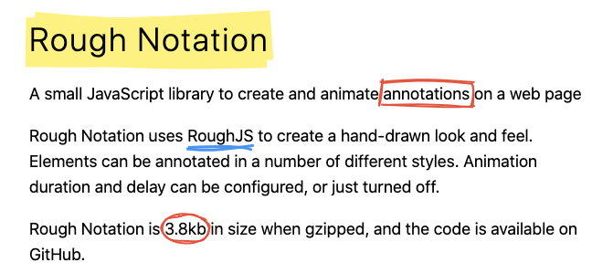
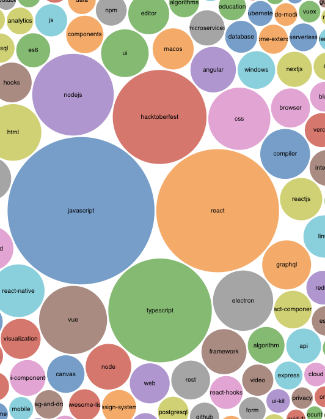
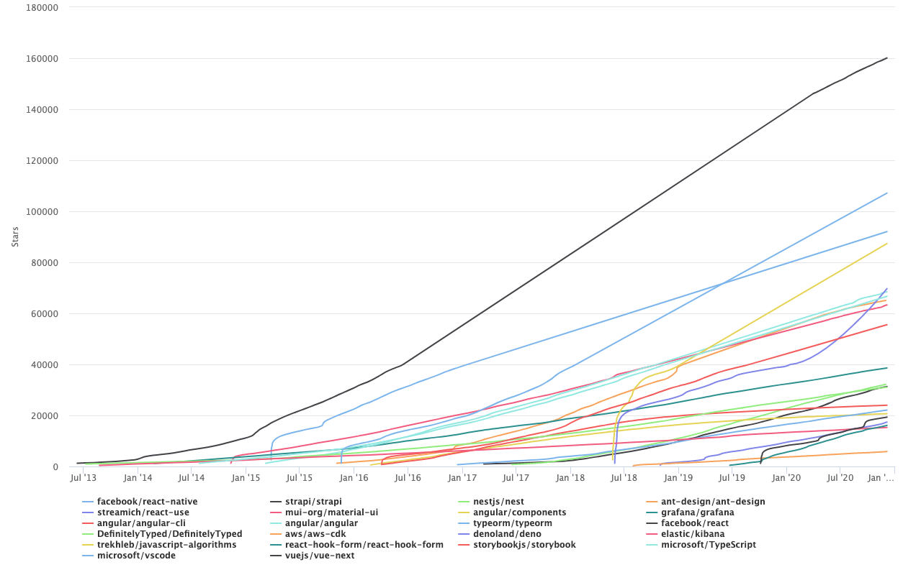

れこです。この記事は[Node.js Advent Calendar 2020](https://qiita.com/advent-calendar/2020/nodejs)の 12 日目の記事です。今回は年の瀬ということで酒の肴になりそうな記事を書きたいと思います。

本記事では 2020 年に GitHub のトレンドに上がったリポジトリをいくつかの切り口で集計して、独断と偏見で感想を付け加えます。  
この記事を酒の肴に 2020 年の JS/TS について懐かしんでもらえたら幸いです。

## 集計方法

GitHub のトレンドは過去の履歴が残っていないので非公式に集計されたデータを利用しています。

- 集計期間は 2020/01/01 から 2020/12/05 までの 341 日間
- 対象言語は`JavaScript`と`TypeScript`のみ
- トレンドの過去データのソースは[xiaobaiha/github-trending-history](https://github.com/xiaobaiha/github-trending-history)を参照
  - 日ごとにまとめた markdown になっており、remark で AST→ データ化しました

**GitHub がそのリポジトリをなんの言語と見なしたかをもとに集計対象を決定している**ことにご留意ください。また、別言語で書かれた JS 向けのツール（swc, esbuild など）、CSS フレームワークなども対象外とします。

また、本記事では振り返りの指標として GitHub のトレンドおよびスター数を採用しています。話題性やバズに連想する値だとは思っていますが、トレンドに載ることやスター数の大小がそのものの良し悪しを決定する決定的な因子ではないと筆者は思っています。

[xiaobaiha/github-trending-history](https://github.com/xiaobaiha/github-trending-history)のデータをベースに加工した集計用の生データは[こちら](https://docs.google.com/spreadsheets/d/e/2PACX-1vTHFXqzaCMuNqPuDBs4PE6wuxJuJfwbUIYvv8l-IV8neo-6G0BDfP68kcZ8MlV_fFJMkpIdADMzya84/pub?gid=259916409&single=true&output=csv)に CSV として公開しています。

説明が必要そうなCSVカラムの一覧を開く

- firstAppearedOn: 2020/1/1 移行ではじめてトレンドに載った日
- appearedCount: 集計期間にトレンドに載った日数
- appearedDates: 集計期間にトレンドに載った日の一覧（カンマ区切り）
- stargazers20200101: 2020/1/1 時点での star 数（リポジトリが存在しなかった場合は 0）
- stargazers20201206: 2020/12/6 時点での star 数（リネームなどにより最新状況が取得できなかった場合は空欄）
- stargazers2020Diff: `stargazers20201206`と`stargazers20200101`の差
- topics: 2020/12/6 時点でそのリポジトリについているトピックの一覧（カンマ区切り）

## 今年作られた・今年から流行ったリポジトリ

まずは今年作られた・今年から流行ったリポジトリを見てみます。  
単純にトレンドへの掲載率やスター数の累計で集計すると既知のものばかりになるので今年誕生して流行った or 今年から流行り始めたリポジトリに絞って集計します。

- 2020 年にはじめてトレンド入りした時点でスター数が 100 未満
- 今年獲得したスター数（集計開始時のスター数と、集計終了時のスター数の差）が大きい順にソート
- 差分が+5000 以上のリポジトリを抽出

冒頭にある矢印の見方は`2020/1/1のスター数->2020/12/6のスター数`です。

- 1->18211 [microsoft/playwright](https://github.com/microsoft/playwright)
- 0->14795 [anuraghazra/github-readme-stats](https://github.com/anuraghazra/github-readme-stats)
- 0->13896 [rome/tools](https://github.com/rome/tools) (ex-[facebookexperimental/rome](https://github.com/facebookexperimental/rome))
- 0->13476 [vitejs/vite](https://github.com/vitejs/vite) (ex-[vuejs/vite](https://github.com/vuejs/vite))
- 0->13245 [excalidraw/excalidraw](https://github.com/excalidraw/excalidraw)
- 0->12137 [cyrildiagne/ar-cutpaste](https://github.com/cyrildiagne/ar-cutpaste)
- 0->10824 [facebookexperimental/Recoil](https://github.com/facebookexperimental/Recoil)
- 0->10571 [tailwindlabs/heroicons](https://github.com/tailwindlabs/heroicons)
- 18->10400 [desktop/desktop](https://github.com/desktop/desktop)
- 68->9557 [lensapp/lens](https://github.com/lensapp/lens)
- 0->9476 [tabler/tabler-icons](https://github.com/tabler/tabler-icons)
- 1->9137 [responsively-org/responsively-app](https://github.com/responsively-org/responsively-app) (ex-[manojVivek/responsively-app](https://github.com/manojVivek/responsively-app))
- 0->8872 [backstage/backstage](https://github.com/backstage/backstage) (ex-[spotify/backstage](https://github.com/spotify/backstage))
- 0->8095 [bradtraversy/vanillawebprojects](https://github.com/bradtraversy/vanillawebprojects)
- 0->7790 [foambubble/foam](https://github.com/foambubble/foam)
- 0->7506 [yemount/pose-animator](https://github.com/yemount/pose-animator)
- 0->7168 [kautukkundan/Awesome-Profile-README-templates](https://github.com/kautukkundan/Awesome-Profile-README-templates)
- 0->6873 [chuzhixin/vue-admin-beautiful](https://github.com/chuzhixin/vue-admin-beautiful)
- 0->6802 [hediet/vscode-drawio](https://github.com/hediet/vscode-drawio)
- 0->6593 [mengshukeji/Luckysheet](https://github.com/mengshukeji/Luckysheet)
- 0->6588 [AMAI-GmbH/AI-Expert-Roadmap](https://github.com/AMAI-GmbH/AI-Expert-Roadmap)
- 6->6577 [hediet/vscode-debug-visualizer](https://github.com/hediet/vscode-debug-visualizer)
- 0->6464 [oldboyxx/jira_clone](https://github.com/oldboyxx/jira_clone)
- 0->6426 [microsoft/Web-Dev-For-Beginners](https://github.com/microsoft/Web-Dev-For-Beginners)
- 0->6261 [wuhan2020/wuhan2020](https://github.com/wuhan2020/wuhan2020)
- 0->5985 [element-plus/element-plus](https://github.com/element-plus/element-plus)
- 0->5536 [blitz-js/blitz](https://github.com/blitz-js/blitz)
- 0->5316 [rough-stuff/rough-notation](https://github.com/rough-stuff/rough-notation) (ex-[pshihn/rough-notation](https://github.com/pshihn/rough-notation))
- 0->5070 [mikecao/umami](https://github.com/mikecao/umami)
- 0->5054 [poloclub/cnn-explainer](https://github.com/poloclub/cnn-explainer)

### microsoft/playwright

https://playwright.dev/

今年のリポジトリだったことに驚きです。趣味でも業務でもめちゃくちゃお世話になっています。  
playwight は Chromium/Firefox/WebKit の３大ブラウザを透過的な API で扱えるようにした MS 謹製の headless ブラウザ操作ツールです。  
この playwright を E2E テスト用にラップした[microsoft/playwright-test](https://github.com/microsoft/playwright-test)や、ブラウザを起動し GUI での操作を記録して JS のコードを生成してくれる[microsoft/playwright-cli](https://github.com/microsoft/playwright-cli)など、周辺ツールも少しずつ整ってきました。

### anuraghazra/github-readme-stats

7 月ごろに GitHub のプロフィールに載せる README ファイルが作れるようになりましたね。手間をかけずにある程度いい感じになるパーツを生成してくれる系ツールの１つです。私のデータで生成された画像がこちらです。

### rome/tools

> Rome は Babel と yarn の作成者である Sebastian McKenzie と Facebook の React Native チームが作成した実験的な JavaScript ツールチェーンである。Rome には、コンパイラ、リンター、フォーマッター、バンドラー、およびテストフレームワークが含まれており、「JavaScript ソースコードの処理に関連するあらゆるもののための包括的なツール」を目指している。
>
> &mdash; [Facebook が実験的な JavaScript ツールチェーンである Rome を発表](https://www.infoq.com/jp/news/2020/08/rome-experimental-js-toolchain/)

Facebook の Rome かなり話題になりましたね。個人的には ESLint のルールを自作したりバンドルのチューニングをしたり細かい設定を自由にできる方が好きなのであまり関心がないのですが「使用するツールが多くてとっつきにくい」「適切な選択をするための学習コスト」などと言った JS の大きな問題に挑んでる挑戦的なリポジトリだと思います。

<blockquote class="twitter-tweet">
rome興味なくて全くキャッチアップしてなかったのに唐突に意見求められて困惑しているけど、こういう刺激がないとどんどん鈍っていくんだろうなという危機感を感じている
&mdash; Leko / れこ (@L_e_k_o) <a href="https://twitter.com/L_e_k_o/status/1233402076979269637?ref_src=twsrc%5Etfw">February 28, 2020</a></blockquote> 

### facebookexperimental/Recoil

Recoil も話題になりましたね。発表されたのは 5 月ごろだったと記憶しています。  
私は Rx みたいなものだと理解しましたが、Rx を製品でちゃんと使ったことないので解釈違いかもしれません。面白いし気にはなるけど製品に突っ込むことはなさそうだと個人的に思っています。

<blockquote class="twitter-tweet">
recoilちょろっと触ってみて、これ比較対象はReduxじゃなくてRxではと思った
&mdash; Leko / れこ (@L_e_k_o) <a href="https://twitter.com/L_e_k_o/status/1261654648479346688?ref_src=twsrc%5Etfw">May 16, 2020</a></blockquote> 

### vitejs/vite

死語ですが「ジョバンニが一晩でやってくれました」シリーズですね。esbuild が早いぞと話題になっているころ、Vue.js の作者 Evan You がバンドラのパフォーマンスについて悶々と考えた結果生まれた高速な dev サーバです。Vue.js 作者が作っており名前もそれっぽいので Vue.js 専用のツールなのかと思っていましたが、React や preact でも使える作りになっています。

<blockquote class="twitter-tweet">
Open sourced at <a href="https://t.co/LYv5vnOv1O">https://t.co/LYv5vnOv1O</a> <a href="https://t.co/KU2LLpEmTD">https://t.co/KU2LLpEmTD</a>
&mdash; Evan You (@youyuxi) <a href="https://twitter.com/youyuxi/status/1252578206454087680?ref_src=twsrc%5Etfw">April 21, 2020</a></blockquote> 

### excalidraw/excalidraw

[excalidraw](https://excalidraw.com/)は手書きっぽい優しい雰囲気の図形が描ける描画ツールです。ライブラリというよりは web アプリです。UI はミニマルですが完成度はかなり高いと思います。なんと同時編集もできますし、公式にホスティングされているアプリとして使うのはもちろん（React のみですが）埋め込みにも対応しており、ラフなアイデアを共有したり議論するのにかなり使えそうな予感がしています。  
年始に颯爽と現れ描画ツール界隈がザワつきました。日本だと複雑 GUI の会で話題になっていたのを見かけました。

<blockquote class="twitter-tweet">
Made this in <a href="https://twitter.com/Vjeux?ref_src=twsrc%5Etfw">@Vjeux</a>&#39;s Excalidraw <a href="https://t.co/9oAjdW0wAc">https://t.co/9oAjdW0wAc</a> Liberating to have fewer options yet have the results look great. Stop caring so much about your stupid graphics. Every imperfection is a little reminder to stop bikeshedding and focus on communicating something. <a href="https://t.co/vD1uWu4Ay5">pic.twitter.com/vD1uWu4Ay5</a>
&mdash; jordwalke (@jordwalke) <a href="https://twitter.com/jordwalke/status/1214858186789806080?ref_src=twsrc%5Etfw">January 8, 2020</a></blockquote> 

### rough-stuff/rough-notation

全く話題にならなかったと思うんですが個人的に好きなライブラリです。Web ページに ↑ スクショのようなマーカーペンや手書きっぽいアノテーションを加えられるライブラリです。前述の excalidraw も内部で使用している Rough.js を使っており、こちらは web アプリというよりライブラリです。デモは[こちら](https://roughnotation.com/)から。  
アニメーションがヌルヌル動くし、手書きっぽさもかなり自然で、アノテーションを文字に被せてもテキスト選択に干渉しません。ブログやプレゼン資料の強調に使うと面白いかもしれません。

## 2020 年にもっともスターを獲得したリポジトリ

次にリポジトリの柵整備に関係なく 2020 年もっともスターを獲得したリポジトリを見ていきます。

- 2020 年に一度以上トレンドに載った
- 今年獲得したスター数が大きい順にソート
- 上位 20 件のみ表示
- 前述の"今年作られた・今年から流行ったリポジトリ"と重複しているものは~~取り消し線~~を入れてます

では一覧です。

- +30042 [denoland/deno](https://github.com/denoland/deno)
- +29401 [trekhleb/javascript-algorithms](https://github.com/trekhleb/javascript-algorithms)
- +24368 [vuejs/vue](https://github.com/vuejs/vue)
- +21125 [facebook/react](https://github.com/facebook/react)
- +19598 [microsoft/vscode](https://github.com/microsoft/vscode)
- +18808 [goldbergyoni/nodebestpractices](https://github.com/goldbergyoni/nodebestpractices)
- ~~+18211 [microsoft/playwright](https://github.com/microsoft/playwright)~~
- +16853 [gothinkster/realworld](https://github.com/gothinkster/realworld)
- +15321 [vercel/next.js](https://github.com/vercel/next.js), (ex-[zeit/next.js](https://github.com/zeit/next.js))
- ~~+14795 [anuraghazra/github-readme-stats](https://github.com/anuraghazra/github-readme-stats)~~
- +14563 [ryanmcdermott/clean-code-javascript](https://github.com/ryanmcdermott/clean-code-javascript)
- +14560 [azl397985856/leetcode](https://github.com/azl397985856/leetcode)
- +14352 [freeCodeCamp/freeCodeCamp](https://github.com/freeCodeCamp/freeCodeCamp)
- +14027 [angular/angular](https://github.com/angular/angular)
- ~~+13896 [rome/tools](https://github.com/rome/tools) (ex-[facebookexperimental/rome](https://github.com/facebookexperimental/rome))~~
- +13583 [30-seconds/30-seconds-of-code](https://github.com/30-seconds/30-seconds-of-code)
- ~~+13476 [vitejs/vite](https://github.com/vitejs/vite) (ex-[vuejs/vite](https://github.com/vuejs/vite))~~
- ~~+13245 [excalidraw/excalidraw](https://github.com/excalidraw/excalidraw)~~
- +13112 [GitSquared/edex-ui](https://github.com/GitSquared/edex-ui)
- +12873 [tannerlinsley/react-query](https://github.com/tannerlinsley/react-query)

おおよそ想像していた通りです。もともとスター数を集めている有名なリポジトリがさらに star を伸ばしたという感じです。

### vercel/next.js

Next.js に関してはこの前の[Next.js Conf](https://nextjs.org/conf/stage/n)で発表された v10 の新機能たちでザワついたことが記憶に新しいと思います。個人的にはこれまでのサーバサイドフレームワークの責務を再定義したと思える大きなリリースだと思います。[Front-End Study #1](https://forkwell.connpass.com/event/190313/)の[Keynote トーク：Frontend 領域を再定義する](https://zenn.dev/mizchi/articles/c638f1b3b0cd239d3eea)でも Next.js（とそれをラップしたフルスタックフレームワーク時代の開幕）について触れられていましたね。Next.js をベースにしたフルスタックフレームワーク Blitz もランクインしていますがあまり関心はなくてピックアップはしません。

### denoland/deno

Deno は 2018 年に[10 Things I Regret About Node.js](https://www.youtube.com/watch?v=M3BM9TB-8yA)発表されてから２年の時を経て、今年の 5 月に[v1 がリリース](https://deno.land/posts/v1)されました。今後の展開に注目したいです。

v1 が出たころに unstable の Rust plugin を試したんですが、stable になる前に機能ごと削除されるかもしれません。こちらの Issue から議論に参加できます。

> &mdash; [Remove unstable native plugins · Issue #8490 · denoland/deno](https://github.com/denoland/deno/issues/8490)

<blockquote class="twitter-tweet">
Denoで3rd party crateを利用するRust pluginのデモ。deno_core crateがバンバン破壊的変更してるのでGitHub上に転がってるサンプルは型が合わなくて全滅してた。公式にあるソースだけが唯一参考になる。CommonMark準拠のmarkdownトランスパイルを実行するサンプル<a href="https://t.co/VxTonUp60x">https://t.co/VxTonUp60x</a>
&mdash; Leko / れこ (@L_e_k_o) <a href="https://twitter.com/L_e_k_o/status/1269303228539129857?ref_src=twsrc%5Etfw">June 6, 2020</a></blockquote> 

### vuejs/vue

Vue に関しては今年の 7 月に v3 RC をアナウンスし、その後 9 月に Vue.js Amsterdam にて[V3.0 にアナウンス](https://news.vuejs.org/issues/186)されて賑わいましたね。詳しくは本家のキーノートをみた方が確実ですが、日本語だと Vue3 に関してはこちらのトークがわかりやすかったです。

> &mdash; [まちにまった Vue.js 3 - Speaker Deck](https://speakerdeck.com/kazupon/matinimatuta-vue-dot-js-3)

<blockquote class="twitter-tweet">
Vue 3.0 &quot;One Piece&quot; is here! <a href="https://t.co/jH6FfByDmX">https://t.co/jH6FfByDmX</a>
&mdash; Vue.js (@vuejs) <a href="https://twitter.com/vuejs/status/1306992969728380930?ref_src=twsrc%5Etfw">September 18, 2020</a></blockquote> 

## Node.js 関連のトピックに絞った場合

次に Node.js に関連したトピックを持ったリポジトリを比較します。

- `nodejs`または`node`トピックがついているリポジトリを抽出
- 2020 年に 5000 スター以上獲得したリポジトリを抽出
- 今年獲得したスター数が多い順にソート
- ここまでの内容と重複しているものは~~取り消し線~~を入れてます

※ トピックは人間が個々のさじ加減で付与したメタデータのため、Node.js 向けのリポジトリに必ずしもこれらのトピックがついてるわけではありませんし、トピックがついているからと言って必ずしも Node.js 向けとも限りません。

- ~~+18808 (36877->55685) [goldbergyoni/nodebestpractices](https://github.com/goldbergyoni/nodebestpractices)~~
- ~~+15321 (42715->58036) [vercel/next.js](https://github.com/vercel/next.js)~~
- ~~+14352 (302877->317229) [freeCodeCamp/freeCodeCamp](https://github.com/freeCodeCamp/freeCodeCamp)~~
- ~~+13583 (52352->65935) [30-seconds/30-seconds-of-code](https://github.com/30-seconds/30-seconds-of-code)~~
- ~~+13112 (11842->24954) [GitSquared/edex-ui](https://github.com/GitSquared/edex-ui)~~
- +12488 (67025->79513) [axios/axios](https://github.com/axios/axios)
- +11221 (20087->31308) [strapi/strapi](https://github.com/strapi/strapi)
- +10872 (56312->67184) [puppeteer/puppeteer](https://github.com/puppeteer/puppeteer)
- +9964 (22342->32306) [nestjs/nest](https://github.com/nestjs/nest)
- +9638 (65544->75182) [nodejs/node](https://github.com/nodejs/node)
- +7857 (11368->19225) [laurent22/joplin](https://github.com/laurent22/joplin)
- +6159 (8774->14933) [haizlin/fe-interview](https://github.com/haizlin/fe-interview)
- +5644 (5378->11022) [n8n-io/n8n](https://github.com/n8n-io/n8n)
- +5189 (1377->6566) [prisma/prisma2](https://github.com/prisma/prisma2)
- +5189 (1377->6566) [prisma/prisma](https://github.com/prisma/prisma)
- +5028 (46013->51041) [expressjs/express](https://github.com/expressjs/express)

Node.js でサーバサイドの実装してる人にとって特に目新しいものは少ないと思います。  
個人的には fastify や Apollo Server が食い込んでくると思ったのですが、残念ながら fastify のスター数の遷移は`+3783(12809->16592)`、Apollo Server は`+2037(8620->10657)`でした。

### Prisma

Prisma1 は GraphQL が今より全く浸透してない時代から GraphQL ベースのアプローチを始めた挑戦的なリポジトリでした。GraphiQL よりリッチな GraphQL playground を作っていたり（今も Apollo Server の playground などで現役）するので、直接 Prisma に触れたことがなくても間接的に触ったことのある方も多いと思います。そんな Prisma は今年の 5 月に[Prisma 2.0 ベータがアナウンスされ](https://www.prisma.io/blog/prisma-2-beta-b7bcl0gd8d8e)、6 月に[2.0.0 を公開しました](https://github.com/prisma/prisma/releases/tag/2.0.0)。  
1 までは独立した HTTP サーバの印象が強かったですが、2 からは O/R マッパ の印象が強くなっています。Prisma は GraphQL のリソルバを愚直に実装すると起こりがちな N+1 問題に対してクエリを最適化する Data Loader 層の工夫があったり色々といいことがあります。こちらの記事に欲しい情報がまとまっていたので貼っておきます。

> &mdash; [GraphQL と相性の良い ORM Prisma - Qiita](https://qiita.com/joe-re/items/6e09e741ed2e0c6637b0)

## トレンドに上がったリポジトリのトピック

次はリポジトリではなく今年トレンドに上がったリポジトリのトピックを集計しました。

- 2020 年に一度以上トレンドに載ったリポジトリを抽出
- 5 つ以上のリポジトリに共通してつけられているトピックが対象

画像が大きいので中心部分を抜粋しました。こちらのリンクから SVG の全体画像が見れます。

> &mdash; [Bubble Chart / Shingo Inoue / Observable](https://observablehq.com/@leko/bubble-chart)

同じことを来年もやってこの記事と比較したいです。

## トレンド常連組

最後に GitHub のトレンド常連組を載せて終わります。

- 集計期間内に 50 日以上トレンドに載ったリポジトリを抽出
- トレンドに出現した日数をカウント

目新しさが全くないので過去累計のスター数の変遷のグラフもつけてみました。

[view chart online](https://github-stars.socode.pro/?stack=5b0abe7d-3c2a-3a09-fba0-5fbeb24963f1&repos=angular%2Fangular%2Cmicrosoft%2FTypeScript%2Cstorybookjs%2Fstorybook%2Cant-design%2Fant-design%2Cnestjs%2Fnest%2Cgrafana%2Fgrafana%2Cdenoland%2Fdeno%2Cmicrosoft%2Fvscode%2Cvuejs%2Fvue-next%2Caws%2Faws-cdk%2Creact-hook-form%2Freact-hook-form%2Ctypeorm%2Ftypeorm%2Ctrekhleb%2Fjavascript-algorithms%2CDefinitelyTyped%2FDefinitelyTyped%2Cfacebook%2Freact%2Cmui-org%2Fmaterial-ui%2Cangular%2Fangular-cli%2Cangular%2Fcomponents%2Celastic%2Fkibana%2Cstrapi%2Fstrapi%2Cstreamich%2Freact-use%2Cfacebook%2Freact-native)

- 102 日: [angular/angular](https://github.com/angular/angular)
- 74 日: [microsoft/TypeScript](https://github.com/microsoft/TypeScript)
- 69 日: [storybookjs/storybook](https://github.com/storybookjs/storybook)
- 68 日: [ant-design/ant-design](https://github.com/ant-design/ant-design)
- 67 日: [nestjs/nest](https://github.com/nestjs/nest)
- 66 日: [grafana/grafana](https://github.com/grafana/grafana)
- 66 日: [denoland/deno](https://github.com/denoland/deno)
- 66 日: [microsoft/vscode](https://github.com/microsoft/vscode)
- 64 日: [vuejs/vue-next](https://github.com/vuejs/vue-next)
- 63 日: [aws/aws-cdk](https://github.com/aws/aws-cdk)
- 61 日: [react-hook-form/react-hook-form](https://github.com/react-hook-form/react-hook-form)
- 60 日: [typeorm/typeorm](https://github.com/typeorm/typeorm)
- 58 日: [trekhleb/javascript-algorithms](https://github.com/trekhleb/javascript-algorithms)
- 57 日: [DefinitelyTyped/DefinitelyTyped](https://github.com/DefinitelyTyped/DefinitelyTyped)
- 57 日: [facebook/react](https://github.com/facebook/react)
- 53 日: [mui-org/material-ui](https://github.com/mui-org/material-ui)
- 52 日: [angular/angular-cli](https://github.com/angular/angular-cli)
- 52 日: [angular/components](https://github.com/angular/components)
- 52 日: [elastic/kibana](https://github.com/elastic/kibana)
- 52 日: [strapi/strapi](https://github.com/strapi/strapi)
- 51 日: [streamich/react-use](https://github.com/streamich/react-use)
- 50 日: [facebook/react-native](https://github.com/facebook/react-native)

もっともトレンドに乗った日数が多かったのは Angular でした。  
以上です。良いお年を！
