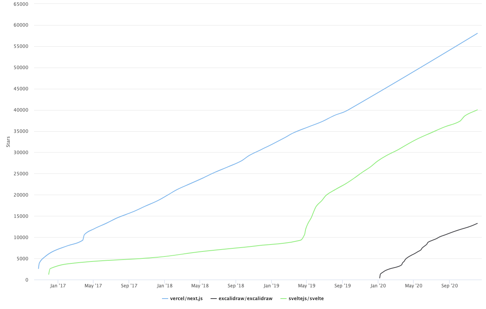

れこです。この記事は[Node.js Advent Calendar 2020](https://qiita.com/advent-calendar/2020/nodejs)の12日目の記事です。  
あれこれ記事のネタを考えてみたのですが、年の瀬ということで酒の肴になりそうな記事にしたいと思いました。

本記事では2020年にGitHubのトレンドに上がったリポジトリをいくつかの切り口で集計して、適当に感想を付け加えます。  
これを眺めながら酒の肴に2020年のJS/TSについて振り返ってもらえれば幸いです。

## 集計方法

GitHubのトレンドは過去の履歴が残っていないので非公式に集計されたデータを利用しています。  
一つ注意していただきたいのは、特定のフレームワークを意図的に除外したわけではなくてGitHubがそのリポジトリをなんの言語と見なしたか？（そのリポジトリに占める最も割合の多い言語はなにか）をもとに集計対象が決定されています。

- 対象言語はJavaScriptおよびTypeScriptのリポジトリのみ（CSSやHTML、.vueとか.elmとかは除外）
- トレンドの過去データは[xiaobaiha/github-trending-history](https://github.com/xiaobaiha/github-trending-history)を参照
- 集計期間は2020/01/01から2020/12/05までの341日間
- データ集計用のスクリプト（js）は[こちら]()
- スター数の遷移をチャート化するのに[Star History](https://star-history.t9t.io)を利用しています

xiaobaiha/github-trending-historyにあるデータは日別にmarkdownになっており、remark等のmarkdownパーサで簡単にデータ化できます。

## まえおき

掲載しているチャートについて注意です。

- **チャートは2020年だけを切り取ったものではなく過去全てのデータを含むグラフ**です。ご注意ください
- 2020年に相当する部分は図のかなり右の方の`Jan '20`からです。

## 殿堂入り

まずは言うまでもなく有名なリポジトリです。集計期間内に50日以上トレンドに出現したリポジトリたちです。

[view chart online](https://github-stars.socode.pro/?stack=5b0abe7d-3c2a-3a09-fba0-5fbeb24963f1&repos=angular%2Fangular%2Cmicrosoft%2FTypeScript%2Cstorybookjs%2Fstorybook%2Cant-design%2Fant-design%2Cnestjs%2Fnest%2Cgrafana%2Fgrafana%2Cdenoland%2Fdeno%2Cmicrosoft%2Fvscode%2Cvuejs%2Fvue-next%2Caws%2Faws-cdk%2Creact-hook-form%2Freact-hook-form%2Ctypeorm%2Ftypeorm%2Ctrekhleb%2Fjavascript-algorithms%2CDefinitelyTyped%2FDefinitelyTyped%2Cfacebook%2Freact%2Cmui-org%2Fmaterial-ui%2Cangular%2Fangular-cli%2Cangular%2Fcomponents%2Celastic%2Fkibana%2Cstrapi%2Fstrapi%2Cstreamich%2Freact-use%2Cfacebook%2Freact-native)

- 102日: [angular/angular](https://github.com/angular/angular)
- 74日: [microsoft/TypeScript](https://github.com/microsoft/TypeScript)
- 69日: [storybookjs/storybook](https://github.com/storybookjs/storybook)
- 68日: [ant-design/ant-design](https://github.com/ant-design/ant-design)
- 67日: [nestjs/nest](https://github.com/nestjs/nest)
- 66日: [grafana/grafana](https://github.com/grafana/grafana)
- 66日: [denoland/deno](https://github.com/denoland/deno)
- 66日: [microsoft/vscode](https://github.com/microsoft/vscode)
- 64日: [vuejs/vue-next](https://github.com/vuejs/vue-next)
- 63日: [aws/aws-cdk](https://github.com/aws/aws-cdk)
- 61日: [react-hook-form/react-hook-form](https://github.com/react-hook-form/react-hook-form)
- 60日: [typeorm/typeorm](https://github.com/typeorm/typeorm)
- 58日: [trekhleb/javascript-algorithms](https://github.com/trekhleb/javascript-algorithms)
- 57日: [DefinitelyTyped/DefinitelyTyped](https://github.com/DefinitelyTyped/DefinitelyTyped)
- 57日: [facebook/react](https://github.com/facebook/react)
- 53日: [mui-org/material-ui](https://github.com/mui-org/material-ui)
- 52日: [angular/angular-cli](https://github.com/angular/angular-cli)
- 52日: [angular/components](https://github.com/angular/components)
- 52日: [elastic/kibana](https://github.com/elastic/kibana)
- 52日: [strapi/strapi](https://github.com/strapi/strapi)
- 51日: [streamich/react-use](https://github.com/streamich/react-use)
- 50日: [facebook/react-native](https://github.com/facebook/react-native)

今年のトレンドで最も出現回数が多かったのはAngularでした。スター数の累計でいうとReactがぶっちぎってますね。Vueも入っていますし、サーバサイドのフレームワークもUIフレームワークもライブラリもサービスも、まぁ知らない人はいないでしょうという有名どころが並んでいます。  
チャートを見ての通り定期的にトレンドに上がるリポジトリのほとんどは2020年より前から人気があるリポジトリたちで、目新しいものはほぼないと思います。

今年から勢いが増したリポジトリは、チャートを見る限りDenoとvue-next(Vue3)、あとreact-hook-formでしょうか。  
Denoは2018年に発表されてから２年の時を経て、今年の5月に[v1がリリース](https://deno.land/posts/v1)され賑わっていた記憶があります。vue-nextはVue3のリリースに際して用意されたリポジトリですね。今年の7月にv3のRCがリリースされ、その後9月にVue.js Amsterdamにて[V3をアナウンス](https://news.vuejs.org/issues/186)発表されて賑わっていた記憶があります。

出現日数が30以上〜50未満のリポジトリは量が多いのでこちらに隠しておきます。  
それ以下の出現頻度のリポジトリも気になる方は自分で集計スクリプトを動かしてみてください。

開く

- 49日: [jhu-ep-coursera/fullstack-course4](https://github.com/jhu-ep-coursera/fullstack-course4), [gothinkster/realworld](https://github.com/gothinkster/realworld)
- 48日: [vuetifyjs/vuetify](https://github.com/vuetifyjs/vuetify)
- 47日: [puppeteer/puppeteer](https://github.com/puppeteer/puppeteer), [gatsbyjs/gatsby](https://github.com/gatsbyjs/gatsby), [discordjs/discord.js](https://github.com/discordjs/discord.js)
- 46日: [facebook/jest](https://github.com/facebook/jest)
- 45日: [vercel/next.js](https://github.com/vercel/next.js)
- 44日: [neoclide/coc.nvim](https://github.com/neoclide/coc.nvim), [react-navigation/react-navigation](https://github.com/react-navigation/react-navigation), [goldbergyoni/nodebestpractices](https://github.com/goldbergyoni/nodebestpractices), [iptv-org/iptv](https://github.com/iptv-org/iptv)
- 43日: [mrdoob/three.js](https://github.com/mrdoob/three.js)
- 42日: [spotify/backstage](https://github.com/spotify/backstage), [cypress-io/cypress](https://github.com/cypress-io/cypress)
- 41日: [marmelab/react-admin](https://github.com/marmelab/react-admin), [aws-amplify/amplify-js](https://github.com/aws-amplify/amplify-js)
- 40日: [microsoft/azure-pipelines-tasks](https://github.com/microsoft/azure-pipelines-tasks), [ryanmcdermott/clean-code-javascript](https://github.com/ryanmcdermott/clean-code-javascript), [sveltejs/svelte](https://github.com/sveltejs/svelte)
- 39日: [cdr/code-server](https://github.com/cdr/code-server), [vuejs/vue](https://github.com/vuejs/vue)
- 38日: [airbnb/javascript](https://github.com/airbnb/javascript)
- 37日: [typescript-eslint/typescript-eslint](https://github.com/typescript-eslint/typescript-eslint)
- 36日: [nodejs/node](https://github.com/nodejs/node)
- 35日: [freeCodeCamp/freeCodeCamp](https://github.com/freeCodeCamp/freeCodeCamp)
- 34日: [lensapp/lens](https://github.com/lensapp/lens), [Azure/azure-sdk-for-js](https://github.com/Azure/azure-sdk-for-js), [nuxt/nuxt.js](https://github.com/nuxt/nuxt.js), [awesome-selfhosted/awesome-selfhosted](https://github.com/awesome-selfhosted/awesome-selfhosted), [alpinejs/alpine](https://github.com/alpinejs/alpine)
- 33日: [n8n-io/n8n](https://github.com/n8n-io/n8n), [Azure/azure-rest-api-specs](https://github.com/Azure/azure-rest-api-specs), [zeit/next.js](https://github.com/zeit/next.js)
- 32日: [excalidraw/excalidraw](https://github.com/excalidraw/excalidraw), [DivanteLtd/vue-storefront](https://github.com/DivanteLtd/vue-storefront), [NG-ZORRO/ng-zorro-antd](https://github.com/NG-ZORRO/ng-zorro-antd)
- 31日: [angular/angularfire](https://github.com/angular/angularfire), [umijs/qiankun](https://github.com/umijs/qiankun), [jonasschmedtmann/complete-javascript-course](https://github.com/jonasschmedtmann/complete-javascript-course)
- 30日: [desktop/desktop](https://github.com/desktop/desktop), [Redocly/redoc](https://github.com/Redocly/redoc), [eclipse-theia/theia](https://github.com/eclipse-theia/theia), [apollographql/apollo-server](https://github.com/apollographql/apollo-server), [facebook/create-react-app](https://github.com/facebook/create-react-app), [Koenkk/zigbee2mqtt](https://github.com/Koenkk/zigbee2mqtt), [azl397985856/leetcode](https://github.com/azl397985856/leetcode)

この中で個人的にピックアップしたいのはexcalidraw, Svelte, Next.jsです。

[excalidraw](https://excalidraw.com/)は今年に誕生したリポジトリであまり有名ではないかもしれませんが手書きっぽい描画ツールとしての完成度がすごく高いと思います。同時編集もできます。公式にホスティングされているサイトで使うのはもちろん（Reactのみですが）埋め込みにも対応しており、自作のアプリケーションに組み込むこともできます。

Svelteはチャートを見ての通り、2019年4月にv3がリリースされてからグンと傾きが変わり今も伸び続けています。自分の観測範囲ではプロダクションに利用している例はあまり耳にしませんが、今年は素振りやSvelteで〜してみたの情報を多く見るようになったと思います。私も今年からSvelteに入門しました。この前Singapore.jsで聞いたSvelteコミッターによる解説[Compile Svelte in your head - SingaporeJS](https://engineers.sg/video/compile-svelte-in-your-head-singaporejs--4120)を読むと実際にどんなJSにコンパイルされて動作するのかイメージしやすくなると思います。

Next.jsに関してはこの前のNext.js Confで発表されたv10の新機能たちが記憶に新しいと思います。個人的にはこれまでのサーバサイドフレームワークの責務を再定義したと感じる大きなリリースだったと思います。ただ仕事でNext.js使ってないのでその感動を活かす場はないのですが。  
リアルタイムでイベントを見てたわけではないので、後からまとめ記事やTwitterの実況を追って補完してました。

