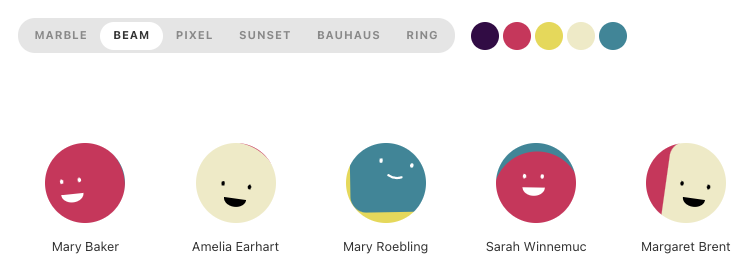

今年も GitHub のトレンドで 2021 年の JavaScript/TypeScript を振り返ります。去年の記事はこちらです。

> &mdash; [GitHub のトレンドで振り返る 2020 年の JavaScript | WEB EGG](https://blog.leko.jp/post/2020-js-ts-trending-history/)

## 集計方法

GitHub トレンドは過去の履歴を公式に提供していないため、非公式に集計されたデータを利用しています。

- データソースは[larsbijl/trending_archive](https://github.com/larsbijl/trending_archive)を使用
  - 去年は[xiaobaiha/github-trending-history](https://github.com/xiaobaiha/github-trending-history)を利用したが今年のデータは無かったので変更
  - 日ごとにまとめた markdown になっており、remark で AST→ データ化しました
- 集計期間は 2021/01/01 から 2021/12/15 まで
- 対象言語は`JavaScript`と`TypeScript`のみ

集計後のデータは[こちら](https://docs.google.com/spreadsheets/d/1S0qz8kQHdiMoVkIZr2JQ2t770J7ZKdjfsfI_CE7HU_o/edit?usp=sharing)のスプレッドシートで公開しています。

**GitHub がそのリポジトリをなんの言語と見なしたかをもとに集計対象を決定している**ことにご留意ください。そのため別言語で書かれた JS 向けのツール（swc, esbuild など）や CSS フレームワークなどは基本的に除外されます。

## 2021 年に作られた・2021 年から流行ったリポジトリ

まずは今年作られた・今年から流行ったリポジトリの紹介です。日時を考慮せずトレンドの掲載やスター数で集計すると既知の大御所リポジトリばかりになるので今年からトレンドになったリポジトリに絞って紹介します。

- 抽出条件
  - 2021 年に初めてトレンド入りした時点でスター数が 100 未満
  - 集計期間のスター数の差分が+5000 以上
  - 今年獲得したスター数（集計開始時のスター数と、集計終了時のスター数の差）が大きい順にソート

行頭にある矢印の見方は 2020/1/1 のスター数->2021/12/15 のスター数です。

- 17 -> 20440(+20423) [conwnet/github1s](https://github.com/conwnet/github1s)
- 47 -> 16747(+16700) [slidevjs/slidev](https://github.com/slidevjs/slidev)
- 20 -> 12018(+11998) [pavlobu/deskreen](https://github.com/pavlobu/deskreen)
- 10 -> 9208(+9198) [benawad/dogehouse](https://github.com/benawad/dogehouse)
- 11 -> 9144(+9133) [VickScarlet/lifeRestart](https://github.com/VickScarlet/lifeRestart)
- 66 -> 8961(+8895) [calendso/calendso](https://github.com/calendso/calendso)
- 46 -> 8810(+8764) [remotion-dev/remotion](https://github.com/remotion-dev/remotion)
- 61 -> 8674(+8613) [withastro/astro](https://github.com/withastro/astro)
- 49 -> 7779(+7730) [alan2207/bulletproof-react](https://github.com/alan2207/bulletproof-react)
- 15 -> 6963(+6948) [upgundecha/howtheysre](https://github.com/upgundecha/howtheysre)
- 57 -> 6997(+6940) [mattermost/focalboard](https://github.com/mattermost/focalboard)
- 98 -> 6150(+6052) [docmirror/dev-sidecar](https://github.com/docmirror/dev-sidecar)
- 77 -> 6009(+5932) [sveltejs/kit](https://github.com/sveltejs/kit)
- 32 -> 5442(+5410) [vuejs/petite-vue](https://github.com/vuejs/petite-vue)
- 20 -> 5407(+5387) [SigNoz/signoz](https://github.com/SigNoz/signoz)
- 12 -> 5290(+5278) [blueedgetechno/win11React](https://github.com/blueedgetechno/win11React)
- 12 -> 5207(+5195) [nextapps-de/winbox](https://github.com/nextapps-de/winbox)

### [conwnet/github1s](https://github.com/conwnet/github1s)

GitHub のリポジトリを開いて`github1s.com`にドメインを変更すると Web 上で VSCode が立ち上がりそのリポジトリのコードが読めるという Web サービスのリポジトリです。今年の 2 月ごろに Twitter で回ってきたやつという理解です。

<blockquote class="twitter-tweet">
Serious productivity boost for reading code on GitHub.  1️⃣.  Go to any repo you are interested in on GitHub.  2️⃣. Replace &quot;github&quot; with &quot;github1s&quot; (one + s) in the browser address bar.  3️⃣. Enjoy browsing code like you would in VS Code.  This is huge 🔥 <a href="https://t.co/FVZhxDIuBC">pic.twitter.com/FVZhxDIuBC</a>
&mdash; ChrisKalmar.eth 🦌🦌🦌🦌🛷 (@chriskalmar) <a href="https://twitter.com/chriskalmar/status/1363759778858729482?ref_src=twsrc%5Etfw">February 22, 2021</a></blockquote> 

### [slidevjs/slidev](https://github.com/slidevjs/slidev)

要は Markdown で登壇資料が作れるツールの１つです。私の登壇資料(https://talks.leko.jp/)は[jxnblk/mdx-deck](https://github.com/jxnblk/mdx-deck)というツールを使っているのですが、それをさらにリッチにしたものという印象です。最近全く登壇していませんが次回登壇するときに試してみようと思います。録画や拡張性やカスタマイズ性・エディタのサポートや速度などの開発体験を重要視してるようですね。Vite, Vue 3 などを利用して作られてるようです。

> Features
>
> - 📝 Markdown-based - use your favorite editors and workflow
> - 🧑‍💻 Developer Friendly - built-in syntax highlighting, live coding, etc
> - 🎨 Themable - theme can be shared and used with npm packages
> - 🌈 Stylish - Windi CSS on-demand utilities, easy-to-use embedded stylesheets
> - 🤹 Interactive - embedding Vue components seamlessly
> - 🎙 Presenter Mode - use another window, or even your phone to control your slides
> - 🧮 LaTeX - built-in LaTeX math equations support
> - 📰 Diagrams - creates diagrams with textual descriptions
> - 🌟 Icons - access to icons from any iconset directly
> - 💻 Editors - integrated editor, or extension for VS Code
> - 🎥 Recording - built-in recording and camera view
> - 📤 Portable - export into PDF, PNGs, or even a hostable SPA
> - ⚡️ Fast - instant reloading powered by Vite
> - 🛠 Hackable - using Vite plugins, Vue components, or any npm packages
>
> &mdash; [slidevjs/slidev: Presentation Slides for Developers (Beta)](https://github.com/slidevjs/slidev)

### [pavlobu/deskreen](https://github.com/pavlobu/deskreen)

Web ブラウザが搭載された任意のデバイスをセカンドスクリーンとして使えるようになる Electron アプリです。README にアーキテクチャが書いてあり、それによるとホストアプリ側の localhost に対しセカンドスクリーン化する端末がアクセスし、その後は WebRTC 経由でホスト側の画面共有をキャストするって挙動のようです。

### [benawad/dogehouse](https://github.com/benawad/dogehouse)

おそらく Discord clone のようなコミュニケーションツールです。特に紹介はしません

### [VickScarlet/lifeRestart](https://github.com/VickScarlet/lifeRestart)

"やり直すんだ。そして、次はうまくやる。"という謎の日本語が書かれた中国語のブラウザゲーです。翻訳しながら遊んでみたところおそらくシミュレーションゲームで、初期シードのステータス設定をすると人生シミュレータが開始し、寿命が尽きるまでに何が起こったかのログが流れるというゲームでした。画面にクトゥルフや幸運って単語が出てきたのでクトゥルフ神話とか TRPG 系の何かなのかと思いましたが、その界隈も中国語も詳しくないため結局何のゲームなのか、なぜ 9000 以上もスターを集めたのかも分かりませんでした。。。

### [calendso/calendso](https://github.com/calendso/calendso)

自分の空いてる日程を相手に共有して予定調整ができる SaaS、[Calendly](https://calendly.com/)のクローンです

### [remotion-dev/remotion](https://github.com/remotion-dev/remotion)

remotion は React コンポーネントの描画結果を動画として描き出せるツールです。コードを読んでみたところ内部的には描画用の Web アプリを localhost で立てて、puppeteer で１フレームずつ描画結果のスクリーンショットを保存し ffmpeg でつなぎ合わせて動画にしているようです。このツールで作られたビデオ例は公式の[Showcase](https://www.remotion.dev/showcase)にあります。映像編集ツールは使えませんがこれだったら動画が作れそうな気がします。

> &mdash; [話題の Remotion で遊んでみた](https://zenn.dev/uzimaru0000/scraps/011315614b47ab)

### [withastro/astro](https://github.com/withastro/astro)

Astro はランタイムを高速化することに重点を置いた静的サイトジェネレータです。React や Web Components やピュアな HTML+JS など、フレームワークや構成を問わず適用可能で、ビルド時に全てを解決してランタイム JS をゼロにし、必要であればハイドレーションもできて、SEO 系のメタ情報ファイルの生成にも気を配っているようです。もともとは Snowpack の org で作られたもののようですが、今は独立した org でメンテナンスされているようです。[Astro 0.21 のアナウンス記事](https://astro.build/blog/astro-021-release/)によると今は Snowpack ではなく Vite を使用しており、コンパイラは Go で書かれているそうです。

> &mdash; [Introducing Astro: Ship Less JavaScript](https://astro.build/blog/introducing-astro/)

### [alan2207/bulletproof-react](https://github.com/alan2207/bulletproof-react)

Production-ready な React アプリを作る際の opinionated なガイド集です。単なるガイドであってテンプレートやボイラープレートの類ではないようです。

### [upgundecha/howtheysre](https://github.com/upgundecha/howtheysre)

各社の SRE エンジニアがどんなことしているかの事例紹介がまとまっている README です

### [mattermost/focalboard](https://github.com/mattermost/focalboard)

Notion の クローンっぽい Web アプリです

### [docmirror/dev-sidecar](https://github.com/docmirror/dev-sidecar)

おそらく中国の Great Firewall 関連のツールだと思うのですが詳しくは不明（中国語なのでわからない）

### [sveltejs/kit](https://github.com/sveltejs/kit)

SvelteKit は Svelte 製アプリを作る際のツールキットおよびフレームワークのようです。ルーティングやレイアウト、Data Fetching やフックの機構を備えた Create React App をモダンにしたものという印象です。

> &mdash; [SvelteKit の特徴をざっくり理解する - console.lealog();](https://lealog.hateblo.jp/entry/2021/04/15/173441)

### [vuejs/petite-vue](https://github.com/vuejs/petite-vue)

機能が削られてる代わりに軽量（6kb）な Vue のサブセット、React でいうところの [preact](https://preactjs.com/) かなと思いました。複雑な制御のいらないページではネットワークのパフォーマンス向上に寄与しそうです。

### [SigNoz/signoz](https://github.com/SigNoz/signoz)

[OpenTelemetry](https://opentelemetry.io/) をベースとした APM サービスです。運用監視に使う Datadog や New Relic などのような SaaS の OSS 版です。サーバやアプリケーションのメトリクスの規格とデータ収集・集計などに必要なエージェントをベンダーニュートラルに開発する OpenTelemetry をベースにしており、SigNoz 自体は OpenTelemetry で収集されたデータのビューアのようなものと理解しました。OSS として自前でホストできるし、MongoDB Atlas や Elastic のようにマネージドなサービスとしても利用できます。

### [blueedgetechno/win11React](https://github.com/blueedgetechno/win11React)

web で Windows11 のデスクトップを再現したもののようです。定期的に特定 OS のデスクトップを再現する web サイト出てきますね。

### [nextapps-de/winbox](https://github.com/nextapps-de/winbox)

フレームワーク非依存で カスタマイズ性の高いウィンドウっぽい UI が作れる JS ライブラリ。動作がサクサクです。

## 欄外だけど個人的な興味でピックアップ

ここまでの紹介を見ての通りで、今年は SaaS クローンや GUI アプリがかなり多く、CLI ツールやライブラリは少なめで個人的に面白く無かったので、獲得スター数的にはランク外ですが、今年トレンドに載ったことのある個人的に関心のあるものをピックアップします。

### [boringdesigners/boring-avatars](https://github.com/boringdesigners/boring-avatars)

Gravatar のデフォルトアイコンのような、ユーザ名等のシード値によっていい感じの匿名アバター SVG 画像を描画できる React コンポーネントです。個人的には BEAM という種類のゆるキャラっぽいアバターが可愛くて好きです。こういうやつ。

### [BuilderIO/partytown](https://github.com/BuilderIO/partytown)

リソースを大量消費するような 3rd パーティスクリプトを WebWorker に移して動作させるという面白い取り組み。3rd パーティスクリプトを単純に WebWorker に移してもメインスレッドとは環境が違うことで動作しない問題を色々ハックして突破するライブラリです。  
動作原理としてはまずメインスレッドの API を Proxy でラップしたオブジェクトを WebWorker 側に露出させ、それが呼ばれると同期 XHR で WebWorker のスレッドをブロックして、その同期 XHR リクエストを監視する Service Worker が代わりにメインスレッドとやり取りして WebWorker に結果を返すことで、3rd party スクリプトから見ると同期的にメインスレッドを操作できており、Web Worker で動いてるので off the main thread が実現できる、という仕組みのようです。まだ枯れてないですが早く本番に突っ込んでみたいです。

> &mdash; [How Partytown's Sync Communication Works - DEV Community 👩‍💻👨‍💻](https://dev.to/adamdbradley/how-partytown-s-sync-communication-works-4244)

### [cloudflare/miniflare](https://github.com/cloudflare/miniflare)

ローカルで Cloudflare Workers が動かせる純正の開発ツールです。TS 製で`wrangler dev`の Alternative と書かれています。公式の安心感もあり、いちいちデプロイしなくて良くなり開発効率が上がるので積極的に使っていきたいと思います。

### [steveruizok/perfect-freehand](https://github.com/steveruizok/perfect-freehand)

フリーハンドで書かれた線の座標を滑らかに・筆っぽくいい感じに補正してくれる JS のライブラリです。マウスを動かす速度によって線の太さを調整したり補正したりしてくれます。ライブラリとしては一定間隔でサンプリングされた座標の配列を渡すだけのシンプルな API で、特定フレームワークに依存してないのが扱いやすそうです。

### [timc1/kbar](https://github.com/timc1/kbar)

GitHub や Slack などで`⌘+K`のショートカットでコマンドパレット的なものが開くと思うのですが、あれを簡単に作れるライブラリです。特定のキーを持つオブジェクトの配列を渡すだけなので、自分でキーボードショートカットの管理などをしなくていいのもとても良いです。tech savvy が喜びそうな機能の１つとして試してみたいです。

### [yeemachine/kalidokit](https://github.com/yeemachine/kalidokit)

JS から顔や手や指、表情や・ポーズなどが認識ができる Google 製の[Mediapipe](https://google.github.io/mediapipe/)を用い、ブラウザだけでモーショントレースができる Web アプリです。試してみた結果はこちらの画像です。左上がキャプチャされた私の座標データで、真ん中が描画結果になります。認識精度は高く 2D, 3D 両方ともいけました。任意の Live2D、VRM のモデルデータを追加して反映させることもできるようです。VTuber になる予定はないですが、ブラウザでやらなくて良いことを全力でやってるのがテクニカルで好きなリポジトリでした。

## 2021 年にもっともスターを獲得したリポジトリ

次に新しいか否かに関わらず 2021 年もっともスターを獲得したリポジトリを見ていきます。

- 抽出条件
  - 2020 年に一度以上トレンドに載った
  - 今年獲得したスター数が大きい順にソート
  - 上位 20 件のみ抽出

前セクションと重複しているものは~~取り消し線~~を入れてます

- ~~92 -> 76501 (+76409) [ant-design/ant-design](https://github.com/ant-design/ant-design)~~
- 138667 -> 180899 (+42232) [kamranahmedse/developer-roadmap](https://github.com/kamranahmedse/developer-roadmap)
- 89240 -> 129501 (+40261) [trekhleb/javascript-algorithms](https://github.com/trekhleb/javascript-algorithms)
- 11171 -> 39404 (+28233) [microsoft/Web-Dev-For-Beginners](https://github.com/microsoft/Web-Dev-For-Beginners)
- 157 -> 24070 (+23913) [google/zx](https://github.com/google/zx)
- 65584 -> 89130 (+23546) [30-seconds/30-seconds-of-code](https://github.com/30-seconds/30-seconds-of-code)
- 314511 -> 337473 (+22962) [freeCodeCamp/freeCodeCamp](https://github.com/freeCodeCamp/freeCodeCamp)
- 13960 -> 35127 (+21167) [vitejs/vite](https://github.com/vitejs/vite)
- 57747 -> 78416 (+20669) [vercel/next.js](https://github.com/vercel/next.js)
- 4671 -> 25175 (+20504) [supabase/supabase](https://github.com/supabase/supabase)
- ~~17 -> 20440 (+20423) [conwnet/github1s](https://github.com/conwnet/github1s)~~
- 159245 -> 179394 (+20149) [facebook/react](https://github.com/facebook/react)
- 23348 -> 43372 (+20024) [iptv-org/iptv](https://github.com/iptv-org/iptv)
- 51251 -> 71034 (+19783) [awesome-selfhosted/awesome-selfhosted](https://github.com/awesome-selfhosted/awesome-selfhosted)
- 16037 -> 34973 (+18936) [anuraghazra/github-readme-stats](https://github.com/anuraghazra/github-readme-stats)
- 106733 -> 125448 (+18715) [microsoft/vscode](https://github.com/microsoft/vscode)
- 42664 -> 60921 (+18257) [ryanmcdermott/clean-code-javascript](https://github.com/ryanmcdermott/clean-code-javascript)
- 33163 -> 50926 (+17763) [tailwindlabs/tailwindcss](https://github.com/tailwindlabs/tailwindcss)
- ~~47 -> 16747 (+16700) [slidevjs/slidev](https://github.com/slidevjs/slidev)~~
- 174775 -> 191415 (+16640) [vuejs/vue](https://github.com/vuejs/vue)

ほとんどはいつもの顔ぶれという感じです。個人的にコメントしたいのは１つだけで、他はコメントを省きます。

### [google/zx](https://github.com/google/zx)

2020 年末に登場した Google 製のシェルを JS で書けるツール。2021 年のトレンド掲載時点では 157 star だったため条件（star 数）を満たさず前パートで紹介できなかったツール。一言で言うなら Node.js の child_process の糖衣構文。top-level await が使えたり、文字列の配列を渡すと CLI 引数として自動でエスケープしてくれたりと細かいところに気が効く。zx 自体をインストールしないと当然動かないが、シェルを直接書くよりはシンプルで JS を生で書くよりはシンプルというバランスのもの。

## Node.js 関連のトピックに絞った場合

次に Node.js に関連したトピックを持ったリポジトリを比較します。

- 抽出条件
  - `nodejs`トピックがついている
  - 2020 年に 5000 スター以上獲得した
  - 獲得したスター数が多い順にソート

ここまでの内容と重複しているものは取り消し線を入れてます

- ~~157 -> 24070 (+23913) [google/zx](https://github.com/google/zx)~~
- ~~65584 -> 89130 (+23546) [30-seconds/30-seconds-of-code](https://github.com/30-seconds/30-seconds-of-code)~~
- ~~314511 -> 337473 (+22962) [freeCodeCamp/freeCodeCamp](https://github.com/freeCodeCamp/freeCodeCamp)~~
- 57149 -> 72747 (+15598) [goldbergyoni/nodebestpractices](https://github.com/goldbergyoni/nodebestpractices)
- 14249 -> 26006 (+11757) [LeCoupa/awesome-cheatsheets](https://github.com/LeCoupa/awesome-cheatsheets)
- 33816 -> 45555 (+11739) [leonardomso/33-js-concepts](https://github.com/leonardomso/33-js-concepts)
- 7024 -> 18175 (+11151) [prisma/prisma](https://github.com/prisma/prisma)
- 79116 -> 89871 (+10755) [axios/axios](https://github.com/axios/axios)
- 32651 -> 42995 (+10344) [nestjs/nest](https://github.com/nestjs/nest)
- 31862 -> 41808 (+9946) [strapi/strapi](https://github.com/strapi/strapi)
- ~~10 -> 9208 (+9198) [benawad/dogehouse](https://github.com/benawad/dogehouse)~~
- 74571 -> 83741 (+9170) [nodejs/node](https://github.com/nodejs/node)
- 8367 -> 16436 (+8069) [discordjs/discord.js](https://github.com/discordjs/discord.js)
- 27012 -> 34773 (+7761) [GitSquared/edex-ui](https://github.com/GitSquared/edex-ui)
- 19366 -> 26956 (+7590) [laurent22/joplin](https://github.com/laurent22/joplin)
- 879 -> 8451 (+7572) [qeeqbox/social-analyzer](https://github.com/qeeqbox/social-analyzer)
- 295 -> 5440 (+5145) [medusajs/medusa](https://github.com/medusajs/medusa)

### [axios/axios](https://github.com/axios/axios)

axios 自体は言わずと知れた有名なライブラリでそれ自体に語りたいことは特にありませんが、メンテナー不足の問題が顕在化し夏頃に議論になったのが記憶に新しいです。

<blockquote class="twitter-tweet">
axiosの利用者まだまだ結構いて影響がわりとあると思っているので、ご協力いただけるとありがたいです :pray: <a href="https://t.co/kLc1d9OUrC">https://t.co/kLc1d9OUrC</a>
&mdash; Kohta Ito (@koh110) <a href="https://twitter.com/koh110/status/1422477526673199110?ref_src=twsrc%5Etfw">August 3, 2021</a></blockquote> 

### [nodejs/node](https://github.com/nodejs/node)

この記事は Node.js のアドベントカレンダー記事なので Node も一応触れます。今年は v16 に始まり v17 がこの前発表されました。個人的にはこの辺が自分にとって大きな影響のあるアップデートでした。

> - M1 Mac
> - Timers Promises API
> - fs.rmdir の recursive オプションが Deprecated
>
> &mdash; [Node.js v16 の主な変更点 - 別にしんどくないブログ](https://shisama.hatenablog.com/entry/2021/04/22/090000)

> - Intl.DateTimeFormat
> - WHATWG Stream との互換性の強化
> - ディープクローンが簡単になる structuredClone の追加
>
> &mdash; [Node.js v17 の主な変更点 - 別にしんどくないブログ](https://shisama.hatenablog.com/entry/2021/10/20/114721#WHATWG-Stream-%E3%81%A8%E3%81%AE%E4%BA%92%E6%8F%9B%E6%80%A7%E3%81%AE%E5%BC%B7%E5%8C%96)

> &mdash; [Deep-copying in JavaScript using structuredClone](https://web.dev/structured-clone/)

## トレンドに上がったリポジトリのトピック

今年トレンドに上がったリポジトリのトピックを集計しました。

- 抽出条件
  - 2021 年に一度以上トレンドに載ったリポジトリを抽出
  - 外れ値を減らすため 5 つ以上のリポジトリに付けられたトピックが対象

この記事のサムネイル画像が画像の中心あたりを一部抜粋したものになります。こちらのリンクから SVG の全体画像が見れます。

> &mdash; [Bubble Chart / Shingo Inoue / Observable](https://observablehq.com/@leko/2021-github-trending-topics)

去年の SVG を並べてみたんですが、特に大きな代わり映えはなかったように思えます。

## トレンド常連組

最後に GitHub のトレンド常連組を載せます。

- 抽出条件

  - 集計期間内にトレンドに載った日数でソート
  - 上位 20 件を抽出

- 122 日 [vercel/next.js](https://github.com/vercel/next.js)
- 106 日 [angular/angular](https://github.com/angular/angular)
- 101 日 [trekhleb/javascript-algorithms](https://github.com/trekhleb/javascript-algorithms)
- 94 日 [github/docs](https://github.com/github/docs)
- 88 日 [storybookjs/storybook](https://github.com/storybookjs/storybook)
- 87 日 [angular/angular-cli](https://github.com/angular/angular-cli)
- 85 日 [ant-design/ant-design](https://github.com/ant-design/ant-design)
- 82 日 [discordjs/discord.js](https://github.com/discordjs/discord.js)
- 77 日 [ionic-team/ionic-framework](https://github.com/ionic-team/ionic-framework)
- 76 日 [cypress-io/cypress](https://github.com/cypress-io/cypress)
- 76 日 [facebook/react-native](https://github.com/facebook/react-native)
- 76 日 [grafana/grafana](https://github.com/grafana/grafana)
- 75 日 [vitejs/vite](https://github.com/vitejs/vite)
- 74 日 [puppeteer/puppeteer](https://github.com/puppeteer/puppeteer)
- 71 日 [iptv-org/iptv](https://github.com/iptv-org/iptv)
- 70 日 [trustwallet/assets](https://github.com/trustwallet/assets)
- 70 日 [Azure/azure-rest-api-specs](https://github.com/Azure/azure-rest-api-specs)
- 69 日 [microsoft/Web-Dev-For-Beginners](https://github.com/microsoft/Web-Dev-For-Beginners)
- 68 日 [microsoft/vscode](https://github.com/microsoft/vscode)
- 68 日 [mui-org/material-ui](https://github.com/mui-org/material-ui)

以上です。良いお年を！
