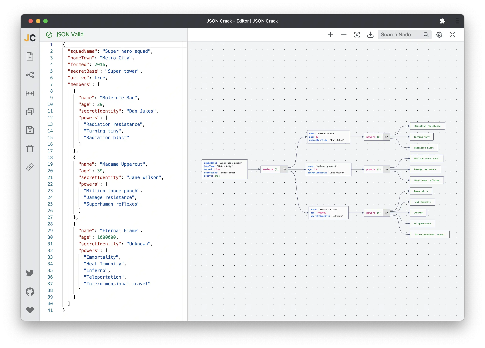
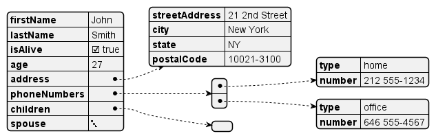
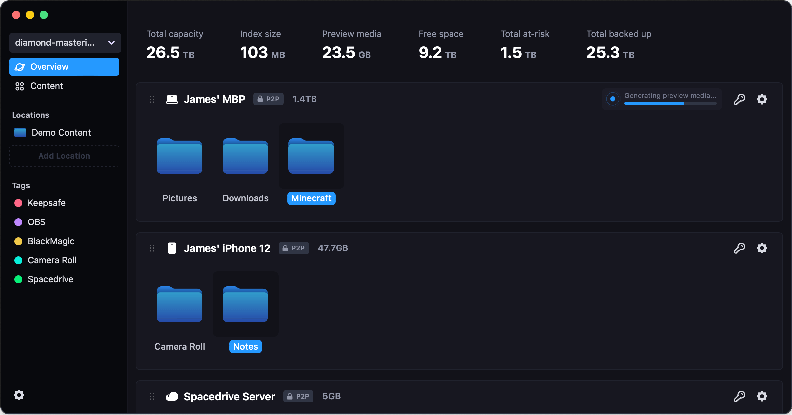
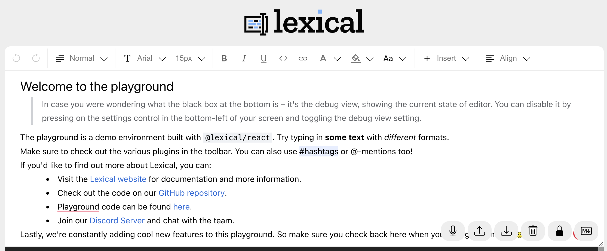
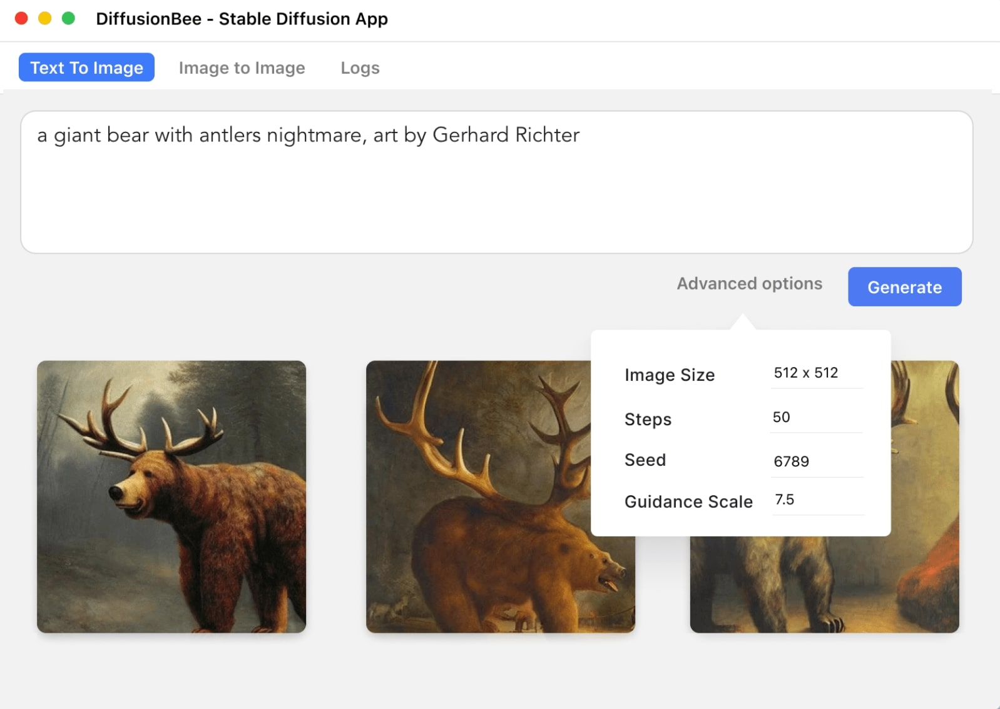
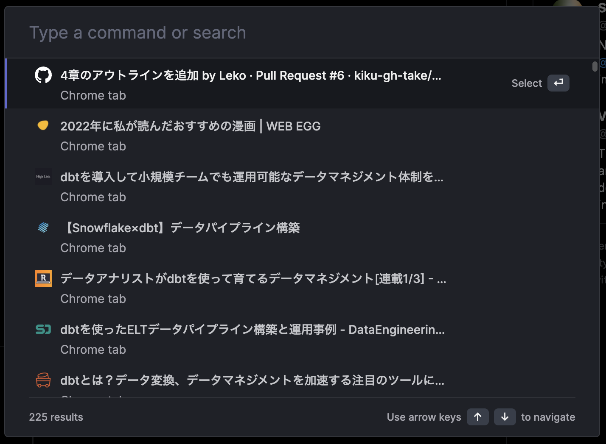
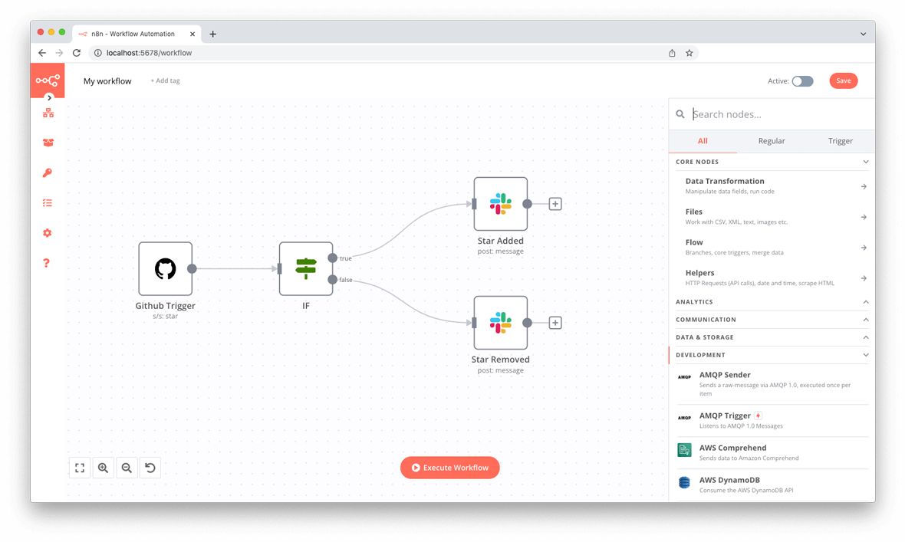

今年も GitHub トレンドから 2022 年の JavaScript/TypeScript を振り返ります。去年の記事はこちらです。

— [GitHub のトレンドで振り返る 2021 年の JavaScript | WEB EGG](https://blog.leko.jp/post/2021-javascript-typescript-trending-history/)

## 集計方法

本記事の集計期間は 2022/01/01〜2022/12/07、対象言語は JavaScript および TypeScript です。  
なお **GitHub がそのリポジトリをなんの言語と見なしてトレンドに掲載したかをもとに集計対象を決定していることにご留意ください。** 別言語で書かれた Rust 製の JS 向けのツールや CSS フレームワークなどは基本的に対象外となります。

集計に利用したデータですが、GitHub は過去のトレンドを閲覧する方法を提供していないため、独自の仕組みで GitHub トレンドのアーカイブを生成しそのデータを利用しました。毎日 UTC 0 時ごろにデータ取得処理が走り、日毎のディレクトリの中にその時点でのトレンドの内容を CSV 化した`言語名.csv`が作成されます。

当記事では集計期間の全ての`javascript.csv`と`typescript.csv`をマージし、リポジトリの作成日やリポジトリのトピック、今年に獲得した star 数などのいくつかのメタ情報を追加取得する集計スクリプトでサマリーデータを生成しました。

- トレンドのアーカイブ（CSV）は[こちら](https://github.com/Leko/github-trending-archive/tree/main/archive/raw)
  - JS/TS に限らず[こちら](https://github.com/Leko/github-trending-archive/tree/main/packages/collector/src/main.ts#L10)に定義された言語が蓄積されています
- 集計スクリプトは[こちら](https://github.com/Leko/github-trending-archive/blob/main/packages/summarize/src/main.ts)
  - CLI 引数で集計期間と言語を指定したサマリーデータが生成できるので、もし機会があれば使ってみてください
- 実際に生成されたサマリーデータは[こちら](https://docs.google.com/spreadsheets/d/1ZSdw70KbQasTbYF251Sv6paGhMSC8qSB7SgnY0h2d_c/edit?usp=sharing)

## 2022 年に作られた・2022 年から流行ったリポジトリ

まずは今年作られた・今年から流行ったリポジトリの紹介です。リポジトリの作成日を考慮せずトレンドの掲載回数やスター数だけで集計すると既知のリポジトリばかりになるので今年からトレンドになったリポジトリに絞って紹介します。

抽出条件:

- 2022/01/01 時点でスター数が 100 未満
- 集計期間のスター数の差分が+5000 以上
- 今年獲得したスター数が大きい順にソート

一覧:

- [AykutSarac/jsoncrack.com](https://github.com/AykutSarac/jsoncrack.com) +20216(1 → 20217)
- [spacedriveapp/spacedrive](https://github.com/spacedriveapp/spacedrive) +15812(10 → 15822)
- [pyscript/pyscript](https://github.com/pyscript/pyscript) +15041(7 → 15048)
- [facebook/lexical](https://github.com/facebook/lexical) +12455(9 → 12464)
- [t3-oss/create-t3-app](https://github.com/t3-oss/create-t3-app) +11632(33 → 11665)
- [toeverything/AFFiNE](https://github.com/toeverything/AFFiNE) +11215(6 → 11221)
- [lensterxyz/lenster](https://github.com/lensterxyz/lenster) +9544(25 → 9569)
- [alibaba/lowcode-engine](https://github.com/alibaba/lowcode-engine) +8610(6 → 8616)
- [faker-js/faker](https://github.com/faker-js/faker) +8175(14 → 8189)
- [upscayl/upscayl](https://github.com/upscayl/upscayl) +7138(53 → 7191)
- [apihero-run/jsonhero-web](https://github.com/apihero-run/jsonhero-web) +7026(6 → 7032)
- [total-typescript/beginners-typescript-tutorial](https://github.com/total-typescript/beginners-typescript-tutorial) +6882(5 → 6887)
- [divamgupta/diffusionbee-stable-diffusion-ui](https://github.com/divamgupta/diffusionbee-stable-diffusion-ui) +6782(17 → 6799)
- [formkit/auto-animate](https://github.com/formkit/auto-animate) +6261(5 → 6266)
- [vercel/satori](https://github.com/vercel/satori) +6028(5 → 6033)
- [BishopFox/unredacter](https://github.com/BishopFox/unredacter) +5928(0 → 5928)
- [alyssaxuu/omni](https://github.com/alyssaxuu/omni) +5749(0 → 5749)
- [ciderapp/Cider](https://github.com/ciderapp/Cider) +5591(65 → 5656)
- [actualbudget/actual](https://github.com/actualbudget/actual) +5561(1 → 5562)
- [Kindelia/HVM](https://github.com/Kindelia/HVM) +5383(2 → 5385)
- [Sanster/lama-cleaner](https://github.com/Sanster/lama-cleaner) +5201(71 → 5272)
- [tremorlabs/tremor](https://github.com/tremorlabs/tremor) +5033(3 → 5036)

### AykutSarac/jsoncrack.com

> 🔮 Seamlessly visualize your JSON data instantly into graphs; paste, import or fetch!  
> [AykutSarac/jsoncrack.com](https://github.com/AykutSarac/jsoncrack.com)

JSON の構造をグラフィカルに可視化できる GUI ツールです。AWS Cloudformation とか読めない巨大 JSON(YAML)に使えそうな予感はしますが、 JSON を可視化するだけのアプリが 2 万 stars まで流行った文脈は汲み取れませんでした...。

<blockquote class="twitter-tweet">
Looking to understand or explore some JSON? Just paste or upload to visualize it as a graph with <a href="https://t.co/HlKSrhKryJ">https://t.co/HlKSrhKryJ</a> 😍   Thanks to <a href="https://twitter.com/aykutsarach?ref_src=twsrc%5Etfw">@aykutsarach</a>! <a href="https://t.co/0LyPUL8Ezz">pic.twitter.com/0LyPUL8Ezz</a>
&mdash; GitHub (@github) <a href="https://twitter.com/github/status/1519363257794015233?ref_src=twsrc%5Etfw">April 27, 2022</a></blockquote> 

UML 記述でおなじみの[PlantUML でも JSON の可視化（下記画像）](https://plantuml.com/ja/json)ができますが、それより洗練された UI に見えます。

### spacedriveapp/spacedrive

> Spacedrive is an open source cross-platform file explorer, powered by a virtual distributed filesystem written in Rust.  
> [spacedriveapp/spacedrive](https://github.com/spacedriveapp/spacedrive)

Spacedrive は 仮想分散ファイルシステム(VDFS)という技術ベースにした Rust 製のクロスプラットフォームなファイルマネージャーです。UI だけ刷新した単なる better Finder な訳ではなく、VDFS を利用しクラウド上にあるデータ（Google Drive, Google Photos, iCloud, etc)も同様のインターフェースで閲覧できるものだそうです。Desktop 版は Tauri, モバイルは RN、web 版も提供されているなど各種デバイスに対応しているようです。  
Spacedrive app 自体は Not for me ですが、VDFS の概念（[UC Berkeley の論文（英語）](https://www2.eecs.berkeley.edu/Pubs/TechRpts/2018/EECS-2018-29.pdf)）は面白く、分析や集計のプログラムでクラウドベンダーの差異を透過的な API で扱えるのは便利そうなので深掘りしてみたいと思います。

### pyscript/pyscript

> Home Page: https://pyscript.net Examples: https://pyscript.net/examples  
> [pyscript/pyscript](https://github.com/pyscript/pyscript)

[Pyodide](https://pyodide.org/en/stable/)という CPython を WASM 化した Python インタプリタを積んだ Custom Element を使って、`<py-script>`というタグに Python のコードを書いて実行できるようにしたもの。matplotlib などで生成したチャートを DOM に append したり pandas などのライブラリを読み込んで実行したり、外部ファイル化した Python を HTTP 経由で読み込んで実行できます。

### facebook/lexical

> Lexical is an extensible text editor framework that provides excellent reliability, accessibility and performance.  
> [facebook/lexical](https://github.com/facebook/lexical)

オープンソースで拡張性の高い WYSIWYG エディタが作れるフレームワークだそうです。ぱっと見かなり高機能そう。昔流行った[Draft.js](https://draftjs.org/)みたいだなと思ったら、Draft.js 側に「[For users looking for an open source alternative, Meta have been working on migrating to a new framework, called Lexical. It's still experimental, and we're working on adding migration guides, but, we believe, it provides a more performant and accessible alternative.](https://github.com/facebook/draft-js#status)」と書いてあり、Lexical が代替となったようです。

### t3-oss/create-t3-app

> The best way to start a full-stack, typesafe Next.js app  
> [t3-oss/create-t3-app](https://github.com/t3-oss/create-t3-app)

[T3 Stack](https://github.com/t3-oss/create-t3-app#the-t3-stack)というスタックでアプリが作れるボイラープレートです。T3 Stack が初耳だったので調べたところこれらの 3 つの `~ty` をコンセプトに、Next とか Prisma とかを利用してアプリを作るスタックのことみたいですね。

> T3 Stack においては以下 3 つの思想に焦点が当てられている。
>
> - simplicity(簡潔さ)
> - modularity(モジュール性)
> - full-stack typesafety(フルスタックの型安全)
>
> &mdash; [フロントエンド界隈で新しく提唱されている T3 Stack について調べてみた](https://zenn.dev/mikinovation/articles/20220911-t3-stack)

### toeverything/AFFiNE

> There can be more than Notion and Miro. AFFiNE is a next-gen knowledge base that brings planning, sorting and creating all together. Privacy first, open-source, customizable and ready to use.  
> [toeverything/AFFiNE](https://github.com/toeverything/AFFiNE)

説明文曰く Notion と Miro を合体させた次世代のリアタイ編集できるナレッジベースです。Notion を無限平面にして、手書きやシェイプを置けるようにしたツールのように見えるけど、まだ Coming Soon な機能が多く Notion っぽい WYSIWYG しか 試すことはできませんでした。

来年あらためてどんな感じにアップデートされたかチェックしてみようと思います。

### lensterxyz/lenster

> Lenster is a decentralized, and permissionless social media app built with Lens Protocol 🌿  
> [lensterxyz/lenster](https://github.com/lensterxyz/lenster)

Lens Protocol という SNS の根幹機能を提供するプロトコルを利用した SNS です。

> Lens Protocol とは
>
> Lens Protocol は、分散型のレンディングサービスとプロトコルを開発する AAVE による分散型のソーシャルグラフ（人と人との関係図）とそこに紐づくコンテンツを扱うためのプロトコルで、ソーシャルメディアのためのプロトコルといわれることもあります。
>
> &mdash; [Lens Protocol – Aave が開発する分散型ソーシャルグラフプロトコル](https://gaiax-blockchain.com/lens-protocol)

### alibaba/lowcode-engine

> An enterprise-class low-code technology stack with scale-out design / 一套面向扩展设计的企业级低代码技术体系  
> [alibaba/lowcode-engine](https://github.com/alibaba/lowcode-engine)

いわゆる[STUDIO](https://studio.design/)のようにローコードでホームページやダッシュボードを作るためのエンジンっぽいですが、デモの UI が中国語なので読めなくて使い方がよくわかりませんでした...。

### faker-js/faker

> Generate massive amounts of fake data in the browser and node.js  
> [faker-js/faker](https://github.com/faker-js/faker)

2020 年に起きた Faker.js の Marak 氏の一件（覚えてない方は下記）を Faker.js Team が落ち着かせて、公式の org に移管し、Issue のトリアージ・修正が完了し今年の 1 月に公式ブログ（[An update from the Faker team | Faker](https://fakerjs.dev/about/announcements/2022-01-14.html)）を発表していたようです。

> &mdash; [OSS のゆく道：Faker.js の顛末｜ Takahiro Ito ｜ note](https://note.com/takahiroyte/n/nd6cceae3af04)

### upscayl/upscayl

> 🆙 Upscayl - Free and Open Source AI Image Upscaler for Linux, MacOS and Windows built with Linux-First philosophy.  
> [upscayl/upscayl](https://github.com/upscayl/upscayl)

AI を用いて低画質な画像を高画質化できるデスクトップアプリです。

試しに私のアバター（下記）を 40px まで縮小し、2 回 upscale した結果がこちらです

流石に元画像が小さすぎたのか、ちょっと想像したのと違いました。  
元画像をリサイズせずにオプションをデジタルアートに変えて実行した結果はこちらです。微妙な違いですがちゃんと高画質になっている。柴犬の 🍞 感が増してもっちりしています。

### apihero-run/jsonhero-web

> JSON Hero is an open-source, beautiful JSON explorer for the web that lets you browse, search and navigate your JSON files at speed. 🚀  
> [apihero-run/jsonhero-web](https://github.com/apihero-run/jsonhero-web)

前述の jsoncrack.com のように JSON の構造を可視化できるツールですが、こちらの方は可視化というよりナビゲーションに特化しており、ぱんくずで jump したりができるようです。

<video src="https://jsonhero.io/build/_assets/JsonHero2-TQVVSEFW.mp4" width="100%" autoplay muted></video>

https://jsonhero.io/

### total-typescript/beginners-typescript-tutorial

> An interactive TypeScript tutorial for beginners  
> [total-typescript/beginners-typescript-tutorial](https://github.com/total-typescript/beginners-typescript-tutorial)

Web 上のテキストエディタで、TypeScript の初心者向けのチュートリアルを提供しているプログラミング学習サービス。エディタに型チェック機構を搭載しており、型エラーを解消すると次に進めるようになってます。

### divamgupta/diffusionbee-stable-diffusion-ui

> Diffusion Bee is the easiest way to run Stable Diffusion locally on your M1 Mac. Comes with a one-click installer. No dependencies or technical knowledge needed.  
> [divamgupta/diffusionbee-stable-diffusion-ui](https://github.com/divamgupta/diffusionbee-stable-diffusion-ui)

Stable Difusion の面倒な環境構築を、このアプリをインストールするだけで完了させるデスクトップアプリ。説明文で`on your M1 Mac`と言ってますがダウンロードページを見ると Intel でも動くようになってるようです。

自分のアバターを使って試してみましたが Image to Image もできました。誰やねんって感じですが要素としては全て揃ってます。

### formkit/auto-animate

> A zero-config, drop-in animation utility that adds smooth transitions to your web app. You can use it with React, Vue, or any other JavaScript application.  
> [formkit/auto-animate](https://github.com/formkit/auto-animate)

react-sprint のようなアニメーションを入れるライブラリ。特定のライブラリに依存せず動作するのが特徴なようです

### vercel/satori

> Enlightened library to convert HTML and CSS to SVG  
> [vercel/satori](https://github.com/vercel/satori)

Vercel が開発する、HTML と CSS を SVG に変換するツール。レイアウトの計算には React Native でお馴染みの Yoga が使われているようです

Vercel で HTML/CSS から OG 画像を生成するユーティリティの[@vercel/og](https://www.npmjs.com/package/@vercel/og)でも内部的に Satori が使われているようです

こちらに作者による解説スレッドがあります。

<blockquote class="twitter-tweet">
Some tech details and stories behind <a href="https://twitter.com/vercel?ref_src=twsrc%5Etfw">@vercel</a>’s OG image generation and Satori lib...  There’s been a demand to generate dynamic and fancy OG images for a long time. And we have some solutions but they all seem to be a little “limited”.
&mdash; Shu (@shuding_) <a href="https://twitter.com/shuding_/status/1579607964549513217?ref_src=twsrc%5Etfw">October 10, 2022</a></blockquote> 

### BishopFox/unredacter

> Never ever ever use pixelation as a redaction technique  
> [BishopFox/unredacter](https://github.com/BishopFox/unredacter)

文字にモザイクをかけた画像から、元のテキストを復元できるツールなようです。デモ動画（Gif）を見る限りモザイクをかけた画像を生成し元画像との差分を検知する総当たりをしてるようです。

### alyssaxuu/omni

> The all-in-one tool to supercharge your productivity ⌨️  
> [alyssaxuu/omni](https://github.com/alyssaxuu/omni)

Chrome のタブや履歴、お気に入りから検索できるランチャー的な Chrome 拡張です。とても便利そうですがタブを探すだけなら Chrome のショートカット`⌘+shift+A`で曖昧検索できるので個人的には使い道はなさそうです

### Sanster/lama-cleaner

> Image inpainting tool powered by SOTA AI Model. Remove any unwanted object, defect, people from your pictures or erase and replace(powered by stable diffusion) any thing on your pictures.  
> [Sanster/lama-cleaner](https://github.com/Sanster/lama-cleaner)

動画を見ての通りで画像から不要な箇所を削除できるアプリ。前述の Diffusion Bee（divamgupta/diffusionbee-stable-diffusion-ui）でも同じことができますが、こちらの方が機能を絞っている感じがします。prompt を追加することで別の画像に差し替えるなんかも可能です。

<video src="https://user-images.githubusercontent.com/3998421/196976498-ba1ad3ab-fa18-4c55-965f-5c6683141375.mp4" width="100%" autoplay muted></video>

### tremorlabs/tremor

> The react library to build dashboards fast.  
> [tremorlabs/tremor](https://github.com/tremorlabs/tremor)

管理画面・ダッシュボード作る系のコンポーネント＆チャートライブラリ

## 2021 年にもっともスターを獲得したリポジトリ

次に新しいか否かに関わらず 2021 年もっともスターを獲得したリポジトリを見ていきます。

抽出条件:

- 2022 年に一回以上トレンドに載ったリポジトリ
- 今年獲得したスター数が大きい順にソート
- 上位 20 件抽出

ここまでの内容と重複しているものは~~取り消し線~~を入れてます

- [Anduin2017/HowToCook](https://github.com/Anduin2017/HowToCook) +48747(100 → 48847)
- [kamranahmedse/developer-roadmap](https://github.com/kamranahmedse/developer-roadmap) +42310(178160 → 220470)
- [awesome-selfhosted/awesome-selfhosted](https://github.com/awesome-selfhosted/awesome-selfhosted) +39282(71552 → 110834)
- [trekhleb/javascript-algorithms](https://github.com/trekhleb/javascript-algorithms) +27881(128347 → 156228)
- [freeCodeCamp/freeCodeCamp](https://github.com/freeCodeCamp/freeCodeCamp) +24188(333763 → 357951)
- [microsoft/Web-Dev-For-Beginners](https://github.com/microsoft/Web-Dev-For-Beginners) +22791(38100 → 60891)
- [facebook/react](https://github.com/facebook/react) +21999(176753 → 198752)
- [yangshun/tech-interview-handbook](https://github.com/yangshun/tech-interview-handbook) +21071(62027 → 83098)
- ~~[AykutSarac/jsoncrack.com](https://github.com/AykutSarac/jsoncrack.com) +20216(1 → 20217)~~
- ~~[AykutSarac/jsonvisio.com](https://github.com/AykutSarac/jsonvisio.com) +20216(1 → 20217)~~
- [vercel/next.js](https://github.com/vercel/next.js) +20151(77258 → 97409)
- [type-challenges/type-challenges](https://github.com/type-challenges/type-challenges) +17465(10936 → 28401)
- [supabase/supabase](https://github.com/supabase/supabase) +16803(25204 → 42007)
- [30-seconds/30-seconds-of-code](https://github.com/30-seconds/30-seconds-of-code) +16490(88898 → 105388)
- [iptv-org/iptv](https://github.com/iptv-org/iptv) +16406(42598 → 59004)
- [microsoft/vscode](https://github.com/microsoft/vscode) +16349(123528 → 139877)
- [ryanmcdermott/clean-code-javascript](https://github.com/ryanmcdermott/clean-code-javascript) +15876(60300 → 76176)
- [vitejs/vite](https://github.com/vitejs/vite) +15371(34818 → 50189)

お変わりない顔ぶれです。特に触れたいものはありませんでした。

## Node.js 関連のトピックに絞った場合

次に Node.js に関連したトピックを持ったリポジトリを比較します。

抽出条件:

- 2022 年に一回以上トレンドに載った`nodejs-framework`, `node-js`, `node`, `nodejs`いずれかのトピックがついているリポジトリ
- 集計期間のスター数の差分が +5000 以上
- 獲得したスター数が多い順にソートし上位 20 件抽出

ここまでの内容と重複しているものは~~取り消し線~~を入れてます

- ~~[kamranahmedse/developer-roadmap](https://github.com/kamranahmedse/developer-roadmap) +42310(178160 → 220470)~~
- ~~[freeCodeCamp/freeCodeCamp](https://github.com/freeCodeCamp/freeCodeCamp) +24188(333763 → 357951)~~
- ~~[vercel/next.js](https://github.com/vercel/next.js) +20151(77258 → 97409)~~
- ~~[Asabeneh/30-Days-Of-JavaScript](https://github.com/Asabeneh/30-Days-Of-JavaScript) +19604(11037 → 30641)~~
- ~~[30-seconds/30-seconds-of-code](https://github.com/30-seconds/30-seconds-of-code) +16490(88898 → 105388)~~
- [withastro/astro](https://github.com/withastro/astro) +14678(8501 → 23179)
- [goldbergyoni/nodebestpractices](https://github.com/goldbergyoni/nodebestpractices) +11883(71943 → 83826)
- [google/zx](https://github.com/google/zx) +11524(23785 → 35309)
- [ToolJet/ToolJet](https://github.com/ToolJet/ToolJet) +11156(4210 → 15366)
- [novuhq/novu](https://github.com/novuhq/novu) +11108(2927 → 14035)
- [nestjs/nest](https://github.com/nestjs/nest) +10181(42472 → 52653)
- [medusajs/medusa](https://github.com/medusajs/medusa) +9889(5450 → 15339)
- [nodejs/node](https://github.com/nodejs/node) +9303(82658 → 91961)
- [strapi/strapi](https://github.com/strapi/strapi) +9204(41222 → 50426)
- [axios/axios](https://github.com/axios/axios) +8854(88792 → 97646)
- [prisma/prisma](https://github.com/prisma/prisma) +8651(18791 → 27442)
- [leonardomso/33-js-concepts](https://github.com/leonardomso/33-js-concepts) +8512(44949 → 53461)
- ~~[faker-js/faker](https://github.com/faker-js/faker) +8175(14 → 8189)~~
- [payloadcms/payload](https://github.com/payloadcms/payload) +8148(485 → 8633)
- [n8n-io/n8n](https://github.com/n8n-io/n8n) +7791(19067 → 26858)

### withastro/astro

> Build faster websites with Astro's next-gen island architecture 🏝✨  
> [withastro/astro](https://github.com/withastro/astro)

最近注目度が上がっている静的サイトジェネレータ。[去年の記事でも紹介しました](https://blog.leko.jp/post/2021-javascript-typescript-trending-history/#withastroastro)。社内の Astro 大好きなメンバーが Astro でブログ作り直したそうなのでぜひみてみてください。

> &mdash; [Astro でサイトを作り直し、ブログをはてなから移管しました - hiroppy's site](https://hiroppy.me/blog/migrate-blog-from-hatena)

### ToolJet/ToolJet

> Extensible low-code framework for building business applications. Connect to databases, cloud storages, GraphQL, API endpoints, Airtable, etc and build apps using drag and drop application builder. Built using JavaScript/TypeScript. 🚀  
> [ToolJet/ToolJet](https://github.com/ToolJet/ToolJet)

前述の[alibaba/lowcode-engine](#alibabalowcode-engine)や[Google Looker Studio](https://support.google.com/looker-studio/answer/6283323?hl=JA)（旧 Google Data Studio）に近いローコードソリューションのようです。内部向けツールを作ることに特化しているようで、各種 DB/DWH やクラウドストレージ、SaaS などからもデータを引っ張って画面やダッシュボードが構築できます。

### novuhq/novu

> The open-source notification infrastructure for products  
> [novuhq/novu](https://github.com/novuhq/novu)

OSS の通知インフラストラクチャ。アプリケーションのコードから通知をトリガーするメソッドを呼ぶと novu で設定した通りに通知が発行されるというように関心の分離が可能。メール・Push 通知・SMS を送ったりといった自前で実装したくない部分を隠蔽してくれて、なおかつアプリケーションコードからは柔軟な呼び出しができ自由度が高そうな予感がします。複数の溜まった通知をダイジェスト化する仕組みなどもあるようでとても便利そうです。

### nestjs/nest

> A progressive Node.js framework for building efficient, scalable, and enterprise-grade server-side applications on top of TypeScript & JavaScript (ES6, ES7, ES8) 🚀  
> [nestjs/nest](https://github.com/nestjs/nest)

今年から[弊社プロダクト](https://yuimedi.notion.site/Yuimedi-3981950c3d324fb183bc8e99279e9375)にて NestJS を本番投入したのですが、デコレータへの抵抗感を乗り越えればとても宣言的で柔軟で拡張しやすい BFF が DX よく作れます。おすすめです。

### payloadcms/payload

> Free and Open-source Headless CMS and Application Framework built with TypeScript, Node.js, React and MongoDB  
> [payloadcms/payload](https://github.com/payloadcms/payload)

OSS のヘッドレス CMS。データストアと REST/GraphQL API の提供のみでなく、Admin UI も提供してくれるところが特徴のようです。

### n8n-io/n8n

> Free and source-available fair-code licensed workflow automation tool. Easily automate tasks across different services.  
> [n8n-io/n8n](https://github.com/n8n-io/n8n)

GUI でワークフローを組み立てられるオートメーションツール。Zapier の OSS クローンという感じがしますが、独自のコンポーネントやロジックを追加実装できるようで、こちらの方が拡張性は高そうです。

## トレンドに上がったリポジトリのトピック

今年トレンドに上がったリポジトリのトピックを集計しました。

抽出条件:

- 2022 年に一回以上トレンドに載ったリポジトリ
- 外れ値や表記揺れノイズを減らすため 5 つ以上のリポジトリに付けられたトピックのみ抽出

トピック毎にそのトピックがついたリポジトリ数を円の大きさとしたバブルチャートがこちらになります。なお当記事のサムネイル画像はバブルチャートの中心あたりを一部抜粋したものになります。[こちら](https://observablehq.com/d/22c17976ec0cb485)から SVG で全体を確認できます。

## トレンド常連組

最後に GitHub のトレンド常連組を載せます。

抽出条件:

- 集計期間内にトレンドに載った日数でソートし上位 20 件抽出

リポジトリ:

- [Asabeneh/30-Days-Of-JavaScript](https://github.com/Asabeneh/30-Days-Of-JavaScript) (105 回)
- [freeCodeCamp/freeCodeCamp](https://github.com/freeCodeCamp/freeCodeCamp) (104 回)
- [vercel/next.js](https://github.com/vercel/next.js) (104 回)
- [angular/angular](https://github.com/angular/angular) (99 回)
- [trekhleb/javascript-algorithms](https://github.com/trekhleb/javascript-algorithms) (96 回)
- [facebook/react-native](https://github.com/facebook/react-native) (86 回)
- [github/docs](https://github.com/github/docs) (86 回)
- [kamranahmedse/developer-roadmap](https://github.com/kamranahmedse/developer-roadmap) (85 回)
- [OpenZeppelin/openzeppelin-contracts](https://github.com/OpenZeppelin/openzeppelin-contracts) (82 回)
- [Azure/azure-rest-api-specs](https://github.com/Azure/azure-rest-api-specs) (79 回)
- [iptv-org/iptv](https://github.com/iptv-org/iptv) (77 回)
- [supabase/supabase](https://github.com/supabase/supabase) (77 回)
- [sveltejs/kit](https://github.com/sveltejs/kit) (76 回)
- [apache/superset](https://github.com/apache/superset) (72 回)
- [microsoft/Web-Dev-For-Beginners](https://github.com/microsoft/Web-Dev-For-Beginners) (72 回)
- [facebook/react](https://github.com/facebook/react) (71 回)
- [angular/angular-cli](https://github.com/angular/angular-cli) (69 回)
- [microsoft/playwright](https://github.com/microsoft/playwright) (69 回)
- [storybookjs/storybook](https://github.com/storybookjs/storybook) (69 回)
- [airbnb/javascript](https://github.com/airbnb/javascript) (68 回)

今年は SaaS クローン少なめでテクニカルなリポジトリが多く、調べてて楽しいリポジトリが多かったです。良いお年を！
