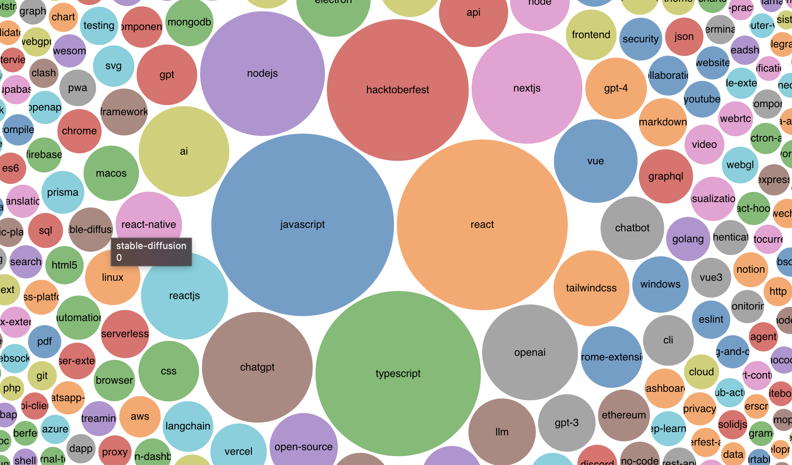

今年も GitHub トレンドから 2023 年の JavaScript/TypeScript を振り返ります。去年の記事はこちらです。

— [GitHub のトレンドで振り返る 2022 年の JavaScript | WEB EGG](https://blog.leko.jp/post/2022-javascript-typescript-trending-history/)

## 集計方法

（去年と同じです、知ってる方は読み飛ばしてください）

本記事の集計期間は 2023/01/01〜2023/12/07、対象言語は JavaScript および TypeScript です。  
なお **GitHub がそのリポジトリをなんの言語と見なしてトレンドに掲載したかをもとに集計対象を決定していることにご留意ください。** 別言語で書かれた Rust 製の JS 向けのツールや CSS フレームワークなどは基本的に対象外となります。

集計に利用したデータですが、GitHub は過去のトレンドを閲覧する方法を提供していないため、独自の仕組みで GitHub トレンドのアーカイブを生成しそのデータを利用しました。毎日 UTC 0 時ごろにデータ取得処理が走り、日毎のディレクトリの中にその時点でのトレンドの内容を CSV 化した`言語名.csv`が作成されます。

当記事では集計期間の全ての`javascript.csv`と`typescript.csv`をマージし、リポジトリの作成日やリポジトリのトピック、今年に獲得した star 数などのいくつかのメタ情報を追加取得する集計スクリプトでサマリーデータを生成しました。

- トレンドのアーカイブ（CSV）は[こちら](https://github.com/Leko/github-trending-archive/tree/main/archive/raw)
  - JS/TS に限らず[こちら](https://github.com/Leko/github-trending-archive/tree/main/packages/collector/src/main.ts#L10)に定義された言語が蓄積されています
- 集計スクリプトは[こちら](https://github.com/Leko/github-trending-archive/blob/main/packages/summarize/src/main.ts)
  - CLI 引数で集計期間と言語を指定したサマリーデータが生成できるので、もし機会があれば使ってみてください
- 実際に生成されたサマリーデータは[こちら](https://docs.google.com/spreadsheets/d/1ZSdw70KbQasTbYF251Sv6paGhMSC8qSB7SgnY0h2d_c/edit?usp=sharing)

## 2023 年に作られた・2023 年から流行ったリポジトリ

まずは今年作られた・今年から流行ったリポジトリの紹介です。リポジトリの作成日を考慮せずトレンドの掲載回数やスター数だけで集計すると既知のリポジトリばかりになるので今年からトレンドになったリポジトリに絞って紹介します。

抽出条件:

- 2023/01/01 時点でスター数が 100 未満
- 集計期間のスター数の差分が+5000 以上
- 今年獲得したスター数が大きい順にソート

一覧:

- [Chanzhaoyu/chatgpt-web](https://github.com/Chanzhaoyu/chatgpt-web) +28480(37 → 28517)
- [reworkd/AgentGPT](https://github.com/reworkd/AgentGPT) +27795(83 → 27878)
- [FuelLabs/fuels-ts](https://github.com/FuelLabs/fuels-ts) +19522(95 → 19617)
- [mckaywrigley/chatbot-ui](https://github.com/mckaywrigley/chatbot-ui) +18932(96 → 19028)
- [getcursor/cursor](https://github.com/getcursor/cursor) +18725(38 → 18763)
- [FlowiseAI/Flowise](https://github.com/FlowiseAI/Flowise) +18373(43 → 18416)
- [Bin-Huang/chatbox](https://github.com/Bin-Huang/chatbox) +15707(20 → 15727)
- [motion-canvas/motion-canvas](https://github.com/motion-canvas/motion-canvas) +14070(31 → 14101)
- [mayooear/gpt4-pdf-chatbot-langchain](https://github.com/mayooear/gpt4-pdf-chatbot-langchain) +13840(21 → 13861)
- [logspace-ai/langflow](https://github.com/logspace-ai/langflow) +13649(50 → 13699)
- [cocktailpeanut/dalai](https://github.com/cocktailpeanut/dalai) +12954(4 → 12958)
- [xcanwin/KeepChatGPT](https://github.com/xcanwin/KeepChatGPT) +12574(53 → 12627)
- [immersive-translate/immersive-translate](https://github.com/immersive-translate/immersive-translate) +12083(84 → 12167)
- [yoavbls/pretty-ts-errors](https://github.com/yoavbls/pretty-ts-errors) +11782(18 → 11800)
- [SawyerHood/draw-a-ui](https://github.com/SawyerHood/draw-a-ui) +11683(41 → 11724)
- [ixahmedxi/noodle](https://github.com/ixahmedxi/noodle) +11041(38 → 11079)
- [getumbrel/llama-gpt](https://github.com/getumbrel/llama-gpt) +9537(33 → 9570)
- [steven-tey/novel](https://github.com/steven-tey/novel) +9415(68 → 9483)
- [dice2o/BingGPT](https://github.com/dice2o/BingGPT) +9278(13 → 9291)
- [hwchase17/langchainjs](https://github.com/hwchase17/langchainjs) +9199(50 → 9249)
- [langchain-ai/langchainjs](https://github.com/langchain-ai/langchainjs) +9198(55 → 9253)
- [josStorer/chatGPTBox](https://github.com/josStorer/chatGPTBox) +9058(18 → 9076)
- [Nutlope/roomGPT](https://github.com/Nutlope/roomGPT) +8806(4 → 8810)
- [chathub-dev/chathub](https://github.com/chathub-dev/chathub) +8673(19 → 8692)
- [BloopAI/bloop](https://github.com/BloopAI/bloop) +8091(44 → 8135)
- [mlc-ai/web-llm](https://github.com/mlc-ai/web-llm) +7927(32 → 7959)
- [Stability-AI/StableStudio](https://github.com/Stability-AI/StableStudio) +7898(8 → 7906)
- [gibbok/typescript-book](https://github.com/gibbok/typescript-book) +7738(12 → 7750)
- [anse-app/chatgpt-demo](https://github.com/anse-app/chatgpt-demo) +7653(7 → 7660)
- [ddiu8081/chatgpt-demo](https://github.com/ddiu8081/chatgpt-demo) +7651(7 → 7658)
- [microsoft/inshellisense](https://github.com/microsoft/inshellisense) +7531(60 → 7591)
- [OptimalScale/LMFlow](https://github.com/OptimalScale/LMFlow) +7481(5 → 7486)
- [microsoft/TypeChat](https://github.com/microsoft/TypeChat) +7154(21 → 7175)
- [total-typescript/ts-reset](https://github.com/total-typescript/ts-reset) +7153(14 → 7167)
- [chaitin/safeline](https://github.com/chaitin/safeline) +7034(88 → 7122)
- [xiangsx/gpt4free-ts](https://github.com/xiangsx/gpt4free-ts) +6856(39 → 6895)
- [Nutlope/aicommits](https://github.com/Nutlope/aicommits) +6699(9 → 6708)
- [ztjhz/BetterChatGPT](https://github.com/ztjhz/BetterChatGPT) +6637(46 → 6683)
- [ztjhz/ChatGPTFreeApp](https://github.com/ztjhz/ChatGPTFreeApp) +6637(46 → 6683)
- [ztjhz/FreeChatGPT](https://github.com/ztjhz/FreeChatGPT) +6637(46 → 6683)
- [Pylogmon/pot](https://github.com/Pylogmon/pot) +6526(12 → 6538)
- [pot-app/pot-desktop](https://github.com/pot-app/pot-desktop) +6518(68 → 6586)
- [Lissy93/web-check](https://github.com/Lissy93/web-check) +6236(5 → 6241)
- [highlight/highlight](https://github.com/highlight/highlight) +6048(10 → 6058)
- [OpenBMB/XAgent](https://github.com/OpenBMB/XAgent) +5978(51 → 6029)
- [nat/openplayground](https://github.com/nat/openplayground) +5778(20 → 5798)
- [l15y/wenda](https://github.com/l15y/wenda) +5755(19 → 5774)
- [wenda-LLM/wenda](https://github.com/wenda-LLM/wenda) +5755(19 → 5774)
- [spdustin/ChatGPT-AutoExpert](https://github.com/spdustin/ChatGPT-AutoExpert) +5689(95 → 5784)
- [a16z-infra/ai-town](https://github.com/a16z-infra/ai-town) +5659(15 → 5674)
- [e2b-dev/e2b](https://github.com/e2b-dev/e2b) +5617(9 → 5626)
- [twentyhq/twenty](https://github.com/twentyhq/twenty) +5557(42 → 5599)
- [midudev/aprendiendo-react](https://github.com/midudev/aprendiendo-react) +5514(64 → 5578)
- [Shaunwei/RealChar](https://github.com/Shaunwei/RealChar) +5495(5 → 5500)
- [a16z-infra/companion-app](https://github.com/a16z-infra/companion-app) +5486(10 → 5496)
- [tjy-gitnub/win12](https://github.com/tjy-gitnub/win12) +5459(96 → 5555)
- [rockbenben/ChatGPT-Shortcut](https://github.com/rockbenben/ChatGPT-Shortcut) +5424(13 → 5437)
- [emilkowalski/sonner](https://github.com/emilkowalski/sonner) +5322(22 → 5344)
- [hyperdxio/hyperdx](https://github.com/hyperdxio/hyperdx) +5269(19 → 5288)
- [vercel-labs/ai](https://github.com/vercel-labs/ai) +5254(56 → 5310)
- [vercel/ai](https://github.com/vercel/ai) +5254(56 → 5310)
- [Licoy/ChatGPT-Midjourney](https://github.com/Licoy/ChatGPT-Midjourney) +5215(13 → 5228)
- [xenova/transformers.js](https://github.com/xenova/transformers.js) +5072(67 → 5139)

## Chanzhaoyu/chatgpt-web

> 用 Express 和 Vue3 搭建的 ChatGPT 演示网页
> [Chanzhaoyu/chatgpt-web](https://github.com/Chanzhaoyu/chatgpt-web)

{TODO}

## reworkd/AgentGPT

> 🤖 Assemble, configure, and deploy autonomous AI Agents in your browser.
> [reworkd/AgentGPT](https://github.com/reworkd/AgentGPT)

{TODO}

## FuelLabs/fuels-ts

> Fuel Network Typescript SDK
> [FuelLabs/fuels-ts](https://github.com/FuelLabs/fuels-ts)

{TODO}

## mckaywrigley/chatbot-ui

> An open source ChatGPT UI.
> [mckaywrigley/chatbot-ui](https://github.com/mckaywrigley/chatbot-ui)

{TODO}

## getcursor/cursor

> An AI-powered code editor based on VSCode 🤖
> [getcursor/cursor](https://github.com/getcursor/cursor)

{TODO}

## FlowiseAI/Flowise

> Drag & drop UI to build your customized LLM flow
> [FlowiseAI/Flowise](https://github.com/FlowiseAI/Flowise)

{TODO}

## Bin-Huang/chatbox

> Chatbox is a desktop app for multiple cutting-edge LLM models, available on Windows, Mac, Linux
> [Bin-Huang/chatbox](https://github.com/Bin-Huang/chatbox)

{TODO}

## motion-canvas/motion-canvas

> Visualize Your Ideas With Code
> [motion-canvas/motion-canvas](https://github.com/motion-canvas/motion-canvas)

{TODO}

## mayooear/gpt4-pdf-chatbot-langchain

> GPT4 & LangChain Chatbot for large PDF docs
> [mayooear/gpt4-pdf-chatbot-langchain](https://github.com/mayooear/gpt4-pdf-chatbot-langchain)

{TODO}

## logspace-ai/langflow

> ⛓️ Langflow is a UI for LangChain, designed with react-flow to provide an effortless way to experiment and prototype flows.
> [logspace-ai/langflow](https://github.com/logspace-ai/langflow)

{TODO}

## cocktailpeanut/dalai

> The simplest way to run LLaMA on your local machine
> [cocktailpeanut/dalai](https://github.com/cocktailpeanut/dalai)

{TODO}

## xcanwin/KeepChatGPT

> 这是一款提高 ChatGPT 的数据安全能力和效率的插件。并且免费共享大量创新功能，如：自动刷新、保持活跃、数据安全、取消审计、克隆对话、言无不尽、净化页面、展示大屏、展示全屏、拦截跟踪、日新月异等。让我们的 AI 体验无比安全、顺畅、丝滑、高效、简洁。
> [xcanwin/KeepChatGPT](https://github.com/xcanwin/KeepChatGPT)

{TODO}

## immersive-translate/immersive-translate

> 沉浸式双语网页翻译扩展 , 支持输入框翻译， 鼠标悬停翻译， PDF, Epub, 字幕文件, TXT 文件翻译 - Immersive Dual Web Page Translation Extension
> [immersive-translate/immersive-translate](https://github.com/immersive-translate/immersive-translate)

{TODO}

## yoavbls/pretty-ts-errors

> 🔵 Make TypeScript errors prettier and human-readable in VSCode 🎀
> [yoavbls/pretty-ts-errors](https://github.com/yoavbls/pretty-ts-errors)

{TODO}

## SawyerHood/draw-a-ui

> Draw a mockup and generate html for it
> [SawyerHood/draw-a-ui](https://github.com/SawyerHood/draw-a-ui)

{TODO}

## ixahmedxi/noodle

> Open Source Education Platform
> [ixahmedxi/noodle](https://github.com/ixahmedxi/noodle)

{TODO}

## getumbrel/llama-gpt

> A self-hosted, offline, ChatGPT-like chatbot. Powered by Llama 2. 100% private, with no data leaving your device. New: Code Llama support!
> [getumbrel/llama-gpt](https://github.com/getumbrel/llama-gpt)

{TODO}

## steven-tey/novel

> Notion-style WYSIWYG editor with AI-powered autocompletion.
> [steven-tey/novel](https://github.com/steven-tey/novel)

{TODO}

## dice2o/BingGPT

> Desktop application of new Bing's AI-powered chat (Windows, macOS and Linux)
> [dice2o/BingGPT](https://github.com/dice2o/BingGPT)

{TODO}

## hwchase17/langchainjs

> [hwchase17/langchainjs](https://github.com/hwchase17/langchainjs)

{TODO}

## langchain-ai/langchainjs

> [langchain-ai/langchainjs](https://github.com/langchain-ai/langchainjs)

{TODO}

## josStorer/chatGPTBox

> Integrating ChatGPT into your browser deeply, everything you need is here
> [josStorer/chatGPTBox](https://github.com/josStorer/chatGPTBox)

{TODO}

## Nutlope/roomGPT

> Upload a photo of your room to generate your dream room with AI.
> [Nutlope/roomGPT](https://github.com/Nutlope/roomGPT)

{TODO}

## chathub-dev/chathub

> All-in-one chatbot client
> [chathub-dev/chathub](https://github.com/chathub-dev/chathub)

{TODO}

## BloopAI/bloop

> bloop is a fast code search engine written in Rust.
> [BloopAI/bloop](https://github.com/BloopAI/bloop)

{TODO}

## mlc-ai/web-llm

> Bringing large-language models and chat to web browsers. Everything runs inside the browser with no server support.
> [mlc-ai/web-llm](https://github.com/mlc-ai/web-llm)

{TODO}

## Stability-AI/StableStudio

> Community interface for generative AI
> [Stability-AI/StableStudio](https://github.com/Stability-AI/StableStudio)

{TODO}

## gibbok/typescript-book

> The Concise TypeScript Book: A Concise Guide to Effective Development in TypeScript. Free and Open Source.
> [gibbok/typescript-book](https://github.com/gibbok/typescript-book)

{TODO}

## anse-app/chatgpt-demo

> Minimal web UI for ChatGPT.
> [anse-app/chatgpt-demo](https://github.com/anse-app/chatgpt-demo)

{TODO}

## ddiu8081/chatgpt-demo

> Minimal web UI for ChatGPT.
> [ddiu8081/chatgpt-demo](https://github.com/ddiu8081/chatgpt-demo)

{TODO}

## microsoft/inshellisense

> IDE style command line auto complete
> [microsoft/inshellisense](https://github.com/microsoft/inshellisense)

{TODO}

## OptimalScale/LMFlow

> An Extensible Toolkit for Finetuning and Inference of Large Foundation Models. Large Models for All.
> [OptimalScale/LMFlow](https://github.com/OptimalScale/LMFlow)

{TODO}

## microsoft/TypeChat

> TypeChat is a library that makes it easy to build natural language interfaces using types.
> [microsoft/TypeChat](https://github.com/microsoft/TypeChat)

{TODO}

## total-typescript/ts-reset

> A 'CSS reset' for TypeScript, improving types for common JavaScript API's
> [total-typescript/ts-reset](https://github.com/total-typescript/ts-reset)

{TODO}

## chaitin/safeline

> 一款足够简单、足够好用、足够强的免费 WAF。基于业界领先的语义引擎检测技术，作为反向代理接入，保护你的网站不受黑客攻击。
> [chaitin/safeline](https://github.com/chaitin/safeline)

{TODO}

## xiangsx/gpt4free-ts

> Providing a free OpenAI GPT-4 API ! This is a replication project for the typescript version of xtekky/gpt4free
> [xiangsx/gpt4free-ts](https://github.com/xiangsx/gpt4free-ts)

{TODO}

## Nutlope/aicommits

> A CLI that writes your git commit messages for you with AI
> [Nutlope/aicommits](https://github.com/Nutlope/aicommits)

{TODO}

## ztjhz/BetterChatGPT

> An amazing UI for OpenAI's ChatGPT (Website + Windows + MacOS + Linux)
> [ztjhz/BetterChatGPT](https://github.com/ztjhz/BetterChatGPT)

{TODO}

## ztjhz/ChatGPTFreeApp

> An amazing UI for OpenAI's ChatGPT (Website + Windows + MacOS + Linux)
> [ztjhz/ChatGPTFreeApp](https://github.com/ztjhz/ChatGPTFreeApp)

{TODO}

## ztjhz/FreeChatGPT

> An amazing UI for OpenAI's ChatGPT (Website + Windows + MacOS + Linux)
> [ztjhz/FreeChatGPT](https://github.com/ztjhz/FreeChatGPT)

{TODO}

## Pylogmon/pot

> 🌈 一个跨平台的划词翻译和 OCR 软件 | A cross-platform software for text translation and recognize.
> [Pylogmon/pot](https://github.com/Pylogmon/pot)

{TODO}

## pot-app/pot-desktop

> 🌈 一个跨平台的划词翻译和 OCR 软件 | A cross-platform software for text translation and recognize.
> [pot-app/pot-desktop](https://github.com/pot-app/pot-desktop)

{TODO}

## Lissy93/web-check

> 🕵️‍♂️ All-in-one OSINT tool for analysing any website
> [Lissy93/web-check](https://github.com/Lissy93/web-check)

{TODO}

## highlight/highlight

> highlight.io: The open source, full-stack monitoring platform. Error monitoring, session replay, logging and more.
> [highlight/highlight](https://github.com/highlight/highlight)

{TODO}

## OpenBMB/XAgent

> An Autonomous LLM Agent for Complex Task Solving
> [OpenBMB/XAgent](https://github.com/OpenBMB/XAgent)

{TODO}

## nat/openplayground

> An LLM playground you can run on your laptop
> [nat/openplayground](https://github.com/nat/openplayground)

{TODO}

## l15y/wenda

> 闻达：一个 LLM 调用平台。目标为针对特定环境的高效内容生成，同时考虑个人和中小企业的计算资源局限性，以及知识安全和私密性问题
> [l15y/wenda](https://github.com/l15y/wenda)

{TODO}

## wenda-LLM/wenda

> 闻达：一个 LLM 调用平台。目标为针对特定环境的高效内容生成，同时考虑个人和中小企业的计算资源局限性，以及知识安全和私密性问题
> [wenda-LLM/wenda](https://github.com/wenda-LLM/wenda)

{TODO}

## spdustin/ChatGPT-AutoExpert

> 🚀🧠💬 Supercharged Custom Instructions for ChatGPT (non-coding) and ChatGPT Advanced Data Analysis (coding).
> [spdustin/ChatGPT-AutoExpert](https://github.com/spdustin/ChatGPT-AutoExpert)

{TODO}

## a16z-infra/ai-town

> A MIT-licensed, deployable starter kit for building and customizing your own version of AI town - a virtual town where AI characters live, chat and socialize.
> [a16z-infra/ai-town](https://github.com/a16z-infra/ai-town)

{TODO}

## e2b-dev/e2b

> Secure sandboxed cloud environments made for AI agents and AI apps
> [e2b-dev/e2b](https://github.com/e2b-dev/e2b)

{TODO}

## twentyhq/twenty

> Building a modern alternative to Salesforce, powered by the community.
> [twentyhq/twenty](https://github.com/twentyhq/twenty)

{TODO}

## midudev/aprendiendo-react

> Curso para aprender React desde cero
> [midudev/aprendiendo-react](https://github.com/midudev/aprendiendo-react)

{TODO}

## Shaunwei/RealChar

> 🎙️🤖Create, Customize and Talk to your AI Character/Companion in Realtime (All in One Codebase!). Have a natural seamless conversation with AI everywhere (mobile, web and terminal) using LLM OpenAI GPT3.5/4, Anthropic Claude2, Chroma Vector DB, Whisper Speech2Text, ElevenLabs Text2Speech🎙️🤖
> [Shaunwei/RealChar](https://github.com/Shaunwei/RealChar)

{TODO}

## a16z-infra/companion-app

> AI companions with memory: a lightweight stack to create and host your own AI companions
> [a16z-infra/companion-app](https://github.com/a16z-infra/companion-app)

{TODO}

## tjy-gitnub/win12

> Windows 12 网页版，在线体验 点击下面的链接在线体验
> [tjy-gitnub/win12](https://github.com/tjy-gitnub/win12)

{TODO}

## rockbenben/ChatGPT-Shortcut

> 🚀💪Maximize your efficiency and productivity, support for English,中文,Español,العربية. 让生产力加倍的 AI 快捷指令。更有效地定制、保存和分享自己的提示词。在提示词分享社区中，轻松找到适用于不同场景的指令。
> [rockbenben/ChatGPT-Shortcut](https://github.com/rockbenben/ChatGPT-Shortcut)

{TODO}

## emilkowalski/sonner

> An opinionated toast component for React.
> [emilkowalski/sonner](https://github.com/emilkowalski/sonner)

{TODO}

## hyperdxio/hyperdx

> Resolve production issues, fast. An open source observability platform unifying session replays, logs, metrics, traces and errors.
> [hyperdxio/hyperdx](https://github.com/hyperdxio/hyperdx)

{TODO}

## vercel-labs/ai

> Build AI-powered applications with React, Svelte, Vue, and Solid
> [vercel-labs/ai](https://github.com/vercel-labs/ai)

{TODO}

## vercel/ai

> Build AI-powered applications with React, Svelte, Vue, and Solid
> [vercel/ai](https://github.com/vercel/ai)

{TODO}

## Licoy/ChatGPT-Midjourney

> 🍭 一键拥有你自己的 ChatGPT+Midjourney 网页服务 | Own your own ChatGPT+Midjourney web service with one click
> [Licoy/ChatGPT-Midjourney](https://github.com/Licoy/ChatGPT-Midjourney)

{TODO}

## xenova/transformers.js

> State-of-the-art Machine Learning for the web. Run 🤗 Transformers directly in your browser, with no need for a server!
> [xenova/transformers.js](https://github.com/xenova/transformers.js)

{TODO}

## 2023 年にもっともスターを獲得したリポジトリ

次に新しいか否かに関わらず 2023 年もっともスターを獲得したリポジトリを見ていきます。

抽出条件:

- 2023 年に一回以上トレンドに載ったリポジトリ
- 今年獲得したスター数が大きい順にソート
- 上位 20 件抽出

ここまでの内容と重複しているものは~~取り消し線~~を入れてます

- [Significant-Gravitas/AutoGPT](https://github.com/Significant-Gravitas/AutoGPT) +154435(141 → 154576)
- [Yidadaa/ChatGPT-Next-Web](https://github.com/Yidadaa/ChatGPT-Next-Web) +52897(279 → 53176)
- [awesome-selfhosted/awesome-selfhosted](https://github.com/awesome-selfhosted/awesome-selfhosted) +47134(112428 → 159562)
- [kamranahmedse/developer-roadmap](https://github.com/kamranahmedse/developer-roadmap) +40119(219959 → 260078)
- [shadcn-ui/ui](https://github.com/shadcn-ui/ui) +36357(263 → 36620)
- [shadcn/ui](https://github.com/shadcn/ui) +36357(263 → 36620)
- [Chanzhaoyu/chatgpt-web](https://github.com/Chanzhaoyu/chatgpt-web) +28480(37 → 28517)
- [reworkd/AgentGPT](https://github.com/reworkd/AgentGPT) +27795(83 → 27878)
- [abi/screenshot-to-code](https://github.com/abi/screenshot-to-code) +27496(625 → 28121)
- [StanGirard/quivr](https://github.com/StanGirard/quivr) +25897(136 → 26033)
- [freeCodeCamp/freeCodeCamp](https://github.com/freeCodeCamp/freeCodeCamp) +23767(355185 → 378952)
- [trekhleb/javascript-algorithms](https://github.com/trekhleb/javascript-algorithms) +22532(155859 → 178391)
- [excalidraw/excalidraw](https://github.com/excalidraw/excalidraw) +22128(38014 → 60142)
- [makeplane/plane](https://github.com/makeplane/plane) +19656(341 → 19997)
- [yangshun/tech-interview-handbook](https://github.com/yangshun/tech-interview-handbook) +19526(83225 → 102751)
- [FuelLabs/fuels-ts](https://github.com/FuelLabs/fuels-ts) +19522(95 → 19617)
- [facebook/react](https://github.com/facebook/react) +19121(196942 → 216063)
- [vercel/next.js](https://github.com/vercel/next.js) +19059(96496 → 115555)
- [openai-translator/openai-translator](https://github.com/openai-translator/openai-translator) +19004(119 → 19123)
- [yetone/openai-translator](https://github.com/yetone/openai-translator) +19001(128 → 19129)

## Significant-Gravitas/AutoGPT

> AutoGPT is the vision of accessible AI for everyone, to use and to build on. Our mission is to provide the tools, so that you can focus on what matters.
> [Significant-Gravitas/AutoGPT](https://github.com/Significant-Gravitas/AutoGPT)

{TODO}

## Yidadaa/ChatGPT-Next-Web

> A well-designed cross-platform ChatGPT UI (Web / PWA / Linux / Win / MacOS). 一键拥有你自己的跨平台 ChatGPT 应用。
> [Yidadaa/ChatGPT-Next-Web](https://github.com/Yidadaa/ChatGPT-Next-Web)

{TODO}

## awesome-selfhosted/awesome-selfhosted

> A list of Free Software network services and web applications which can be hosted on your own servers
> [awesome-selfhosted/awesome-selfhosted](https://github.com/awesome-selfhosted/awesome-selfhosted)

{TODO}

## kamranahmedse/developer-roadmap

> Interactive roadmaps, guides and other educational content to help developers grow in their careers.
> [kamranahmedse/developer-roadmap](https://github.com/kamranahmedse/developer-roadmap)

{TODO}

## shadcn-ui/ui

> Beautifully designed components built with Radix UI and Tailwind CSS.
> [shadcn-ui/ui](https://github.com/shadcn-ui/ui)

{TODO}

## shadcn/ui

> Beautifully designed components built with Radix UI and Tailwind CSS.
> [shadcn/ui](https://github.com/shadcn/ui)

{TODO}

## Chanzhaoyu/chatgpt-web

> 用 Express 和 Vue3 搭建的 ChatGPT 演示网页
> [Chanzhaoyu/chatgpt-web](https://github.com/Chanzhaoyu/chatgpt-web)

{TODO}

## reworkd/AgentGPT

> 🤖 Assemble, configure, and deploy autonomous AI Agents in your browser.
> [reworkd/AgentGPT](https://github.com/reworkd/AgentGPT)

{TODO}

## abi/screenshot-to-code

> Drop in a screenshot and convert it to clean code (HTML/Tailwind/React/Vue)
> [abi/screenshot-to-code](https://github.com/abi/screenshot-to-code)

{TODO}

## StanGirard/quivr

> Your GenAI Second Brain 🧠 A personal productivity assistant (RAG) ⚡️🤖 Chat with your docs (PDF, CSV, ...) & apps using Langchain, GPT 3.5 / 4 turbo, Private, Anthropic, VertexAI, Ollama, LLMs, that you can share with users ! Local & Private alternative to OpenAI GPTs & ChatGPT powered by retrieval-augmented generation
> [StanGirard/quivr](https://github.com/StanGirard/quivr)

{TODO}

## freeCodeCamp/freeCodeCamp

> freeCodeCamp.org's open-source codebase and curriculum. Learn to code for free.
> [freeCodeCamp/freeCodeCamp](https://github.com/freeCodeCamp/freeCodeCamp)

{TODO}

## trekhleb/javascript-algorithms

> 📝 Algorithms and data structures implemented in JavaScript with explanations and links to further readings
> [trekhleb/javascript-algorithms](https://github.com/trekhleb/javascript-algorithms)

{TODO}

## excalidraw/excalidraw

> Virtual whiteboard for sketching hand-drawn like diagrams
> [excalidraw/excalidraw](https://github.com/excalidraw/excalidraw)

{TODO}

## makeplane/plane

> 🔥 🔥 🔥 Open Source JIRA, Linear and Height Alternative. Plane helps you track your issues, epics, and product roadmaps in the simplest way possible.
> [makeplane/plane](https://github.com/makeplane/plane)

{TODO}

## yangshun/tech-interview-handbook

> 💯 Curated coding interview preparation materials for busy software engineers
> [yangshun/tech-interview-handbook](https://github.com/yangshun/tech-interview-handbook)

{TODO}

## FuelLabs/fuels-ts

> Fuel Network Typescript SDK
> [FuelLabs/fuels-ts](https://github.com/FuelLabs/fuels-ts)

{TODO}

## facebook/react

> The library for web and native user interfaces.
> [facebook/react](https://github.com/facebook/react)

{TODO}

## vercel/next.js

> The React Framework
> [vercel/next.js](https://github.com/vercel/next.js)

{TODO}

## openai-translator/openai-translator

> 基于 ChatGPT API 的划词翻译浏览器插件和跨平台桌面端应用 - Browser extension and cross-platform desktop application for translation based on ChatGPT API.
> [openai-translator/openai-translator](https://github.com/openai-translator/openai-translator)

{TODO}

## yetone/openai-translator

> 基于 ChatGPT API 的划词翻译浏览器插件和跨平台桌面端应用 - Browser extension and cross-platform desktop application for translation based on ChatGPT API.
> [yetone/openai-translator](https://github.com/yetone/openai-translator)

{TODO}

## Node.js 関連のトピックに絞った場合

次に Node.js に関連したトピックを持ったリポジトリを比較します。

抽出条件:

- 2023 年に一回以上トレンドに載った`nodejs-framework`, `node-js`, `node`, `nodejs`いずれかのトピックがついているリポジトリ
- 集計期間のスター数の差分が +5000 以上
- 獲得したスター数が多い順にソートし上位 20 件抽出

ここまでの内容と重複しているものは~~取り消し線~~を入れてます

- [kamranahmedse/developer-roadmap](https://github.com/kamranahmedse/developer-roadmap) +40119(219959 → 260078)
- [freeCodeCamp/freeCodeCamp](https://github.com/freeCodeCamp/freeCodeCamp) +23767(355185 → 378952)
- [vercel/next.js](https://github.com/vercel/next.js) +19059(96496 → 115555)
- [immich-app/immich](https://github.com/immich-app/immich) +15646(6576 → 22222)
- [novuhq/novu](https://github.com/novuhq/novu) +15604(15645 → 31249)
- [drizzle-team/drizzle-orm](https://github.com/drizzle-team/drizzle-orm) +15298(140 → 15438)
- [withastro/astro](https://github.com/withastro/astro) +14348(23359 → 37707)
- [30-seconds/30-seconds-of-code](https://github.com/30-seconds/30-seconds-of-code) +12151(104637 → 116788)
- [Chalarangelo/30-seconds-of-code](https://github.com/Chalarangelo/30-seconds-of-code) +12151(104636 → 116787)
- [goldbergyoni/nodebestpractices](https://github.com/goldbergyoni/nodebestpractices) +10593(83469 → 94062)
- [ToolJet/ToolJet](https://github.com/ToolJet/ToolJet) +10125(15162 → 25287)
- [nodejs/node](https://github.com/nodejs/node) +9560(91035 → 100595)
- [Asabeneh/30-Days-Of-JavaScript](https://github.com/Asabeneh/30-Days-Of-JavaScript) +9203(30330 → 39533)
- [nestjs/nest](https://github.com/nestjs/nest) +9183(52318 → 61501)
- [n8n-io/n8n](https://github.com/n8n-io/n8n) +8809(26852 → 35661)
- [nuxt/nuxt](https://github.com/nuxt/nuxt) +7883(41081 → 48964)
- [benphelps/homepage](https://github.com/benphelps/homepage) +7881(3336 → 11217)
- [gethomepage/homepage](https://github.com/gethomepage/homepage) +7879(3351 → 11230)
- [Infisical/infisical](https://github.com/Infisical/infisical) +7787(2555 → 10342)
- [strapi/strapi](https://github.com/strapi/strapi) +7717(50012 → 57729)

## kamranahmedse/developer-roadmap

> Interactive roadmaps, guides and other educational content to help developers grow in their careers.
> [kamranahmedse/developer-roadmap](https://github.com/kamranahmedse/developer-roadmap)

{TODO}

## freeCodeCamp/freeCodeCamp

> freeCodeCamp.org's open-source codebase and curriculum. Learn to code for free.
> [freeCodeCamp/freeCodeCamp](https://github.com/freeCodeCamp/freeCodeCamp)

{TODO}

## vercel/next.js

> The React Framework
> [vercel/next.js](https://github.com/vercel/next.js)

{TODO}

## immich-app/immich

> Self-hosted photo and video backup solution directly from your mobile phone.
> [immich-app/immich](https://github.com/immich-app/immich)

{TODO}

## novuhq/novu

> 🔥 The open-source notification infrastructure with fully functional embedded notification center 🚀🚀🚀
> [novuhq/novu](https://github.com/novuhq/novu)

{TODO}

## drizzle-team/drizzle-orm

> TypeScript ORM that feels like writing SQL.
> [drizzle-team/drizzle-orm](https://github.com/drizzle-team/drizzle-orm)

{TODO}

## withastro/astro

> The web framework that scales with you — Build fast content sites, powerful web applications, dynamic server APIs, and everything in-between ⭐️ Star to support our work!
> [withastro/astro](https://github.com/withastro/astro)

{TODO}

## 30-seconds/30-seconds-of-code

> Short code snippets for all your development needs
> [30-seconds/30-seconds-of-code](https://github.com/30-seconds/30-seconds-of-code)

{TODO}

## Chalarangelo/30-seconds-of-code

> Short code snippets for all your development needs
> [Chalarangelo/30-seconds-of-code](https://github.com/Chalarangelo/30-seconds-of-code)

{TODO}

## goldbergyoni/nodebestpractices

> :white_check_mark: The Node.js best practices list (December 2023)
> [goldbergyoni/nodebestpractices](https://github.com/goldbergyoni/nodebestpractices)

{TODO}

## ToolJet/ToolJet

> Low-code platform for building business applications. Connect to databases, cloud storages, GraphQL, API endpoints, Airtable, Google sheets, OpenAI, etc and build apps using drag and drop application builder. Built using JavaScript/TypeScript. 🚀
> [ToolJet/ToolJet](https://github.com/ToolJet/ToolJet)

{TODO}

## nodejs/node

> Node.js JavaScript runtime ✨🐢🚀✨
> [nodejs/node](https://github.com/nodejs/node)

{TODO}

## Asabeneh/30-Days-Of-JavaScript

> 30 days of JavaScript programming challenge is a step-by-step guide to learn JavaScript programming language in 30 days. This challenge may take more than 100 days, please just follow your own pace. These videos may help too: https://www.youtube.com/channel/UC7PNRuno1rzYPb1xLa4yktw > [Asabeneh/30-Days-Of-JavaScript](https://github.com/Asabeneh/30-Days-Of-JavaScript)

{TODO}

## nestjs/nest

> A progressive Node.js framework for building efficient, scalable, and enterprise-grade server-side applications with TypeScript/JavaScript 🚀
> [nestjs/nest](https://github.com/nestjs/nest)

{TODO}

## n8n-io/n8n

> Free and source-available fair-code licensed workflow automation tool. Easily automate tasks across different services.
> [n8n-io/n8n](https://github.com/n8n-io/n8n)

{TODO}

## nuxt/nuxt

> The Intuitive Vue Framework.
> [nuxt/nuxt](https://github.com/nuxt/nuxt)

{TODO}

## benphelps/homepage

> A highly customizable homepage (or startpage / application dashboard) with Docker and service API integrations.
> [benphelps/homepage](https://github.com/benphelps/homepage)

{TODO}

## gethomepage/homepage

> A highly customizable homepage (or startpage / application dashboard) with Docker and service API integrations.
> [gethomepage/homepage](https://github.com/gethomepage/homepage)

{TODO}

## Infisical/infisical

> ♾ Infisical is the open-source secret management platform: Sync secrets across your team/infrastructure and prevent secret leaks.
> [Infisical/infisical](https://github.com/Infisical/infisical)

{TODO}

## strapi/strapi

> 🚀 Strapi is the leading open-source headless CMS. It’s 100% JavaScript/TypeScript, fully customizable and developer-first.
> [strapi/strapi](https://github.com/strapi/strapi)

{TODO}

## トレンドに上がったリポジトリのトピック

今年トレンドに上がったリポジトリのトピックを集計しました。

抽出条件:

- 2023 年に一回以上トレンドに載ったリポジトリ
- 外れ値や表記揺れノイズを減らすため 5 つ以上のリポジトリに付けられたトピックのみ抽出

トピック毎にそのトピックがついたリポジトリ数を円の大きさとしたバブルチャートがこちらになります。なお当記事のサムネイル画像はバブルチャートの中心あたりを一部抜粋したものになります。[こちら](https://observablehq.com/d/22c17976ec0cb485)から SVG で全体を確認できます。

{TODO}

## トレンド常連組

最後に GitHub のトレンド常連組を載せます。

抽出条件:

- 集計期間内にトレンドに載った日数でソートし上位 20 件抽出

リポジトリ:

- [vercel/next.js](https://github.com/vercel/next.js) +19059(96496 → 115555)
- [cypress-io/cypress](https://github.com/cypress-io/cypress) +3865(41452 → 45317)
- [trekhleb/javascript-algorithms](https://github.com/trekhleb/javascript-algorithms) +22532(155859 → 178391)
- [angular/angular](https://github.com/angular/angular) +9207(83602 → 92809)
- [iptv-org/iptv](https://github.com/iptv-org/iptv) +13249(59310 → 72559)
- [microsoft/Web-Dev-For-Beginners](https://github.com/microsoft/Web-Dev-For-Beginners) +17872(60754 → 78626)
- [freeCodeCamp/freeCodeCamp](https://github.com/freeCodeCamp/freeCodeCamp) +23767(355185 → 378952)
- [github/docs](https://github.com/github/docs) +2864(12145 → 15009)
- [OpenZeppelin/openzeppelin-contracts](https://github.com/OpenZeppelin/openzeppelin-contracts) +2734(20603 → 23337)
- [Yidadaa/ChatGPT-Next-Web](https://github.com/Yidadaa/ChatGPT-Next-Web) +52897(279 → 53176)
- [ant-design/ant-design](https://github.com/ant-design/ant-design) +6464(82124 → 88588)
- [supabase/supabase](https://github.com/supabase/supabase) +17793(42631 → 60424)
- [odoo/odoo](https://github.com/odoo/odoo) +4855(27204 → 32059)
- [Asabeneh/30-Days-Of-JavaScript](https://github.com/Asabeneh/30-Days-Of-JavaScript) +9203(30330 → 39533)
- [facebook/react](https://github.com/facebook/react) +19121(196942 → 216063)
- [mrdoob/three.js](https://github.com/mrdoob/three.js) +9328(86857 → 96185)
- [apache/superset](https://github.com/apache/superset) +6307(49204 → 55511)
- [calcom/cal.com](https://github.com/calcom/cal.com) +10840(14531 → 25371)
- [louislam/uptime-kuma](https://github.com/louislam/uptime-kuma) +15735(26832 → 42567)
- [Expensify/App](https://github.com/Expensify/App) +1401(599 → 2000)

## vercel/next.js

> The React Framework
> [vercel/next.js](https://github.com/vercel/next.js)

{TODO}

## cypress-io/cypress

> Fast, easy and reliable testing for anything that runs in a browser.
> [cypress-io/cypress](https://github.com/cypress-io/cypress)

{TODO}

## trekhleb/javascript-algorithms

> 📝 Algorithms and data structures implemented in JavaScript with explanations and links to further readings
> [trekhleb/javascript-algorithms](https://github.com/trekhleb/javascript-algorithms)

{TODO}

## angular/angular

> Deliver web apps with confidence 🚀
> [angular/angular](https://github.com/angular/angular)

{TODO}

## iptv-org/iptv

> Collection of publicly available IPTV channels from all over the world
> [iptv-org/iptv](https://github.com/iptv-org/iptv)

{TODO}

## microsoft/Web-Dev-For-Beginners

> 24 Lessons, 12 Weeks, Get Started as a Web Developer
> [microsoft/Web-Dev-For-Beginners](https://github.com/microsoft/Web-Dev-For-Beginners)

{TODO}

## freeCodeCamp/freeCodeCamp

> freeCodeCamp.org's open-source codebase and curriculum. Learn to code for free.
> [freeCodeCamp/freeCodeCamp](https://github.com/freeCodeCamp/freeCodeCamp)

{TODO}

## github/docs

> The open-source repo for docs.github.com
> [github/docs](https://github.com/github/docs)

{TODO}

## OpenZeppelin/openzeppelin-contracts

> OpenZeppelin Contracts is a library for secure smart contract development.
> [OpenZeppelin/openzeppelin-contracts](https://github.com/OpenZeppelin/openzeppelin-contracts)

{TODO}

## Yidadaa/ChatGPT-Next-Web

> A well-designed cross-platform ChatGPT UI (Web / PWA / Linux / Win / MacOS). 一键拥有你自己的跨平台 ChatGPT 应用。
> [Yidadaa/ChatGPT-Next-Web](https://github.com/Yidadaa/ChatGPT-Next-Web)

{TODO}

## ant-design/ant-design

> An enterprise-class UI design language and React UI library
> [ant-design/ant-design](https://github.com/ant-design/ant-design)

{TODO}

## supabase/supabase

> The open source Firebase alternative.
> [supabase/supabase](https://github.com/supabase/supabase)

{TODO}

## odoo/odoo

> Odoo. Open Source Apps To Grow Your Business.
> [odoo/odoo](https://github.com/odoo/odoo)

{TODO}

## Asabeneh/30-Days-Of-JavaScript

> 30 days of JavaScript programming challenge is a step-by-step guide to learn JavaScript programming language in 30 days. This challenge may take more than 100 days, please just follow your own pace. These videos may help too: https://www.youtube.com/channel/UC7PNRuno1rzYPb1xLa4yktw > [Asabeneh/30-Days-Of-JavaScript](https://github.com/Asabeneh/30-Days-Of-JavaScript)

{TODO}

## facebook/react

> The library for web and native user interfaces.
> [facebook/react](https://github.com/facebook/react)

{TODO}

## mrdoob/three.js

> JavaScript 3D Library.
> [mrdoob/three.js](https://github.com/mrdoob/three.js)

{TODO}

## apache/superset

> Apache Superset is a Data Visualization and Data Exploration Platform
> [apache/superset](https://github.com/apache/superset)

{TODO}

## calcom/cal.com

> Scheduling infrastructure for absolutely everyone.
> [calcom/cal.com](https://github.com/calcom/cal.com)

{TODO}

## louislam/uptime-kuma

> A fancy self-hosted monitoring tool
> [louislam/uptime-kuma](https://github.com/louislam/uptime-kuma)

{TODO}

## Expensify/App

> Welcome to New Expensify: a complete re-imagination of financial collaboration, centered around chat. Help us build the next generation of Expensify by sharing feedback and contributing to the code.
> [Expensify/App](https://github.com/Expensify/App)

{TODO}

今年は{TODO}。良いお年を！
