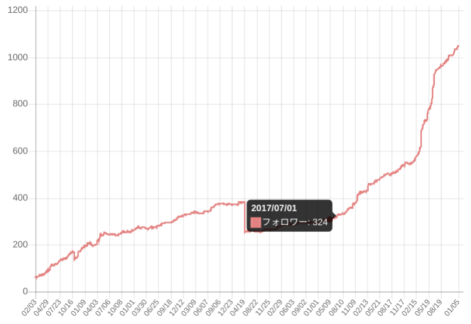

本日で最終出社が終わったので、記録を残しておきます。  
表題の通り、2017 年 7 月から２年半ほど勤めた[株式会社 CureApp](https://cureapp.co.jp/)を退職します。報告と自分語りです。

<!--more-->

## CureAppでやってたこと

治療アプリ&copy;という疾患を治療するアプリを作るソフトウェアエンジニアとして入社しました。スマフォアプリが治療効果を持つ医療機器として承認されるため、薬事や臨床開発などの今まで全く知らなかった医療の世界に貢献できることはなにか、自分がなすべき領分は何かを考えながら仕事してました。  
初仕事は臨床試験のためにアプリを仕上げることと、技術スタックをキャッチアップして[Real World React Native in Agri/Med/Fin Tech](https://connpass.com/event/62895/)というイベントで事例紹介することでした。登壇資料はこちら。

> &mdash; [React Nativeで医療機器作ってます - Speaker Deck](https://speakerdeck.com/leko/react-nativedeyi-liao-ji-qi-zuo-tutemasu)

主な使用技術は React 、患者さんが利用するネイティブアプリは React Native 、サーバサイドは Node.js（express）とすべて JavaScript の構成です。現在はそれらをすべて TypeScript で記述しています。創業当初から「すべて JavaScript」の方針は変わっていないのですが、Titanium → React Native、jQuery → React、Electron → web、Coffee → Flowtype → TypeScript などの時流の変化に合わせてその時々で取るべき技術選択やコードベースのマイグレーションをしてきました。

> &mdash; [実践AST FlowからTypeScriptへの変換](https://talks.leko.jp/transform-flow-to-typescript-using-ast/#0)

最終的な職位は技術部 部長でした。CTOとかVPoEとかではありません。部長として 10 人強のエンジニア組織の人材マネジメントしてました。期初にメンバーと OKR を決め、日々 1on1/CFR でトラッキングして、期末にはメンバーを評価し、プロジェクトの進捗にあわせて役員と QCD やリソースを調整をしたり、中途・業務委託のスカウトや採用面談をしたり、技術的な壁打ち役になったり、プロマネしたり AWS のインフラをポチポチしたりYAML書いたり、社内用のライブラリ作ってメンテしたり、自分の担当プロジェクトのコード書いたりしてました。コード書く以外にもプロダクトのために必要な事があればそれは自分の仕事だと思い仕事をしていました。

> &mdash; [複数プロダクトで利用する共通ライブラリの戦略と運用経験](https://talks.leko.jp/bcu30-library-strategy/)

## CureApp の昔と今

CureApp に入った当初はまだ全員で 10 人ちょっとの小さなスタートアップでした。入社時点でエンジニア社員は4名だったので全員がフルスタックエンジニア的な動きをしていました。エンジニア以外も全員が何かを兼務しており自分の専門性を発揮しながら組織・会社に足りないことをフォローし合う働き方をしていました。私も医療従事者が集う島根の学会に参加しトークを聞いたりお弁当を配ったりもしたし、新（現）オフィスのデザイン業者の選定に加わったりもしました。  
昔の CureApp については AWS Loft で医療系スタートアップが集まるトークイベントみたいなのをログミーさんが記録してくださっているので、そこにリアルな声があるかもしれません。

> &mdash; [試験のたびに数年単位でコードフリーズが発生　「治療アプリ ®︎」開発の知られざる舞台裏 - ログミー Tech](https://logmi.jp/tech/articles/322257)  
> &mdash; [ヘルステックスタートアップのエンジニアたちが語る、ベンチャーの醍醐味と医療・健康領域において大変なこと - ログミー Tech](https://logmi.jp/tech/articles/322358)

最近の CureApp の様子については、BS フジのこの国の行く末 2という番組の取材が入ったのでそちらのアーカイブを見るとイメージしやすいと思います。

> &mdash; [この国の行く末 2 ーテクノロジーの進化とオープンイノベーションー](https://konokuni.jp/#all3793)

入社した当初に居た慕っていた先輩や同僚はほとんど代替わりして、ガラガラだったオフィスもすでに手狭なほど人が増え、調達額も増えプロダクトも増えてフェーズが進み、徐々に大きい職場にってきたなと感慨深く思っています。まさにこれからって時期なんですが、主担当だったプロジェクトのキリが良なったので、今を逃すと次のタイミングはたぶん数年後になるので、ここらで次のキャリアを目指そうと思って転職を選択しました。

## CureApp 入社前の私

CureApp に入社する前は、箱根のお膝元こと小田原でオフショア開発のブリッジ SE 兼チームリーダー をしてました。他には PHP の web アプリを企画したり実装したり運用したり保守したり新卒採用や新卒研修したり、目につくもの何にでも手を出すような仕事をしてました。

React/RNはあるプロジェクトで使ったことがあるけど、Node.jsや昨今のフロントエンドの実務経験はほとんどなくBabelもwebpackもReduxもほぼ経験値ゼロでした。  
当時 JS 界隈での知名度も知り合いもほぼ皆無だったし、対外的に見て分かる実績も皆無でした。Twitter のフォロワーは 300 人くらいだったと思います。

> https://twilog.org/L_e_k_o/stats

そんな私でしたが、せっかく CureApp という JS しか書かないスタートアップに転職したのだから JS の知識経験をどんどん深めJS界隈のどこかで頭角を現したいと思っていました。主な転機は[ISUCON7 の Node.js 参考実装の作成](https://qiita.com/L_e_k_o/items/13d4e59a5c65418c4650)と[Node.js へのコミット](https://speakerdeck.com/leko/node-dot-jsnicontributesite-keyue-decollaboratorninatuta)、あと JS 系の勉強会/meetup に登壇して回ったことだと思います。社外にアウトプットすることを会社が推奨・後押ししてくれていたので気兼ねなく活動できてました。

お世辞抜きに、CureApp で仕事していなければ今の私は無かっただろうと思っています。

> &mdash; [JSerに転職してからの２年間](https://talks.leko.jp/phper-to-jser/)

## 次のキャリアでやりたいこと

現職でも JS/TS ばかり書いてきましたが、次はネイティブからは離れて web のフロントエンドの仕事をします。まだ入社したわけではないので企業名はブログには書きませんが、次の職場も皇居より東側のエリアです。

「こういった仕事を成し遂げたい」といった具体的な目標はありませんが、web をちゃんとやりたいなと思っています。  
"ちゃんと"ってなんだって話ですがブラウザ実装者の気持ちが分かるくらい、仕様策定者になって Web を作る人の一端を担えるくらいちゃんとした人になりたいと思っています。  
コード書いて直接的にプロダクトにコミットすることよりも、技術を事業価値に還元することに頭を使いたいなと思っています。

## 今回の転職活動

今回の転職は元から中の人複数と知り合いの企業さんのみ選考を進めました。他に検討したものはこんな感じです。

- 転職エージェント
  - 前回の転職時に使って全く肌に合わなかった（結局自力で CureApp を見つけて選んだ）ので使ってません
- 転職ドラフト
  - 850 万の指名をもらったのですが、結局それらの企業の選考に進むことはありませんでした
- Linkedin
  - Google のリクルーターから連絡がありカジュアル面談的なのをしたけどなんか違うなと思い断念。また次のキャリアで考えてみようと思う
  - それ以外はよくあるリクルーター、ヘッドハンティングっぽい人からしか連絡が来てないので全部無視
- Wantedly/Forkwell/その他スカウト系サービス
  - 「まずはお会いしましょう」から、ゼロから初めて会社を知り好きになるほどの気力が今回はもてなかったので今回は見送った
  - せっかくなので話を聴くぐらいの余裕は持っても良かったと思う。転職後落ち着いたら情報交換ってていでご挨拶をしてっても良いかもと思う

## これから

2 月末まで有給消化と無職で暇をもらい、3 月から新しい職場に行こうと思います。  
それまでは２月末に開催する[TSConf JP](https://www.tsconf.jp/2020)の準備と狩猟をしながら、英語勉強したり引っ越したり旅行したりして過ごそうと思っています。もしランチや飲み会があれば誘ってもらえると嬉しいです。
