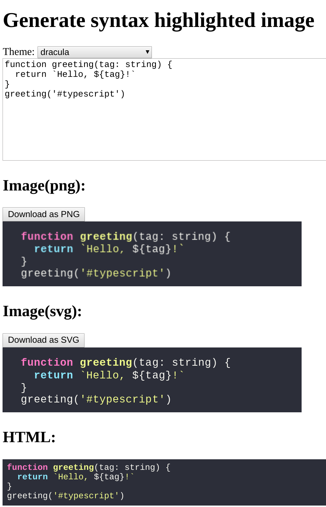
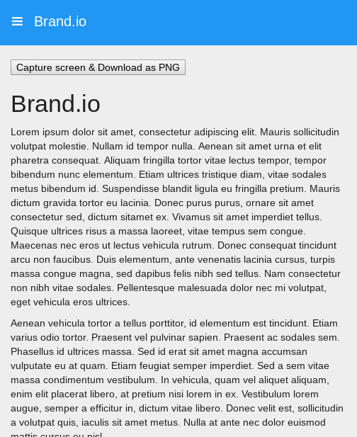

ソースコードを画像に変換できる[Carbon](https://carbon.now.sh)という web アプリをご存知でしょうか。  
↑のような画像が生成できるサービスです。フォントやテーマなどがとても素敵な画像が生成されるため、TLでよく見るようになってきました。

画像の生成をサーバサイドでやっているのかと持ったのですが、開発者ツールでデバッグしてみても、画像export時に通信は発生していません。フォントをfetchしてくるだけで、それ以外はブラウザ内部で生成されているようです。

このような画像を生成できる仕組みを調べて実証してみました。

<!--more-->

## 作ったもの

こちらになります。  
※OffscreenCanvas という API を使用しているため、おそらく Chrome でしか動作しません ([ブラウザ互換](https://caniuse.com/#feat=offscreencanvas))

> &mdash; [Example of rendering HTML element into canvas](https://vm2lz0ppql.codesandbox.io/)

動作しない環境のためにスクショも載せておきます。  
textarea と最終成果物の PNG 画像、中間データである SVG をデモ用に表示、highlight.js でシンタックスハイライト済みの HTML を最下部に表示しています。



PNGの画質が荒かったりスタイルが洗練されていなかったり、生成される画像のクオリティでは Carbon に到底及びませんが、HTML の要素を画像に変換する PoC としては十分伝わると思います。

ソースコードはこちらです。  

> &mdash; [Generate image of syntax highlighted code from highlight.js - CodeSandbox](https://codesandbox.io/s/objective-keller-vm2lz0ppql)

## 仕組み

<blockquote class="twitter-tweet" data-lang="en"><p lang="ja" dir="ltr">シンタックスハイライトを画像化してみた。SVGのforeignObjectにstyleとハイライト後のHTMLを突っ込んでBlobに変換、blob://のままだとtaintedになりCanvasがPNG出力できないのでFileReaderでdata://に変換した&lt;img /&gt;をdrawImageしてconvertToBlobすれば、ブラウザだけでHTMLをPNGまで変換できる。 <a href="https://t.co/HAgziJhZmN">pic.twitter.com/HAgziJhZmN</a></p>&mdash; れこ | 6/18 TS meetup #1 (@L_e_k_o) <a href="https://twitter.com/L_e_k_o/status/1128364583071014912?ref_src=twsrc%5Etfw">May 14, 2019</a></blockquote>
<script async src="https://platform.twitter.com/widgets.js" charset="utf-8"></script>

一言に詰め込むとこんな作りになっています。  
１つ１つの要素について説明していきます。

### シンタックスハイライトして HTML を作る

これはただの HTML+JS の操作です。  
[highlight.js](https://github.com/highlightjs/highlight.js/)のドキュメントの通りにシンタックスハイライトを実行します。

```ts
import hljs from 'highlight.js/lib/highlight'
import typescript from 'highlight.js/lib/languages/typescript'

// ハイライトしたい言語を登録しておく
hljs.registerLanguage('typescript', typescript)

const el = document.querySelector('#code code')
el.textContent = 'コード'
hljs.highlightBlock(el)
```

単にハイライト済みの HTML 文字列を得たい場合は`highlightAuto`というメソッドが利用できますが、その場合得られた要素のサイズ（幅、高さ）を自前で計算する必要があります。

```ts
const code: string = 'コード'
const html: string = hljs.highlightAuto(code).value
```

抽象的に捉えるなら、要は HTML 形式の文字列と画像のサイズが手に入れば OK という話です。

### HTML を SVG に変換する

> &mdash; [<foreignObject> - SVG: Scalable Vector Graphics | MDN](https://developer.mozilla.org/en-US/docs/Web/SVG/Element/foreignObject)

SVG の中で使える foreignObject という要素があります。この中には (X)HTML が書けます。  
ミニマムだとこのような SVG を文字列で生成することになります

```ts
const parentEl = document.querySelector('#code')
const codeEl = document.querySelector('code')
const w = codeEl.clientWidth
const h = codeEl.clientHeight
const svg = `
<svg
  width="${w}px"
  height="${h}px"
  viewBox="0 0 ${w} ${h}"
  xmlns="http://www.w3.org/2000/svg"
>
  <foreignObject width="100" height="50">
    ${parentEl.outerHTML}
  </foreignObject>
</svg>
`
```

ただし、この SVG を画像として表示させようとしても表示されないと思います。  
foreignObject の中には**X**HTML を記述しないといけないため[XMLSerializer](https://developer.mozilla.org/en-US/docs/Web/API/XMLSerializer)を使用して XML のシリアライズします。  
XMLSerializer には string ではなく Node(HTMLElement)を渡す必要があります。

```ts
const serializer = new XMLSerializer()
const svg = `
<svg ...>
  <foreignObject ...>
    ${serializer.serializeToString(parentEl)}
  </foreignObject>
</svg>
`
```

これで SVG 画像は描画できるようになったと思います。

### SVG に style をつける

このままだとスタイルの当たってないただの HTML なので、スタイルを当てます。  
foreignObject にはインライン CSS が書けます。

例えば highlight.js のテーマ（CSS）を適用するならこんな感じにインライン化できます。
XMLSerializer には string ではなく Node(HTMLElement)を渡す必要があるため、style タグを生成してシリアライズしています

```ts
const loadTheme = name => {
  return fetch(`https://unpkg.com/highlight.js@9.15.6/styles/${name}.css`).then(
    res => res.text()
  )
}

const css = await loadTheme('dracula')
const style = document.createElement('style')
style.textContent = css

const svg = `
<svg ...>
  <foreignObject ...>
    <div xmlns="http://www.w3.org/1999/xhtml">
      <style>
        // 独自スタイルもインラインで書ける
      </style>
      <style>${serializer.serializeToString(css)}</style>
      ${serializer.serializeToString(parentEl)}
    </div>
  </foreignObject>
</svg>
`
```

SVG でもよければ、ここまでで終わります。  
ベクター画像なのでとても綺麗な反面、SVG は OGP の画像として使えなかったりと汎用性が高くないので、PNG 画像への変換に続きます。

### Canvas に SVG を描画する

SVG から PNG を得るために Canvas を使用します。

Canvas に画像を render するには[drawImage](https://developer.mozilla.org/en-US/docs/Web/API/CanvasRenderingContext2D/drawImage)を使用します。ただし SVG の文字列をそのままは render できないので、作った SVG 文字列を`data:`の URL に変換し、 img タグに読み込ませ drawImage に与えます。

DOM 依存の Canvas を使う必要はなく、オンメモリ上で計算ができる OffscreenCanvas を利用しています。

```ts
// `blob:`のままだとCanvasのCORS制限にひっかかってPNG出力できないので、`data:`に変換する
const blobToDataUri = (blobUri): Promise<string> => {
  return new Promise((resolve, reject) => {
    var reader = new FileReader()
    reader.addEventListener('error', reject)
    reader.addEventListener('load', () => {
      resolve(reader.result)
    })
    reader.readAsDataURL(blobUri)
  })
}

const svgToDataUri = (svgStr: string): Promise<string> => {
  const blob = new Blob([svgStr], { type: 'image/svg+xml;charset=utf-8' })
  return blobToDataUri(blob)
}

const dataUri = await svgToDataUri(svg)
const img = new Image()
img.src = dataUri
img.addEventListener('load', () => {
  const canvas = new OffscreenCanvas(w, h)
  const ctx = canvas.getContext('2d')
  ctx.drawImage(img, 0, 0)
  const pngBlob = canvas.convertToBlob()
  const pngObjectUri = URL.createObjectURL(blob)
})
```

`pngObjectUri`を img タグで表示すると、PNG 画像が表示されます。  
画面に表示するのではなくファイルとして手に入れたい場合は、aタグをメモリに生成すればファイルダウンロードも可能です。

> &mdash; [aタグのdownload属性でサーバを介さずにファイルダウンロードする | WEB EGG](https://blog.leko.jp/post/how-to-download-with-a-tag-without-file-server/)

これらすべてを含んだ最終的なソースコードはこちら（再掲）です。  

> &mdash; [Generate image of syntax highlighted code from highlight.js - CodeSandbox](https://codesandbox.io/s/objective-keller-vm2lz0ppql)


以上の手順で HTML 要素を PNG まで変換できます。

## WebWorker でも動くのか？

おそらく無理だと思います。少なくともこの記事を書いた時点では実現できませんでした。  
処理の中で`new Image()`してSVG画像をレンダリングした結果をcanvasに渡しているのですが、`Image`はWebWorkerには存在しないAPIなので、SVGを簡単にレンダリングする手段がありません。  

## 応用範囲は広い

本記事では仕組みの説明のためにシンタックスハイライトを題材に書きましたが、もっと抽象的な用途に応用できそうです。  
要はHTML+インラインCSSを画像化できるので、例えば画面全体のスクリーンショットを撮れるはずです。

画面内の`link[rel="stylesheet"]`をかき集めてインライン化し、`<style>`タグをあわせて foreignObject の中に入れて、`document.body`を XMLSerializer に入れたらどうなるか試した結果、ある程度うまく行きました。

動作デモはこちらです。  
ある程度複雑なUIを実現するために[MUI という CSS フレームワークのチュートリアル](https://www.muicss.com/docs/v1/example-layouts/responsive-side-menu)を撮影対象にしました（数年ぶりに jQuery 書いた）

> &mdash; [Capture screen & Download as PNG](https://1uk01.codesandbox.io/)

実際に生成される画像はこちらです。



惜しい感じになりました。なぜかサイドバーが消えています...

（WebWorkerで動かないのでやや厳しいですが）ドラレコの要領で裏側で画面を撮影をしておきサーバに送れれば、ユーザの操作がリアルに見えて、ユーザテスト、アクセス解析、エラートラッキングetcに役立たちそうと思いました。マウスカーソルの座標を保持しておき、カーソルっぽい画像を Canvas に書き加えてから画像化すればマウスカーソル（を模したもの）を画像に写すこともできますし。

やり方によっては悪用できそうなので、悪用はしないようお願いいたします。
