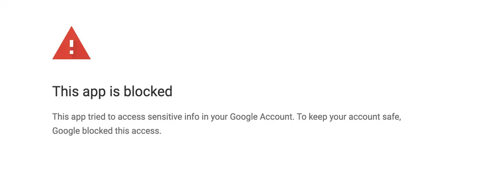

れこです。当記事では Google カレンダーのイベントの開始数分前に、イベントに紐づいたリモートミーティングの URL を自動で開く Chrome 拡張を作ったのでその紹介をしたいと思います。

## TL;DR

- インストールは[こちら](https://chrome.google.com/webstore/detail/crx-gcal-url-opener/pjginhohpenlemfdcjbahjbhnpinfnlm?hl=ja)（Chrome ウェブストア）
- OSS です。GitHub のリポジトリ[こちら](https://github.com/Leko/crx-gcal-url-opener)
- 何かあればリポジトリの Issue にお願いします

## 当記事の背景と反省

当記事を書くに至ったきっかけのは 2022/06/28 にツイートしたこの投稿です。

<blockquote class="twitter-tweet">
Chrome拡張機能作った。ストアに公開済み。Googleカレンダーのイベント開始数分前にイベントに設定されたURL（Google Meet, Zoom）を自動で開くもの。もうこれ無しでは仕事ができない。<a href="https://t.co/pYY074hdZD">https://t.co/pYY074hdZD</a> <a href="https://t.co/DvXZdAZnGu">pic.twitter.com/DvXZdAZnGu</a>
&mdash; Leko / れこ (@L_e_k_o) <a href="https://twitter.com/L_e_k_o/status/1541572838208851969?ref_src=twsrc%5Etfw">June 28, 2022</a></blockquote> 

完全に準備不足でした。  
ツイート当初は「知り合いが 10 人くらい使ってくれて、Twitter や飲み会や勉強会でばったり会った時などにフィードバックをもらい、こじんまりと開発していけばいいや」と気楽に構えていたので Chrome ウェブストアにて拡張の審査は通していたものの **Google の OAuth Consent Screen（Google アカウントでログインしアプリに権限を付与する同意画面のこと）の審査を通していませんでした。** というのも審査を出さなくても`This app hasn't been verified`的な warning が出てくるだけで認証・認可はできるのでひとまずはそれでいいやと思っていました。  
しかしツイートが想像を遥かに超えて拡散されてしまい、審査を出してないセンシティブなスコープを利用するアプリのサインアップ上限 100 名の枠を一瞬で使い切ってしまい`This app is blocked`のエラー画面が表示されてしまいました。

**一応補足すると何かやらかして Google からブロックされたわけではなくて、サインアップ 100 名を超えると 101 人目からサインアップがブロックされるためこの画面が表示されます。**

<blockquote class="twitter-tweet" data-conversation="none">
拡張を使おうとしてThis app is blockedと表示された方、現在新規のサインアップがブロックされています。上限緩和のためGoogleのレビューを通してるところでしてもう暫しお待ちください。 <a href="https://t.co/JpxNZ87s4C">pic.twitter.com/JpxNZ87s4C</a>
&mdash; Leko / れこ (@L_e_k_o) <a href="https://twitter.com/L_e_k_o/status/1542373098011258880?ref_src=twsrc%5Etfw">June 30, 2022</a></blockquote> 

完全に想定外でしたが、せっかく使いたいと言ってくれた方が使えないのは勿体無いので慌てて Google の審査を通しました。審査に時間がかかってしまいバズの旬は過ぎましたが、どなたでもサインアップできるようになったのであらためて審査の話を添えつつ告知記事を書きました。

## 拡張機能の紹介

ここからが拡張機能の解説です。冒頭でも書きましたがこの Chrome 拡張は Google カレンダーのイベントの開始数分前に、イベントに紐づいたリモートミーティングの URL を自動で開くツールです。
OSS として公開しており、GitHub のリポジトリはこちらです。

https://github.com/Leko/crx-gcal-url-opener

### 問題提起

コロナ禍になってからリモートでのミーティングが格段に増えたと思います。リモートミーティングに際してこのような問題ってないでしょうか。

- タスクを中断してカレンダーアプリや Google カレンダー web 版などを開き、当該のイベントをクリックして MTG に参加するの手数が多くて単純に面倒くさい
- 私用アカウントと社用アカウントの２つでログインしており、ミーティング URL を開いた際にアカウントの切り替えが必要
- Google Meet でのミーティングかと思ってたら説明文の方に書いてある Zoom の URL に参加すべきだった
- ミーティング開始 10-5 分前くらいから参加待ちでただ待機している
- その待ち時間を使ってタスクを終わらせようとしたら時間を忘れて MTG の参加に遅れる
- タスクに取り組んでる際集中しすぎてカレンダーの通知に気づかず参加し忘れる

### この拡張が解決すること

これらの問題を解決するため以下のアプローチで拡張機能を作りました。

- 手数が多くて単純に面倒くさい
  - 指定の時間になったら自動でミーティングのタブが開かれる
  - 最近のツールは参加の前に準備の画面が挟まってるため用意できていないまま参加してしまうことはない
- ミーティング URL を開いた際にアカウントの切り替えが必要
  - 認証した方の Google アカウントでミーティングが開かれるよう`authuser`というクエリパラメータを付与します
- Google Meet かと Zoom の URL に参加すべきだった
  - イベントに両方の URL が設定されている場合 Zoom が優先されます（Google Meet の優先度が最低になります）
  - そもそも Meet じゃないミーティングに Meet の URL を設定することが問題ではあるが、GSuite の設定によっては明示的に off にしない限り自動で Meet のリンクが設定されてしまうため招待側が毎回気をつけないとこれが起こる
- ミーティング開始 10-5 分前くらいから参加待ちでただ待機している
- その待ち時間を使ってタスクを終わらせようとしたら時間を忘れて MTG の参加に遅れる
- タスクに取り組んでる際集中しすぎてカレンダーの通知に気づかず参加し忘れる
  - 時間になったら自動でタブが開くので、時間を気にする必要はない
  - タブを開く際に他のウィンドウが最前面にあっても Chrome を最前面に表示するので強制的に作業を中断できる

2 ヶ月ほど自分でテスト運用しましたがとても良く動作しており、もはやこれがないと仕事したくないレベルにヘビーユースしています。その他使い心地のためやっていることとしては以下があります。

- 参加を辞退したイベントは無視する。未回答 or 参加と回答した時のみ対象
- リスケされることがあるため一定周期で最新状態を取得
- Zoom の[バニティ URL](https://support.zoom.us/hc/ja/articles/215062646-%E3%83%90%E3%83%8B%E3%83%86%E3%82%A3-URL-%E3%83%AA%E3%82%AF%E3%82%A8%E3%82%B9%E3%83%88%E3%81%AE%E3%82%AC%E3%82%A4%E3%83%89%E3%83%A9%E3%82%A4%E3%83%B3)にも対応
- Microsoft Teams にも対応（他の SaaS の要望あったら Issue 立ててください）

紹介は以上となります。[README](https://github.com/Leko/crx-gcal-url-opener/#readme)にインストールとセットアップ方法が書いてあるので是非お試しください。

今後の展望として対応サービスの拡充や設定カスタマイズの解放などを検討していますが、審査対応でエネルギーを吸われてしまったので気が向いたら対応します。コントリビューションはいつでも歓迎です。

## OAuth Consent Screen の審査について

最後に審査の苦労話です。これから審査に挑む方には役立つかもしれませんが読んでも面白くない内容だと思います...  
この Chrome 拡張は Google カレンダーを読み取る必要があるので `calendar.readonly` スコープが必要です。このスコープはプロフィールやメールアドレスの取得などとは異なりセンシティブなスコープと扱われるそうです。で、センシティブなスコープを取り扱う OAuth アプリの場合、Google による審査が必須となり、審査が通るまでは 100 人までしか認証できない制限がかかります。

審査を開始したのがツイート当日なので Jun 28、審査が通ったのは Jul 15 でした。

### 審査の苦労話

審査を通すためにもっとも苦労したのはコミュニケーションでした。「質問があったらメールに返信してね」と書いてあるので 4 回ほど定義や質問の意図について質問しましたが全て無視され、また「質問があったらメールに返信してね」と書かれた全く同じ内容の指摘が届いたり、申請内容ですでに対応済みのことを何度も指摘され 2-3 回"もうすでに要件を満たしてるよ"と伝えてやっと別の論点に移ってくれるという調子でした。  
bot 等が機械的にチェックしメールを送信してるのか、もしくは申請内容は実は関係なく単なる忍耐力チェック＆人間判定をさせられていたのか、それとも「審査レビューに対し人間はなんと反論するか」の教師データを入力させられていたのではないかと思うほどにコミュニケーションが成立せず、加えて時差があるためメール 1 往復ごとに 2 日の速度で進行せざるを得ないため時間を割かれました。  
（上記事項は審査を担当している Trust & Safety Team に全てフィードバックしました）

### 審査によって変わったこと・増えたもの

とはいえ当然私の申請内容にも不備あったため要素を追加したり変えたりしました。審査の前後でアプリのコア機能は一切変わっていません

1. ホームページを作りました
   - URL: https://leko.jp/crx-gcal-url-opener/
   - 最初は GitHub の README や Chrome web ストアの URL を貼っていたのですがホームページは Google Search Console にて所有権を確認できるドメインでホストされているものに限るそうで、審査のためにホームページを作りました。手をかけたくないのでほぼ素の HTML で一切スタイルを入れてません
   - Google Calendar API から取得可能な何の情報をどのように使いどう保持するのか？について明記したので一読いただければと思います
2. デモビデオを撮りました
   - URL: https://www.youtube.com/watch?v=9jz5ZO6XMpM
   - 見る価値ありません。審査用に撮った冗長で一切説明のない動画です
   - 認証の過程、実際に取得されたデータがどのように動作するか、申請内容の通りに反映されているか？を動画に撮り YouTube に上げ、**全体公開**する必要があります。限定公開だと弾かれました
3. ポップアップ内のログインボタンが変わりました
   - ブランドガイドラインに抵触するとのことで公式のログインボタンを利用しました。機能としては何も変わっていません
4. ポップアップ内にプライバシーポリシーへのリンクを追加
   - 画面下部にリンクが増えてます。リンク先は前述のホームページ（のプライバシーへの取り組みセクション）です

実際にはこれだけの対応しかしてないため実際の作業時間としては数時間で終わる範囲内だったのですが、前述の問題により審査が完了するまでにだいぶ時間がかかってしまいました。

以上です。これから審査対応される方に役立てば幸いです。ぜひ拡張機能使ってみてください
