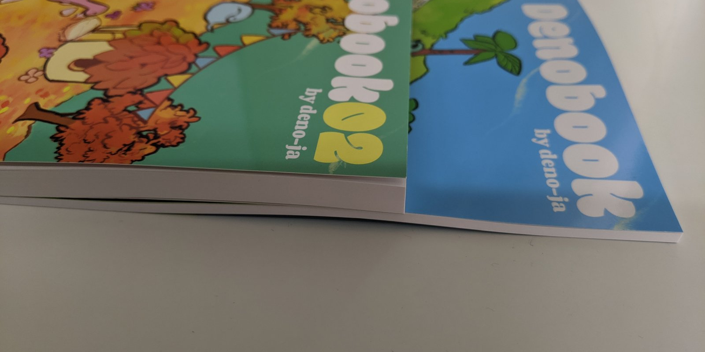

## TL;DR

- 運営の方およびイベントに携わった皆さんお疲れ様でした
- はじめて技術書展に参加し denobook 02 という本を執筆・頒布した
- 書いた本の概要は[こちら](https://scrapbox.io/deno-ja/Denobook_02)を参照
  - 私は第 5 章の Deep dive into Deno compiler を担当した
- BOOTH で電子版も販売してます。技術書展行けなかった方はぜひこちらから購入お願いします
  - [Denobook 02 【電子版】 - deno-ja - BOOTH](https://deno-ja.booth.pm/items/1574063)
- 食わず嫌いしていたが、やってみたら得られたものは多かった
- サークル参加でならまた出たい。普通のお客さんとしては依然興味ない
- 書くなら既刊があるサークルに混ぜてもらうのがハードル低いと思う

## そもそも Deno とは？

Deno とは Node.js の作者 Ryan Dahl が Node.js での反省を活かして作成した新しい TypeScript ランタイムです。とてもわかり易いまとめ画像があるのでこれで経緯を掴めると思う

<blockquote class="twitter-tweet"><p lang="ja" dir="ltr">denoとは何ぞ？というところから現状まで、グラフィックレコーディング風に描いてみました！<br>不正確なところがあればツッコミください！<a href="https://twitter.com/hashtag/denoland?src=hash&amp;ref_src=twsrc%5Etfw">#denoland</a> <a href="https://t.co/9ybQmyEB9k">pic.twitter.com/9ybQmyEB9k</a></p>&mdash; はしゅろ (@hashedrock) <a href="https://twitter.com/hashedrock/status/1174364824391708672?ref_src=twsrc%5Etfw">September 18, 2019</a></blockquote>

## 企画編

ことの発端は 2019 年 6 月末の Deno 勉強会の５回目でのこと。  
Deno 勉強会はその名の通り Deno コミッターや Deno のライブラリ作者、Deno に興味のある方が集う小規模でインタラクティブな勉強会。

> &mdash; [第 5 回 Deno 勉強会 - connpass](https://connpass.com/event/134840/)

deno-ja チームでは技術書展 6 で既に[denobook 01](https://scrapbox.io/deno-ja/Denobook_01)という技術書を頒布していた。技術書典 7 の申込み期日が迫っていたので、「技術書典 7 に出たい（執筆したい）人はいるか？」という話題があがった。

技術書典の存在は昔から知っていたし、身近な人も頒布・参加をしているのを目撃していた。しかし私は人混みがものすごく苦手なのでコミケに参加しても人酔いで一冊も本を買えず全く楽しめなかった経験しかない。
ただ denobook 02 に関しては書いてみたいという好奇心が勝り**一般参加者ではなく執筆者としての参加、かつブースから出ずに人混みを避ける**ならアリかも知れないと思い手を上げる。

denobook 01 の執筆者の[@\_\_syumai](https://twitter.com/__syumai)さん、[@keroxp](https://twitter.com/keroxp)さんに加え、[@kt3k](https://twitter.com/kt3k)さん、[@sasurau4](https://twitter.com/sasurau4)さん、私の計５名が手を上げた。テーマは合わせずに**各自が Deno について書きたいことを書く**でやることになった。表紙や DTP 系は denobook 01 に引き続き[@hashedrock](https://twitter.com/hashedrock)さんが担当するという分担で始動した。

## 執筆編

私は第 5 章の Deep dive into Deno compiler を担当した。
端的に説明すると、Deno のコードリーディングをして`deno`コマンドを実行しプロセスが起動してから TypeScript のコードが実行されるまでの処理を読むという内容。内容のニッチさと対象層のレベルからトリをつとめることになった。

このネタは以前に書いた[Dive into Deno：プロセス起動から TypeScript が実行されるまで | WEB EGG](/post/code-reading-of-deno-boot-process/)の**焼き増しではなく改訂版**に相当する。2 ヶ月に 1 回くらい Deno のコードをチェックしながら、日々コミットされ形骸化していくブログ記事を見て、手直し程度の更新では全く追いつけなかったので、ゼロからコードを読み直し記事をまるごと書き直したほうが早いと判断して書き直した。  
まだ Deno は 0.x なので今回書き直してもまた形骸化することが確定しているのだが、1.x がリリースされて production ready になったときの知識のギャップを少しでも埋めておきたいため Deno のリハビリのために同人誌として執筆することを決めた。

内容に関しては denobook 02 を買ってほしいのでそちらに委ねるが、執筆にあたって書籍では割愛した細かいところについて少し書く。  
まず[記事の内容と denobook 執筆時点の denoland/deno の差分](https://github.com/denoland/deno/compare/f9b167de...595b4daa)を見てほしい。差分が大きすぎて GitHub の画面で開くと固まるレベル。

```
$ git diff --shortstat f9b167de...595b4daa
 662 files changed, 46852 insertions(+), 20228 deletions(-)
```

もはや別物以外の何物でもない。実際、表層のコードだけではなく設計レベルの変更が多数発生しており、以前の感覚のまま読める処理はほんの数箇所しかなかった。

その中でも特に大きく変更されていた点は以下の 3 つ。

1. GN 廃止され cargo build でビルドするようになった
1. V8 snapshot の作成・復元処理が激変
1. import の依存グラフの解決が非同期＆マルチスレッド＆イベントドリブンに

ブログ記事の時点では、これらは質素な作りだったので非常に読みやすかったが品質に難がある状態だった。執筆時点ではこれらの問題が改善された代わりに処理が複雑化しやや読みにくくなっていた。特に import の依存グラフの解決に関しては非常に複雑になっていた。詳しくは denobook 02 を読んでいただきたいが、マルチスレッドで依存グラフの木構造を処理していくところが非常に複雑で、コードを読んで理解するのに丸 1 日かかった。

そんなこんなで各執筆者が好きなように書いていき、前回（48p）と比べて圧倒的にページ数が増え**152p**の大作ができあがった。写真でみるとわかるように、なぜかページ数の割合以上に本が分厚い。



## 宣伝編

入稿した後に問題が起こった。**被チェック数が全然伸びない。**150 部刷っているのに被チェック数が 30 ちょっとしかなかったため、大量に在庫を抱え赤字になるフラグが立っていた。チーム全員で denobook を頒布すること自体の告知を何度か試みたがなかなかチェック数は伸びない。  
「deno のことを忘れているか、そもそも deno が何か分からないから内容が伝わらないのではないか？」と仮説を立てて deno 自体についての説明を多めに告知。その内容を分かりやすくまとめたイラストが生まれる。

<blockquote class="twitter-tweet"><p lang="ja" dir="ltr">denoとは何ぞ？というところから現状まで、グラフィックレコーディング風に描いてみました！<br>不正確なところがあればツッコミください！<a href="https://twitter.com/hashtag/denoland?src=hash&amp;ref_src=twsrc%5Etfw">#denoland</a> <a href="https://t.co/9ybQmyEB9k">pic.twitter.com/9ybQmyEB9k</a></p>&mdash; はしゅろ (@hashedrock) <a href="https://twitter.com/hashedrock/status/1174364824391708672?ref_src=twsrc%5Etfw">September 18, 2019</a></blockquote>

それらの宣伝によって被チェック数は 70 ちょっとくらいまでは伸びたが、刷った 150 部には遠く及ばないまま本番を迎えることになった。

## 設営編

技術書典の参加も、ブースの設営も、紙の本を書くということも何もかもが初めてだったので、ありとあらゆる勝手がわからずあたふたしていたが、denobook 01 執筆経験者たちのノウハウ＋前回使った備品類を使い回すことで無事設営を完了させた。
当日の動きに関して、経験者のノウハウに頼らさせてもらえるのはとても心強かった。

改善点を挙げるとしたら、キャスターを持ってくるべきだった。本が厚くて重いため 10kg 近くあるダンボール箱を運搬するのはかなりしんどかった。

<blockquote class="twitter-tweet"><p lang="ja" dir="ltr">hashrockさん渾身のポスターが載ってなかったので再掲<a href="https://twitter.com/hashtag/%E6%8A%80%E8%A1%93%E6%9B%B8%E5%85%B8?src=hash&amp;ref_src=twsrc%5Etfw">#技術書典</a> <a href="https://t.co/2I13lDjxQ7">pic.twitter.com/2I13lDjxQ7</a></p>&mdash; sasurau4_deno-ja@技術書典お86C (@sasurau4) <a href="https://twitter.com/sasurau4/status/1175591243364978690?ref_src=twsrc%5Etfw">September 22, 2019</a></blockquote>

## 販売編

最初は「deno 本売ってまーす」などと呼びかけていたが、宣伝時に発生した「そもそも deno が何か分からないから内容を伝えても見向きもされないのではないか」という仮説を立て、deno 自体の説明をするよう呼びかけ文句を変えたり見本誌を読んでくれるお客さんに deno の説明をしながら本のあらすじを伝えるなどの工夫が重ねられていった。

販売ながら徐々に改良が加えられ最終的にはこんなブースになり、接客トークも洗練されていった。  
通りがかった小さいお子さんが恐竜で遊んだりしていた。

<blockquote class="twitter-tweet"><p lang="ja" dir="ltr">回を追うごとにブースに恐竜が増えていくｗ <a href="https://t.co/U75V48AEUs">pic.twitter.com/U75V48AEUs</a></p>&mdash; syumai@技術書典お86C (@__syumai) <a href="https://twitter.com/__syumai/status/1175720231748001792?ref_src=twsrc%5Etfw">September 22, 2019</a></blockquote>

そんな努力の甲斐もあってか、結果としては被チェック数の不安は杞憂に終わり 130 部近く売れた。買っていただいた皆さんありがとうございました。

## 参加編

ブースに座っていると知り合いのサークルから本をいただいたり本を買っていただいたりするので、そのお礼にサークルを巡ることにした。  
人口密度が高すぎて非常にストレスを感じたが、用もなく回ってるわけではなくお礼を伝えること、知り合いのサークルの本を買いに行くことを目的にしていたのでなんとかなった。何冊かまったく面識のないサークルの本も買ったが、たぶん積読になると思う。貰い物も含め戦利品としては以下のようになった。

<blockquote class="twitter-tweet"><p lang="ja" dir="ltr">買ったもの <a href="https://twitter.com/hashtag/%E6%8A%80%E8%A1%93%E6%9B%B8%E5%85%B87?src=hash&amp;ref_src=twsrc%5Etfw">#技術書典7</a> <a href="https://t.co/aYZaHKBHGD">pic.twitter.com/aYZaHKBHGD</a></p>&mdash; れこ / 技術書典お86C (@L_e_k_o) <a href="https://twitter.com/L_e_k_o/status/1175793653450563584?ref_src=twsrc%5Etfw">September 22, 2019</a></blockquote>

## 撤収編

撤収時は運営のアナウンスがしっかりしていたので特に混乱することなく終えられた。
既刊も新刊も少し余ったので、残った本はとらのあなに委託し解散した。

## 感想

サークル参加した結果、とても経験になるイベントだったし、このために時間を使ってよかったと感じている。

denobook 01 の執筆メンバーによる、企画の取りまとめや執筆時のフォロー、宣伝、会場設営、販売など様々なノウハウに頼らさせていただいてとても心強かった。もし一人でやっていたらこんな成功体験は得られなかったどころか、下手したら大失敗して技術書典を嫌いになっていたかも知れない。技術書典に参加してみたいと思った方が居たら、経験者のいるサークルに混ぜて頂くことで低いハードルでスタートできると思う。  
もちろん提供してもらうだけではなく、できることをして貢献しよう。

（ブースを一周回ってみて、一般参加者として行くのは会場の人口密度が高すぎてしんどそうだなと思った。見て回る人として参加するのは今後もしなくていいと思った）

## 電子書籍版のご案内

技術書典に来られなかった方向けに電子版も販売してます。お見逃しないようぜひ買っていって下さい。

- 新刊(¥1,000): [Denobook 02 【電子版】 - deno-ja - BOOTH](https://deno-ja.booth.pm/items/1574063)
- 既刊(¥500): [Denobook 01 【電子版】 - deno-ja - BOOTH](https://deno-ja.booth.pm/items/1317172)

## さいごに：deno-ja に興味がある方へ

deno-ja の活動に興味がある方は以下のリンクから deno-ja の Slack に参加できます。技術書典の話に限らず Deno のアップデートの話や Deno コミュニティの話、勉強会のセッティングなど Deno に関する詳しい情報が知れます。興味がある方はぜひ加入して下さい。

> &mdash; [Slack の参加方法 - deno-ja](https://scrapbox.io/deno-ja/Slack%E3%81%AE%E5%8F%82%E5%8A%A0%E6%96%B9%E6%B3%95)
