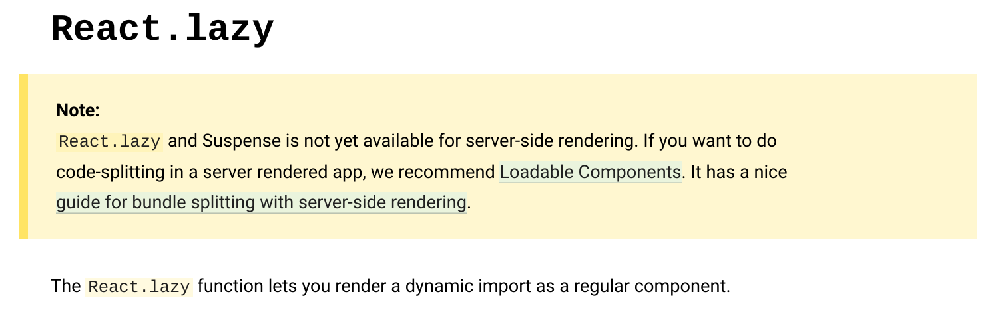

前記事の[Gatsby 製サイトに Algolia のサイト内検索を実装する](/post/on-site-search-in-gatsby-with-algolia/)を実現するにあたって、色々ライブラリが増えるけどページのロード時間は増やしたくなかったので React Suspense（以下 Suspense）＋ React.lazy ＋ Dynamic import で Code splitting を試みたところハマったので備忘録を残します。

<!--more-->

## TL;DR

- まだ React Suspense は Gatsby（SSR）で使用できない
- SSR での Suspense サポートは React 16.x のロードマップに含まれている
- SSR での Suspense をサポートするまでは[@loadable/component](https://github.com/smooth-code/loadable-components)を使ってねと Gaysby の Issue も React の公式ドキュメントも言っている

## 再現コード

動かないので GitHub にはコミットされていませんが、こんな感じのことをすると Gatsby のビルドがこける。

```jsx
import React, { Suspense, lazy } from 'react'

export function Hoge() {
  const SomeComponent = lazy(() => import('./SomeComponent'))
  return (
    <Suspense fallback={null}>
      <SomeComponent />
    </Suspense>
  )
}
```

このコードは`gatsby develop`で動作確認しているときは普通に動くので余計にハマった。

## エラーの内容

`gatsby build`すると以下のエラーが発生した。

https://reactjs.org/docs/error-decoder.html/?invariant=294

これでは分からないのでデコードしてみると、以下のエラーだった。

```
ReactDOMServer does not yet support Suspense.
```

まだサポートされていなかった。  
もしかして使ってる React のバージョンが古いんじゃないかと思ったものの、バージョンは記事執筆時の最新（16.8.6）だった

## React のロードマップを調べる

いつ頃使えるようになるのか調べてみたが、明確にどのバージョンでリリースされるかは明記されていなかった。

> **Suspense for Server Rendering**  
> We started designing a new server renderer that supports Suspense (including waiting for asynchronous data on the server without double rendering) and progressively loading and hydrating page content in chunks for best user experience. You can watch an overview of its early prototype in this talk. The new server renderer is going to be our major focus in 2019, but it’s too early to say anything about its release schedule. Its development, as always, will happen on GitHub.
>
> &mdash; [React 16.x Roadmap – React Blog](https://reactjs.org/blog/2018/11/27/react-16-roadmap.html#suspense-for-server-rendering)

## Gatsby の Issue

Gatsby にすでに Issue が報告されていた。

> &mdash; [Suspense and React.lazy isn't working · Issue #11960 · gatsbyjs/gatsby](https://github.com/gatsbyjs/gatsby/issues/11960)

回答によると、まだ Suspense+React.lazy はサポートされていないので、サポートされるまで`Loadable components`というパッケージを使ってねとのこと。

> Gatsby is using SSR which Suspense & React.Lazy not yet support. You can move to a full client site to use those features but to have the static generation of pages you sadly can't. React recommonds to use the Loadable components package until SSR is resolved.
>
> &mdash; [Suspense and React.lazy isn't working · Issue #11960 · gatsbyjs/gatsby](https://github.com/gatsbyjs/gatsby/issues/11960)

## work around

React.lazy の公式ドキュメントにでかでかと書いてあった。



Loadable Components と書かれているリンク先がこのリポジトリ。

[smooth-code/loadable-components](https://github.com/smooth-code/loadable-components)

使い方は Suspense + React.lazy を一手に担う感じ。大きくコードは変わらない。

```jsx
import React from 'react'
import loadable from '@loadable/component'

const OtherComponent = loadable(() => import('./OtherComponent'))

function MyComponent() {
  return <OtherComponent />
}
```

このコードを Suspense + React.lazy で書くとこうなる。  
ほぼ Suspense+React.lazy と同様の使用感で使える。

```jsx
import React, { Suspense, lazy } from 'react'

const OtherComponent = lazy(() => import('./OtherComponent'))

function MyComponent() {
  return (
    <Suspense fallback={null}>
      <OtherComponent />
    </Suspense>
  )
}
```

結果的にコミットされた dynamic import は[こう](https://github.com/Leko/WEB-EGG/blob/6e088d55d43ea8988282044a67e39fb573bd12a4/src/components/Layout.js#L14-L29)なった。
