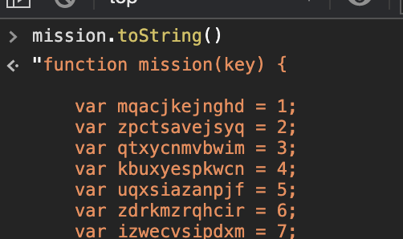

- 注意：この記事には[SPY×FAMILY SPECIAL MISSION](https://www.shonenjump.com/p/sp/2020/spyfamily_challenge/)上級編の**直接的なネタバレ**が含まれます
- 注意：この記事で述べる方法は**一切謎解きではありません。完全に邪道です**。そういうのが大丈夫な方だけ先へお進みください

SPYxFAMILY面白いですよね。  
連載が開始したときに表紙を見て「TISTAの人だ！」と感動したのを覚えています。5巻くらいで終わってしまったけど好きな漫画だったので、その人が描く次の物語ということで気になってました。  

前置きはさておきこれはネタ記事です。2020/09/13現在、SPYxFAMILYの謎解きキャンペーンである[SPY×FAMILY SPECIAL MISSION](https://www.shonenjump.com/p/sp/2020/spyfamily_challenge/)というサイトが特設されています。ジャンプ＋のアプリから読んでる方も話の後の広告枠に二進数っぽい文字列のバナーがあるので気になった方もいるでしょう。  
いざサイトを開くと子供騙しのような、いわゆる「たぬきのかたたたき」の問題が表示されます。ページを開いて数秒経つと、ページ下部にこんな文言が出現します。

> このページのどこかに
> さらにこの問題とは別の上級編への入り口があるぞ！！
> さあどこに隠されているかな？
> 紙版のコミックスを持っている人は
> どこかにヒントがあるかも…！？
>
> &mdash; [SPY×FAMILY SPECIAL MISSION](https://www.shonenjump.com/p/sp/2020/spyfamily_challenge/)

おもしろFlashと同時期に流行ってた隠しリンクサイトの匂いがしますね。でもリンクは隠れてないし問題ですらないと言える簡単さです。本の帯を持ってようと持ってなかろうと見つけられます。  
上級編にたどり着いたところでやっと本題です。この上級編で**一切謎を解かずに問題を解きます**。  
1問目をみて「また”たぬきのかたたたき”かよ...」とそっ閉じしないでください。この問題は簡単ですが問題は1問ではありません。問題は複数あります。2問目を真面目に解こうとするとけっこうな苦労が必要になると思います。まだ謎を解かれてない方はとりあえず（ズルせず）自力で挑まれてはいかがかと思います。

<!--more-->

## 使用するもの
頭脳と根気の代わりに使用するのはJavaScriptです。ただし健全性のために以下のルールを設けます。

1. ページに存在する回答の入力フォームに解答を入力して送信する正規の手段を用いて問題に正解する
1. URLへの総当たりなどのキャンペーンサーバに負荷をかけうることはしない
1. 問題自体を無視して結果のページへ遷移するなどのアクセス解析に問題が生じたり攻撃になり得ることもしない
1. 問題の判定ロジック自体を壊して突破するようなコンセプト破壊もしない。きちんと正解して通過する

まとめるとズルはするけど先方に迷惑はかけないということです。
先に結論を書くとJSの中に判定ロジックがありますし、JSが読める人なら秒で解けます。私が上級編を解き終わるまでにかかった時間は調査を含めても1-2分です。

## 方針
試しに適当な値を入力してみるとエラーと表示されます。当然ですが成否判定ロジックが存在してます。

TODO画像

つまり入力値を判定するロジックがどこかにあるはずです。「問題そのものではなく問題の判定ロジックを解いて正解となる入力値を見つける」ことが方針となります。  
上級編はCapture The Flag(CTF)の一種であると捉えることも可能です。その例えは流石に歯応えなさすぎですが、入門としてならいい問題かもしれません。

ちなみに、上級編のページのURLに`1st_mission`という文字列が含まれているため、これを`2nd_mission`に書き換えたら次の問題に行けると思うかもしれませんが、ルール3に違反するためやりません。うっかり内部管理用のURLを踏んでしまいIPアドレスが見えてしまったり全データを消し飛ばしてしまうなんて事故が起こらないとも言えないですし、仮にそんなことを起こしてしまった場合の責任なんて取れません。こういうズルをするときはあくまで一般ユーザを模倣しておくと安心です。

## 調査

まずはクイズの仕組みの調査です。入力した文字列がこのサイト上どう扱われているかを外側から見ていきます。  

まずは初級編に戻って、Chromeの開発者ツールを起動しネットワークを監視てから正解の文字列を送信します。このサイトはSPAではなく画面遷移を伴うためPreserve logオプションを有効にしておきましょう。正解を入力した結果以下のことがわかります。

- リクエストのURLにもヘッダにもボディにも入力した文字列は含まれていない
- その前後でそれらしき通信も発生していない

サーバは入力値を受け取っていないため回答を判定していないことがわかります。絶対とは言いませんがかなりの高確率でJSで正解を判定しているはずです。  
金銭やセッションが絡むわけでもない単発のキャンペーンのためにわざわざサーバを用意し、悪意を持った攻撃やDDOSのリスクに晒すのはナンセンスなので、JSで判定していると考えるのが筋でしょう。  
以上から、そのデメリットがあることから初級編と上級編はどちらもJSで判定ロジックが書かれていると推測できます。案件の性質上わざわざ別アーキテクチャを用意するほどコストを割く意味がないですし。

ということでJSに答えが書いてあるという仮説をもとに上級者編のページのJSを読みます。

## 正解の文字列を得る

JSが読める人なら悩むまでもありません。お疲れ様でした。正解を手に入れ満足感を手に入れましょう。  
解説するほどでもないですが一応コードを見ていきます。日本語のコメントがたっぷり書かれたjQuery製のコードが出てきます。この中でformのsubmitもしくは送信ボタンに何かしらのイベントを設定しているコードを探します。

```js
$("button").on("click", function() {

  var keyword = mission(97);
  if ($('.keyword').val() == keyword ) {
    window.location.href = '2nd_mission.html';
  } else {
	$('.red').addClass('error');
  }
});
```

ここですね。`mission(97)`を開発者ツールで実行すれば正解の文字列が手に入ります。なお、現在出題されているこれ以降の問題も同様の方法で解けます。当然正解となる文字列は違いますが、正解の文字列の見つけ方は同じです。

(੭ु˙꒳​˙)੭ु⁾⁾

## 蛇足：mission関数の難読化について
本記事ではmission関数の実装は完全にブラックボックスのままでも正解の文字列を得られます。ただ、正解をハードコードせずわざわざmissionという関数を用意し、しかも引数に数値を渡して周りくどいことをしているのが気になります。ということで中身を読んでみました。



すごそう。あまりに長くて全コードを記事に貼るとかさばるので代わりにURLを載せておきます。
https://www.shonenjump.com/p/sp/2020/spyfamily_challenge/_common/mission.js

とは言え難読化の中ではとてもシンプルな部類です。読んでみるともとのコードが小さいこともあり簡単に読めます。変換前のコードはおそらくこんな感じです。  
直接的な答えを書かないようにfromCharCodeの部分だけ復元せずにそのまま残してあります。

```js
function mission(key) {
  if (key == 94){
    return String.fromCharCode(12404, 12540, 12394, 12387, 12388);
  }
  if (key == 97){
    return String.fromCharCode(83, 84, 69, 76, 76, 65);
  }
  if (key == 921){
    return String.fromCharCode(12365, 12363, 12435, 12375, 12419);
  }
}
```

完全に理解したのでこれで終わります。

## さいごに
mission関数の内部実装は難読化されているのになぜ肝心のクイズの判定処理が難読化されていないのか気になりましたが、その心を知るすべはありません。  
もしJSが全て難読化されており、もう少し複雑に難読化されていたらもう少し手応えのある問題になっていたかもしれません。
