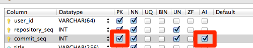
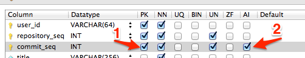

こんにちは。  
今日、[MySQLWorkbench](http://www-jp.mysql.com/products/workbench/)というMySQL純正ツールを使ってDDLを作っていたのですが、

GUIでテーブルを設定し、SQLにエクスポートしたら

**Incorrect table definition; there can be only one auto column and it must be defined as a key**

というエラーが出たのでその対処法を残します。

<!--more-->

なぜエラーが起こるのか(SQLのお作法)
----------------------------------------

まずエラーの意味を理解します。

**Incorrect table definition; there can be only one auto column and it must be defined as a key**

とは、`AUTO INCREMENT`**が設定されたカラムは主キーでなければならない**  
と言っています。

しかし、AUTO INCREMENTを設定したカラムは主キーにしてあります。

ではなぜエラーが起こるのでしょう。

なぜエラーが起こるのか(ツールのバグ？ )
----------------------------------------

こちらのページに引っかかる記述がありました。

> 主キーの設定をしていない場合は、主キーの設定をしてからAUTO_INCREMENT属性を設定する必要があります。  
> [主キーの設定・削除、AUTO_ICREMENT属性の設定｜カラム（フィールド）：データ定義（SQL文）｜MySQL｜PHP & JavaScript Room](http://phpjavascriptroom.com/?t=mysql&p=autoincerment)

どうやら、主キーの設定がされる前に、AUTO INCREMENTの指定がされてしまっているようです。

そんなこと言われましても…。  
**吐き出されたSQLをいちいち手動で修正**しなければならないのかと思いましたが、**直せました**。

対処法
----------------------------------------

上記のエラーが起こる原因は、**カラムの属性を選ぶ"順番"が左右していた**ようです。

つまり、チェックボックスの`AI`属性に先にチェックを入れてしまっていて、  
そのあとに`PK`の指定をしたため、アウト。

**そんな馬鹿な**。。。

GUIからチェックボックスを選んだ順番なんてまともに見る術も無いのに、  
あまりに不親切すぎませんか…

ということでチェックを解除して`PK`>`AI`の順番でチェックを入れなおしたら治りました。

