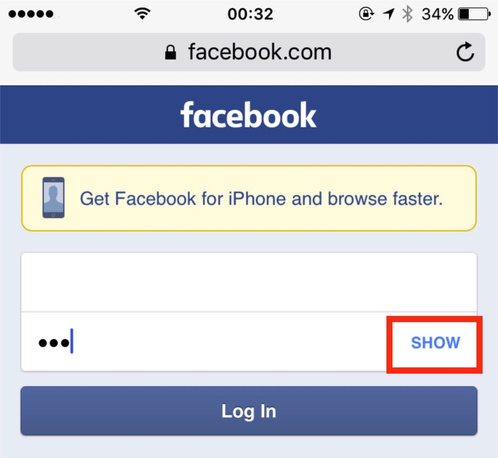
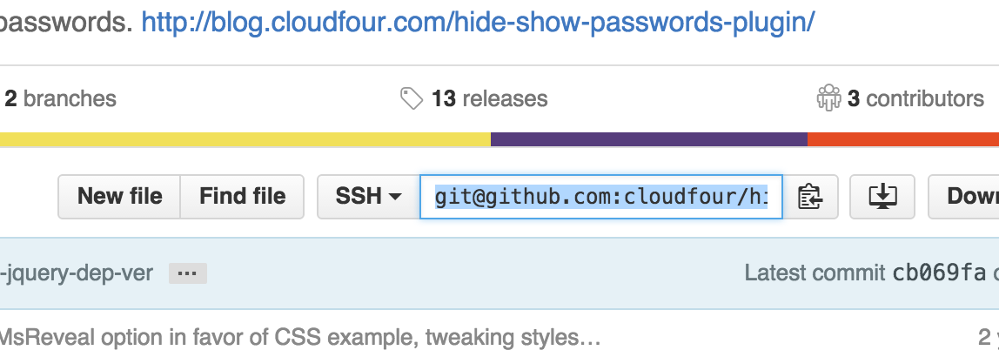
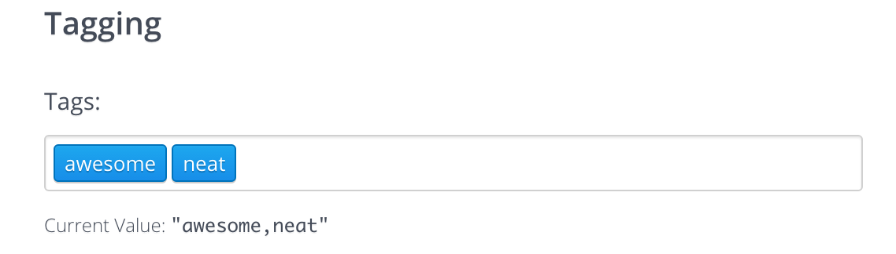
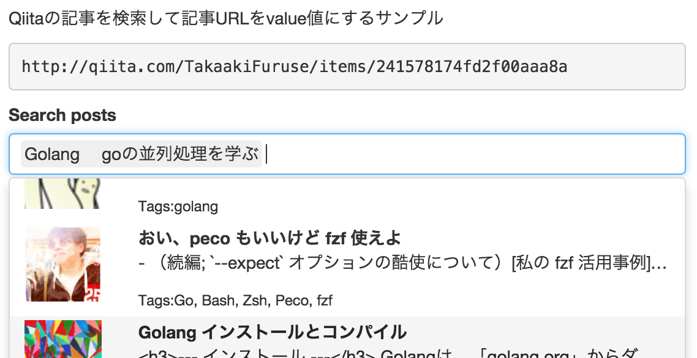

れこです。  
[Hamee Advent Calendar 2015](http://qiita.com/advent-calendar/2015/hamee) 2 日目の記事です。

<del>「明日使えるフロントエンドと作業効率化の備忘録」とか銘打っておきながら、<br /> フロントエンドの記事を書くのはものすごく久々な気がします。</del>

フォームや input 周りを扱っていると、毎回小さな機能を作るたびググって毎回使用するライブラリや実装が揺れてしまうので、  
2015/11/24 現在での決定版を調べてまとめて備忘録にします。

<!--more-->

## まえおき

当記事で紹介するライブラリ、コードを[全部まとめたデモを作りました](https://jsfiddle.net/leko/znos4wf0/)。  
記事と内容を読みつつ、具体的なコードはデモをご参照ください。  
**記事内にはコードはほとんど書きません** 。デモがあるのと、README の内容をコピー&ペーストしてもすぐ情報が古くなるためです。

また、ライブラリを採用する場合には以下の採用基準で選んでいます

- 使いやすい、拡張しやすい（一部妥協有り）
- Github でホスティングされている
- デモ、ドキュメントが存在する
- 一定以上 star がついている
  - ※分野により最大スター数がまちまちなので、実際は独断と偏見で判断
- メンテナンス面
  - 現在もメンテナンスされている、もしくはきちんと枯れてるもの
  - 長い目でサポートされそう

前置きは以上です

## パスワードの表示/非表示を切り替える

- リポジトリ: https://github.com/cloudfour/hideShowPassword
- デモ: http://cloudfour.github.io/hideShowPassword/

 IE10 から取り入れられた「パスワードを表示/非表示する」ボタンです。  
詳しくは[こちら(公式, 英語)](http://answers.microsoft.com/en-us/ie/wiki/ie11-iewindows8_1/the-use-of-the-password-reveal-eye-button-in-ie10/19a9dee2-fb0c-4c26-a6bc-ac02cf98d80e)のブログで紹介されています。

スマフォ web 版 Facebook のログイン画面にも「パスワードを表示する」機能があったりします。



パスワードは入力しても「●●●●」のようになってしまうため、打ち間違えた場合にも中身が見えません。  
特に打ち間違えやすいスマートフォンなどでは、表示/非表示の切り替えがあると親切な場合があるかもしれません。

パスワードが画面に出てしまうのでソーシャルエンジニアリングのリスクが発生しますが、  
そこはソースコードには関係ない要件や決めの問題なので、この記事では考慮しません。ご利用の際はご留意ください。

## クリックしたら全選択



Github のリポジトリの URL（上記画像を参考）のように、フォーカスを当てたら全選択される要素の作り方です。

ライブラリを使うほどではなく、こちらの[Stackoverflow の質問](http://stackoverflow.com/questions/13887430/select-all-text-in-an-input-when-it-gains-focus)にわかりやすくまとまっていました。  
ライブラリ化するほどか否か迷いますが、多用するならきちんとコンポーネント化しておいたほうが良いと思います。

ざっくり jQuery プラグイン化するなら、こんな感じかと思います。

```html
<input
  type="url"
  class="form-control focus-then-select"
  readonly
  value="ssh://hoge.git"
/>
```

```javascript
jQuery.fn.focusThenSelect = function() {
  this.on('focus', function() {
    this.select()
  })
}
$('input.focus-then-select').focusThenSelect()
```

## タグっぽいものを入力する

- リポジトリ: https://github.com/brianreavis/selectize.js/
- デモ: https://brianreavis.github.io/selectize.js/



語彙力が足りずすみません。上記画像のような UI です。  
Bootstrap3 用に最適化された CSS も公式で対応していたりします。「流石の star 数である」と感嘆するクオリティです。

## インクリメンタルサーチする



タグっぽい入力でも紹介した Selectize にかかれば、インクリメンタルサーチもお手のものです。

選択候補を Ajax で読み取ったり、あいまい検索もできたりといい感じです。  
ただし結構ゴリゴリと js を書く必要があるので注意です。

> ちなみに、React で似たようなインクリメンタルサーチを実装するなら[furqanZafar/react-selectize](https://github.com/furqanZafar/react-selectize)がよさそうでした。デモでは React を取り扱っていませんが紹介です。

## 郵便番号から住所検索

- リポジトリ: https://github.com/ajaxzip3/ajaxzip3.github.io
- デモ: https://ajaxzip3.github.io/sample-page/

[BASE](https://thebase.in)というネットショップを作成できるサービスの、購入者情報を入力する画面では[AjaxZip 2.0 – Ajax 郵便番号 → 住所自動入力フォーム（CGI 不要版）](http://www.kawa.net/works/ajax/ajaxzip2/ajaxzip2.html)というライブラリが使用されていました。

> &mdash; [いつのまにか ajaxzip が進化して、メンテ不要の住所入力支援ツールになっててビビった件。](http://blog.motoo.net/2010/10/15/102802)

Google code が廃れ、Github に移転し、郵便番号データを保持する必要がなくなり、バージョン 3 だそうです（スターが全然ついてないのが怖い）

こういったライブラリ、サービスを利用すればサーバに郵便番号マスタや差分更新バッチを持たなくても良いのですが、 **代償として非公式の外部リソースに依存する** のってどうなんでしょう。。。  
郵便番号を検索する API を公開している人は多いものの、全部非公式なのでどうにも不安です。  
なら自社で郵便番号を検索できるサービスをマイクロサービスとして切り出して運用とかのほうがマシかもしれません。

そもそも[郵便番号一覧を公開している](http://www.post.japanpost.jp/zipcode/download.html)日本郵便さん公式で API を公開・運用してくれればこんな悩みを抱えずに済むのに…

## まとめ

以上です。他に思いつくものがありましたら調査して乗せます。  
もし調査の希望や「これいいよ！」等がございましたらコメントにてご連絡いただけると幸いです。
