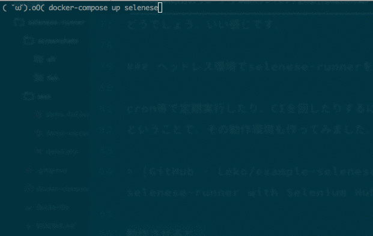

この記事は[12/21 クローラー／Web スクレイピング](http://qiita.com/advent-calendar/2016/crawler)の記事です。

最近、自社システムのシナリオテストの実施方法周りの調査をやっているのですが、

- GUI からテストコードの原型を作成できる
- テストコードを編集しても GUI で編集できる可逆性が有る
- CI のためにヘッドレスで実行できる
- 環境構築が簡単

な手法を調べており、[selenese-runner](https://github.com/vmi/selenese-runner-java)というツールと Selenium が提供している Selenium Hub というツールを利用したらいいんじゃないか、という結論になりました。  
この方法なら専門的な技能がなるべく少なくて済むんじゃないか。

と思っている方法を紹介します。

<!--more-->

## Selenium IDE

[Firefox のアドオン](https://addons.mozilla.org/ja/firefox/addon/selenium-ide/)として配布されています。  
ブラウザでの操作をマクロとして記録する機能があります。  
また、IDE 上で記録したマクロを編集したりアサーションを追記したりできます。  
補完とドキュメントが付いているので、Selenium の機能を熟知していなくても、補完で命名を補いってドキュメントで知識を補いながら書けます。  
IDE からステップ実行もできるので、１手順ずつ動作確認していくことも可能です。

Selenium IDE の詳しい使い方については色んな方が記事書いてくださっていますので割愛します。

> &mdash; [5 分でわかる Selenium IDE の使い方 – Qiita](http://qiita.com/naoqoo2/items/90d382cd9370d3526509)  
> &mdash; [これだけはおさえておきたい！Selenium IDE のコマンド – Qiita](http://qiita.com/oh_rusty_nail/items/c59d4345d5372213128f)  
> &mdash; [Selenium IDE で Web ページのテストを自動化しよう！｜社員ブログ｜株式会社 Qript](http://www.qript.co.jp/blog/technique/1691/)

## IDE 上でアサーションを書き加える

アサーションを書くのはややプログラマ的な視点が必要になるかもしれませんが、  
CSS セレクタと HTML タグが分かればある程度のテストなら書けるので、  
フロントのマークアッパーとかも十分戦力として計上可能な範囲の専門性だと思います。

## HTML ファイルとして保存

エクスポート機能を使わずにファイルとして保存すると、HTML ファイル（selenese という形式らしい）が吐き出されます。  
selenese という形式は結構冗長な HTML です。かなしい。  
ただし、ここで重要なのが **可逆性があること** です。  
selenese の形式を崩さなければ、 **テキストエディタ等で編集した後でも再度 Selenium IDE で開き直すことが可能** です。

エクスポート機能を利用すると、様々な形式のコードへエクスポートが可能です。  
**ただし、selenese という形式以外にエクスポートすると、Selenium IDE で開けなくなります。非可逆です。**  
で、selenese という形式は結構冗長な HTML です。かなしい。

可逆性を失うと「エディタが扱えて selenese 形式の HTML が理解できる」エンジニアが必要になってしまうと思います。  
でないとメンテナンスできなくなっちゃうので、できれば IDE で何度でも編集できる形にしておきたい。  
ということでエクスポートは selenese 形式一択だと現状考えています。

## selenese-runner で実行する

お待ちかねの CLI 化+ヘッドレス化です。

### selenese-runner とは

[selenese-runner](https://github.com/vmi/selenese-runner-java)自体の使い方については[ご本人が公開されているスライド](https://vmi.jp/software/selenium/StudyingSelenium-01/SeleneseRunner-20140118.html)が参考になると思います。

この便利ツールを使用して、selenese 形式の HTML をコマンドラインから実行できます。

### selenese-runner をホストで動かす

selenese-runner 単体をホスト側実行するとブラウザが起動し、HTML の内容が実行されます。

どうでしょう。いい感じです。

### ヘッドレス環境で selenese-runner を動作させる

cron 等で定期実行したり、CI を回したりするには、GUI のない Linux サーバで実行する必要があると思います。  
ということで、その動作環境も作ってみました。

> [GitHub – Leko/example-selenese-runner-with-hub: Example of scenario testing used by selenese-runner with Selenium Hub](https://github.com/Leko/example-selenese-runner-with-hub)

動作させると、

こんな感じです。いかがでしょうか。  
これなら GUI 不要なので、cron でも CI でも exec でもいい感じにもらえばいいと思います。

### コンテナの構成

こんな感じです。  
設定ファイルの中で selenese コンテナはドライバを`remote`、`remote-url`に hub コンテナの URL を指定してあります。  
その指定をすると selenese-runner 側が Selenium hub にテスト実行依頼を投げます。  
依頼を受け取った hub は、接続済みの chrome か firefox を起動しテストを実行します。

Selenium hub 使ったことなかったので理解するまでが難しかったですが、実際に動かしてみたら簡単に理解できました。  
Selenium hub 自体については公式リポジトリとこちらの記事が参考になりました。

> &mdash; [GitHub – SeleniumHQ/docker-selenium: Docker images for Selenium Standalone Server](https://github.com/SeleniumHQ/docker-selenium)  
> &mdash; [&raquo; Selenium Grid で複数の実機ブラウザで自動テスト TECHSCORE BLOG](http://www.techscore.com/blog/2015/05/10/selenium-grid/)

### 日本語サポート

Selenium はデフォルトでは日本語などのマルチバイト文字をサポートしていません。  
なのでスクショを撮る時に □□□ みたいな感じに化けるのですが、せっかくスクショ撮るようにしたなら日本語対応したいな、ということでしておきました。  
`selenium/hub`側に日本語対応を入れるのかと思っていましたが、`node-chrome`と`node-firefox`コンテナの方に入れる必要がありました。  
詳しくは Ubuntu のドキュメントと公開したリポジトリの Dockerfile を御覧ください。

> &mdash; [Ubuntu の日本語環境 \| Ubuntu Japanese Team](https://www.ubuntulinux.jp/japanese)

ちなみに、[中国語のタグ](https://github.com/SeleniumHQ/docker-selenium/pull/339)の PR に対して、

> however not sure if those containers could accept such locale support for general cases

と回答しているので公式のタグとしては登場しなさそうです。

## まとめ

これをベースに自分たちなりのアレンジで運用してもらえれば、  
スクレイピングもシナリオテストもいい感じに回っていくかな、と思います。
