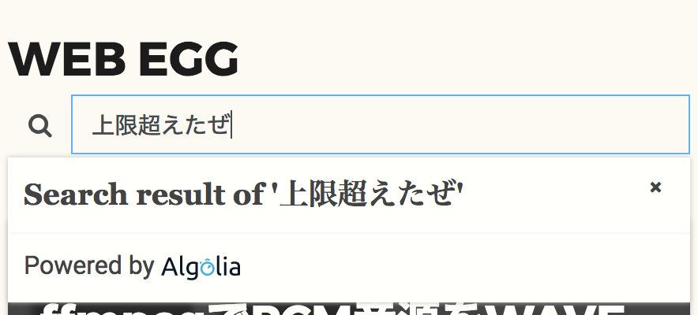

こんにちは。  
当ブログのサイト内検索をしたことある方はお気づきかもしれませんが、サイト内検索に[Algolia](https://www.algolia.com/)を利用しています。  
（後述の事情により月初に使えなくなることがたまにありますが）動作速度もかなり早く、安定して稼働してます。  

運用コストもゼロで、記事書いてPRをマージすれば記事公開日に勝手にコンテンツが検索対象に一手間加えてあります。  
Algoliaを１ヶ月実運用してみたので、**Algoliaはいいぞ**という紹介記事を書きたいと思います。  

また、CQRS・DDDの勉強のために、フロントはReactと[Almin](https://github.com/almin/almin)で実装してみました。  
Almin、CQRS、Fluxの小さな実装例の１つとしても参考になるかと思います。

<!--more-->

Algoliaとは
---------------------------------------
https://www.algolia.com/

Algoliaは、検索機能を提供するAPIと管理用APIと公式ライブラリ、そして周辺ツール群にて構成されています。  
私なりの「Algoliaのここがすごい！」は、

* 検索がとにかく早い
* プランが柔軟
* カスタマイズ性が高い
* １ヶ月利用して１回も落ちてない
* 検索APIの気が利いてる
* 自動でタイポの名寄せをしてくれる（NoedをNodeとして解釈可能）
* バックエンド、フロントエンド共にライブラリが充実
* フィールドの重み付けなどのパラメータ調整をコード変えずに対応可能

あたりです。  
大きな導入事例もあり、Alt GoogleSiteSearchのデファクトなのでは!? と思うほどのクオリティと感じています。

DocSearchとは
---------------------------------------
今回はAlgoliaのすごさを全力アピールするため、周辺ツールも紹介します。  
Algoliaが提供する周辺ツールのうち、ぜひ知って欲しいのが[DocSearch](https://community.algolia.com/docsearch/)です。

DocSearchはAlgoliaのコミュニティが提供する、ドキュメントに特化した検索機能用のツールです。  
Algoliaのバックエンドを利用する点は同じですが、**タグを数行書けばサイト内をクローリングして検索対象を自動収集**してくれます。  
今は亡きGoogle Site Searchのような使い勝手で、使い心地はこちらの方が高いと感じました。

> グーグルは、サイト内検索サービスのGoogle Site Searchを2018年に終了することを決定しました。
>
> &mdash; [Google Site Searchが終了へ、サイト内検索は2018年までに他のサービスに乗り換えを | 編集長ブログ―安田英久 | Web担当者Forum](http://web-tan.forum.impressrd.jp/e/2017/03/28/25352)

導入例はかなり強力で、その界隈の開発者にとっては馴染み深いドキュメントで広く活躍してます。
もしかしたらこれらのドキュメントを読んでる過程で、サイト内検索を利用し、Algoliaのロゴに出会ったりしていないでしょうか。

* [React Native](https://facebook.github.io/react-native/)
* [Babel](https://babeljs.io/)
* [Middleman](https://middlemanapp.com/basics/install/)
* [Vue.js](http://vuejs.org/v2/guide/)
* [Scala](http://docs.scala-lang.org/)

なお、今回は自前で実装してAlmin、DDD、CQRSについて実践したかったので、DocSearchではなくAlgoliaを利用しています。

Algoliaの導入例
---------------------------------------
周辺ツールの１つであるDocSearchに話が逸れましたが、Algolia本家の話に戻します。

先述の通りAlgoliaは一部開発者にとっては馴染み深いドキュメントで利用されていますが、  
他にも有名なWebサービスでも利用されているようです。

* [Twitch](https://www.twitch.tv/)
* [Periscope](https://www.pscp.tv/)
* [Stripe](https://stripe.com/jp)

DocSearchのように、だいたいサイト内検索系のサービスの対象は静的サイトだと思いますが、  
Algoliaが恐ろしいのは**動的なWebサービスでも利用されている**という点です。  
それもAmazon(Twitch)やTwitter(Periscope)などすでに巨大な検索エンジンを持ってそうな企業が採用している点は脅威です。

自分で使ってみても、それくらい検索性・速度の面で圧倒的に良いと思いますし、  
何より、複雑になりがちな検索機能のクエリ処理を実装しなくていいというのはかなりのアドバンテージなのではないでしょうか。  
試してはないですが、AlgoliaはバックエンドのAPIがかなり整っているので、動的サイトでも大きな遅延なく検索機能を代替できそうなイメージがあります。

Algoliaの料金・制限
---------------------------------------
[Algoliaの料金ページ](https://www.algolia.com/pricing)

Algoliaは無料で始められます。  
また、小規模なサイトであれば無料のまま使い続けられます。

* 検索対象になるマスタデータ1万件まで
  * 当ブログに置き換えると1万記事までOK
* Algolia APIを月10万回まで実行可能
  * 記事の登録も1回、記事の検索も1回
* Algoliaを用いている箇所にAlgoliaのロゴを表示すること

で用途として足りていれば、無料のまま継続利用できます。  
月10万回というのがとても絶妙な数でして、月1万PVほどの当ブログで1ヶ月試した結果、ギリギリアウトでした（残３日にて回数上限オーバー）。  
なお、**上限オーバーすると、検索もコンテンツの追加もできなくなります。**



このブログにおいて検索はさほどクリティカルな機能ではないし、無料で提供しているので、まぁ数日くらい検索できなくてもいいやくらいの温度感でやってます。  
もしプラン上げたくなったら、管理画面から手続きすればプランの分だけ上限は復活するので、最悪そうします。

概要、メリット、費用面について整理できたので早速Algoliaで検索機能の実装を始めます

記事をJSON化してAlgoliaに登録する
---------------------------------------
当ブログはMiddleman(Ruby)を使用しているので、[algolia/algoliasearch-client-ruby](https://github.com/algolia/algoliasearch-client-ruby)を使用します。  
おそらく大体の言語の公式クライアントライブラリがあるので、言語に合わせて読み替えてください。

使用するメソッドは`Algolia::Index#save_objects!`です。ソースは[こちら](https://github.com/algolia/algoliasearch-client-ruby/blob/5062d7b6fff7d58694731c7c294d82677620a07b/lib/algolia/index.rb#L295)  
記事を検索できるように、記事データを登録するために、記事データをJSON化する必要があります。

Middlemanの場合、幸い.jsonのついたファイルを作っておくだけで勝手にJSONを吐いてくれるので、とても楽でした。  
**なんて美味い話はなくて**、多少は楽だったんですが、多少の工夫が必要でした。  
記事データをJSON化しているのは[このファイル](https://github.com/Leko/WEB-EGG/blob/master/source/posts.json.erb)で、以下の通りです。

```erb
<%= all_articles.select{|a| a[:published]}.to_json %>
```

ここはとてもシンプル。公開されている記事だけフィルタしてJSON化してます。  
ここで出てくる`all_articles`は自作のヘルパです。[このファイル](https://github.com/Leko/WEB-EGG/blob/master/config.rb)に記述しており、以下の通りです。

```ruby
helpers do
  # ...
  def all_articles
    blog.articles.map{|post|
      {
        objectID: Digest::MD5.hexdigest(post.slug),
        title: post.title,
        date: post.date,
        body: strip_tags(post.body),
        summary: strip_tags(post.summary),
        tags: post.tags,
        published: post.published?,
        locale: post.locale,
        slug: post.slug,
        path: post.data.path,
      }
    }
  end
  # ...
end
```

* objectIDという一位なキーがAlgoliaに必要
* 記事の本文や冒頭文はHTMLになってるので、HTMLを剥がす必要がある

という手を加えています。

> &mdash; [Middlemanでstrip_tagsを使ってサマリーをplain textにする方法](http://webfood.info/middleman-how-to-strip-tag-to-plain-text/)

という感じでMiddlemanなら簡単に記事データをJSON化できたので、あとはそれをクライアントライブラリに渡すだけです。
記事データの登録に成功すると、記事データがAlgoliaに登録されて、検索可能な状態になります。

検索機能を実装する
---------------------------------------
検索対象を登録したので、早速記事データを検索してみます。  
実装の全体像は[こちら](https://github.com/Leko/WEB-EGG/tree/master/source/javascripts/SearchApp)を見るといいかと思います。

Reactと、[Almin](https://github.com/almin/almin)というユースケース駆動、CQRS、DDDと相性の良いFlux実装を使って実装してます。  
Algoliaを使って検索する、という点はオリジナルですが、実装の雛形はAlmin公式のTODO MVCのチュートリアルがほぼ全てです。  
データの取得方法と、取って来たデータの見せ方を変えただけ、という感じです。

> In this guide, we’ll walk through the process of creating a simple Todo app.
>
> &mdash; [Todo App · Almin.js](https://almin.js.org/docs/tutorial/todomvc/)

上記チュートリアルで`MemoryDB`というオンメモリの値をDBかのように振る舞うインフラレイヤのアダプタを参考に、[Algolia用のインフラレイヤのアダプタ](https://github.com/Leko/WEB-EGG/blob/master/source/javascripts/infra/adapter/Algolia.js)を実装してあります。  
Almin自体の詳細はもっとノウハウを貯めて別の記事にて書ければと思います。

記事を書いたら自動でAlgoliaにコンテンツが登録されるようにする
---------------------------------------
当ブログはTravis CIで事前にビルドしたものをデプロイしているので、  
サイトのビルド・デプロイ時に自動的に記事データをAlgoliaに登録する処理を入れてみました。

```ruby
configure :build do
  after_build do
    def update_search_index(path)
      Algolia.init application_id: ENV['ALGOLIA_APP_ID'], api_key: ENV['ALGOLIA_API_KEY']
      index = Algolia::Index.new(ENV['ALGOLIA_INDEX'])
      batch = JSON.parse(File.read(path))
      index.save_objects!(batch)
      File.delete(path)
    end
    update_search_index('./build/posts.json')
  end
end
```

`build/posts.json`は、先ほどのJSON化するためのファイルが出力される場所です。  
Algoliaに登録したらもうJSONデータは使わないので消してあります。

これで`middleman build`すれば自動的にAlgoliaに記事データが登録されます。  
差分更新にするには記事の追加だけでなく変更や削除まで対応する必要があり、面倒だったので全件更新にしてます。  
何か問題が起きたら差分更新にすると思います。

検索対象のデータと、レスポンスに含めるフィールドを調整する
---------------------------------------
記事の本文も検索対象に含めたかったのですが、記事本文が丸ごとレスポンスに入っているとデータ量が多くてパフォーマンスが出なかったので、調整をしました。

検索する側のパラメータは

```js
  async find (keyword: string): Promise<PostList> {
    const algoliaOptions = {
      query: keyword,
      hitsPerPage: 1000,
      attributesToRetrieve: [
        'title',
        'summary',
        'tags',
        'path',
        'objectID',
        'date',
        'published',
        'locale',
        'slug',
      ]
    }
    const response: AlgoliaResponse = await this.index.search(algoliaOptions)
    // ...
  }
```

`attributesToRetrieve`を指定すると、レスポンスに含めるフィールドを指定できます。  
記事本文をレスポンスから除外したら、かなりパフォーマンスが上がりました。

検索にマッチした箇所をハイライト表示
---------------------------------------


当サイトの検索機能はキーワードにマッチしたところがハイライトされるようにしてるのですが、  
これは実装したわけではなく、Algolia側が勝手にやってくれてます。まじすごい。

レスポンスの中に`_highlightResult`というキーが入っており、ここにハイライト済みのHTMLが格納されています。  
HTML文字列をそのまま表示させるので普通にReactは使えなくなってしまうのですが、[dangerouslySetInnerHTML](https://facebook.github.io/react/docs/dom-elements.html#dangerouslysetinnerhtml)というpropを使うとお茶を濁せます。

まとめ
---------------------------------------
* Algoliaはすごい
* Algoliaで検索するときはレスポンスのデータ量を最小限にすると早い
* Alminとても可能性を感じる、手に馴染む

他にも検索可能なフィールドを絞ったり、検索結果の優先度設定などパラメータをいじっているのですが、  
それだけで一本記事書けるレベルに量が多くなると思うので、この記事では割愛します。

ぜひAlgoliaとAlmin試してみてください。
