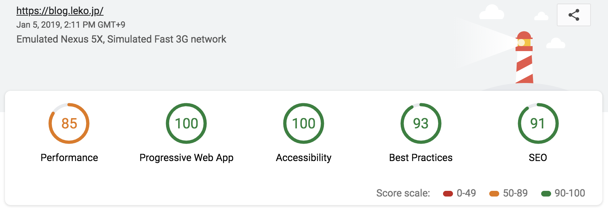

2017年にこのブログはWordpressからMiddleman製に作り変えたのですが、この度MiddlemanからGatsbyへ移行しました。前回の移行の記事はこちらです。

> &mdash; [Wordpressで運用していたブログをMiddleman+Netlifyに変更した | WEB EGG](https://blog.leko.jp/post/migrate-wp-to-middleman-and-netlify/)

Middleman時代からmarkdownや画像系を全てソース管理していたので、移行は二日くらいで特に問題なく終わりました。
今回はマイグレーションガイドではなく、使用感としてMiddlemanとGatsbyを比較してみたいと思います。

## 移行にあたり求めてたこと
- 描画のパフォーマンスを上げたい
- ビルド速度の大幅改善（もともと3-40分かかってた）
- 初期描画の後に動的に動くjs（サイト内検索とか）の開発体験を"普通"にしたい

Gatsby使えばオフライン対応が入ってPWAにしやすいって話もあるんですが、このブログがPWAになってもどうしようもないのでその辺りは割愛します。

## Gatsbyによって描画のパフォーマンスが上がった
lighthouseのスコアはこんな感じです。



まだ初期描画のパフォーマンスがやや低い（jsのbundleが大きい）のですが、まぁ許容範囲かなと思っています。このブログはリピートで訪問される方の方が多いので、２回目以降や回遊時のパフォーマンスでいえば、圧倒的にGatsbyの方が上です。  
Gatsbyをドキュメント通りに使えばService Workerによるキャッシュやprefetchがかかるので、一度訪れたページの表示速度はかなり早いです。
（Middlemanでも[sw-precache](https://github.com/GoogleChromeLabs/sw-precache)を使ってごちょごちょやってたんですが、管理が面倒で投げ出した）

[gatsby-plugin-sharp](https://www.gatsbyjs.org/packages/gatsby-plugin-sharp)で複数解像度の画像をクエリして[gatsby-image](https://www.gatsbyjs.org/packages/gatsby-image/)を使って画像のlazy loadingと解像度の低い画像を初期表示しておくことも簡単に実現できます。  
参考：[記事のfeatured imageのクエリ](https://github.com/Leko/WEB-EGG/blob/34bb9aeb99f7fabf4947b8ae31aa8fc02b8a388d/src/templates/blog-post.js#L107-L114) と [それを表示するコード](https://github.com/Leko/WEB-EGG/blob/34bb9aeb99f7fabf4947b8ae31aa8fc02b8a388d/src/templates/blog-post.js#L34-L37)

画面遷移には[gatsby-link](https://www.gatsbyjs.org/docs/gatsby-link/)と[gatsby-plugin-catch-links](https://www.gatsbyjs.org/docs/gatsby-link/gatsby-plugin-catch-links)を使うのですが、これらがprefetchの仕組みを備えているので、リンクにmouseenterするとsame-originのリンク先はfetchされ、クリックする前にキャッシュされてるのでサイト内の画面遷移も高速になります。  
また、通常の`<a />`タグを用いたリロードを伴う画面遷移ではなく、[@reach/router](https://github.com/reach/router)を用いてフロントエンドでルーティングしているので、同一ドメイン内での遷移ではリロードが発生しません。当然その分だけ早いです。この辺も自前で頑張らずとも勝手にそうなってくれるのでありがたい限りです。  
[quicklink](https://github.com/GoogleChromeLabs/quicklink)を使って回線強度によっては富豪的にリソースを読み込んでも良さそう、と思ってるのでprefetchの仕組みを変えるかもしれません。

また、HTTP2対応として[gatsby-plugin-netlify](https://www.gatsbyjs.org/packages/gatsby-plugin-netlify/?=netlify)を使えばLinkヘッダも自動で生成もできますし、[gatsby-plugin-zopfli](https://www.gatsbyjs.org/packages/gatsby-plugin-zopfli/?=zop)と[gatsby-plugin-brotli](https://www.gatsbyjs.org/packages/gatsby-plugin-brotli/?=bro)を読み込むだけでZepfliやBrotliの圧縮にも対応できます。

## ビルド速度が大幅に改善された
Middlemanのビルドがとにかく遅くて、CI回すたびに3-40分待つことになるのがかなり辛かったです。  
ページのビルドも遅かったんですが、もっとも遅かったのは[ImageMagick](https://www.imagemagick.org)による画像の最適化でした。パッケージやRubyを最新バージョンにしても速度は改善することなく、アクティブな開発も止まってるので、改善される未来も見えないなーと思っていました。  
一方Gatsbyは画像の圧縮を含めても3-4分ほどでビルドが終わるので、10倍以上早くなりました。Gatsbyは画像の最適化に[sharp](https://github.com/lovell/sharp)というOSSを用いており、かなり高速に動作します。sharpは自分も仕事で使っているプロダクトだったので安心して使っています。  

結果的にCIもデプロイもすぐ終わるようになったのでとても快適です。
Gatsby自体がとてもアクティブに開発されているし、ビルド速度に関してもまだまだ改善の余地があると思います。  

## 開発体験が普通になった
私にとっての"普通"とは、JSのエコシステムに乗っかってwebpackサーバ立ててバベって〜、といったよくあるフロントエンドの開発のスタックに乗り換えたいということでした。

> &mdash; [MiddlemanのビルドにWebpackを組み込む方法 | WEB EGG](https://blog.leko.jp/post/how-to-use-webpack-with-middleman/)

MiddlemanでもAsset pipelineに乗っからずに無理やりwebpackを突っ込んで利用していたんですが、あまり体験は良くありませんでした。
Gatsbyではwebpackの設定がいい感じなので設定を自前で頑張る必要もありません（現時点では独自のwebpack.config.jsを持ってない）。
カリカリにチューニングしようと思ったらその辺頑張る必要があると思うんですが、いざという時はなんとでもできそうという安心感があります。

## 総評
まだ移行して数日ですが、今の所メリットしかないと思っています。  
もちろんメリットがあると思っていたから移行したんですが、思ってた以上の嬉しさ（prefetch周りとかオフライン対応とか）がついてきたので、思わぬ誤算でした。
今回のスタックはかなり満足いってるので、使ってて何か出たらGatsbyのプラグインやcoreにcontributeしていく所存です。

## その他雑感
その他感じたことも雑多に残しておきます。

### 見た目を完全に保ったまま移行するのはかなり手間だと思う
MiddlemanやJekyll等から移ってくるには、これまでテンプレートエンジンで書いてた部分やスタイルを全てjsxで書き直す必要があります。
もともとのcssやSassを保ちつつ、１つ１つの要素にclassName振ってってもいいと思いますが、CSS in JSで書いた方がtree shakeしやすかったり「JSで書くならやれること」がたくさんあるので文句なしの形に移行するにはかなり手間がかかると思います。  

移行に際して、見た目に関してこだわっておらず「本文が読みやすくて表示が早ければいい」と思っていたので、ほぼデフォルトのままで、本文に関してはMediumを参考にスタイルを当てました。

### markdownエンジンの移行はノーダメージ
markdownのエンジンがRuby（私の場合は[Redcarpet](https://github.com/vmg/redcarpet)）からNode（[remark](https://github.com/remarkjs/remark)）のものに変わるので、独特の方言を使ってると記法の解釈が変わる可能性がありますが、当ブログのmarkdownの構文は変えずに移行できました（アセットのパスとかfrontmatterのフィールド名はASTにバラしてゴリっと変えたけど）。  
もしAsset pipelineを活かした`xxx.md.erb`のようなmarkdownエンジンの外側の問題があると、そこは苦労すると思います。

~~strike through~~も使えるし、見出しの横のパーマリンクも[gatsby-remark-autolink-headers](https://www.gatsbyjs.org/packages/gatsby-remark-autolink-headers/?=head)で実現できたし、

```js
const message = 'Fenced code blockによるSyntax highlightも使えるし'
```

記事では見えませんがFrontmatterも使えてます。
（[この記事のソース](https://github.com/Leko/WEB-EGG/blob/master/content/blog/impression-comparison-of-middleman-and-gatsby/index.md)）

### 開発用サーバの起動はMiddlemanの方が早い
Middlemanでは類似の記事の検索＋表示をやっていました。Gatsbyではそれをやってないのですが、それでもMiddlemanの方が起動は早いです。  
画像の圧縮を開発時にもやっていることが主な問題なんですが、本番だけバグることをなるべく避けたいし、そのデバッグに手間をかけたくないのでこのまま続ける予定です。もし速度が気になっても開発時は圧縮を切ればいいので、改善の余地はまだまだあると思います。  
（もしMiddlemanで画像の圧縮を開発時にやっていたらサーバ起動するのにビルド時のように数十分かかるので、相対的に見れば圧倒的に早い）

起動する時間はMiddlemanはおおよそ30秒、Gatsbyの方は1~2分ってとこなのですが、どちらにせよエディタに向かって記事を書いてる間にサーバは立ち上がってるのでそれほど問題になっていません。

### ライブリロードの速さはGatsbyの方が上
Hot Module Replacement(HMR)が入ってるので、画面自体をリロードせずに描画だけ更新ができます。  
Webアプリなどで自前で設定を組むのはやや面倒ですがGatsbyでは最初から設定済みなので、使い始めれば勝手にHMRが効くようになります。
細かいスタイルの調整をしてる時にはとてもありがたく、一度サーバさえ立ち上がってしまえばそのあとは圧倒的にGatsbyの方が快適です。

### GatsbyのページネーションはGraphQLに慣れれば簡単で明快
ページネーション系のプラグインを探してみたものの、どれもあまり使われてないか、開発が止まっていました。  
ただそもそもプラグインは必要なく、[公式のガイド](https://www.gatsbyjs.org/docs/adding-pagination/#adding-pagination)があったのでその通りに実装しました。`gatsby-node.js`から各コンポーネントへのデータフローがわかれば、特に違和感なく書けると思います。  
その要領で[タグごとの記事一覧ページ](https://github.com/Leko/WEB-EGG/blob/34bb9aeb99f7fabf4947b8ae31aa8fc02b8a388d/gatsby-node.js#L65-L81)も作りましたが、特にハマることも無く素直に実装できました。

### TODO
- 初期描画のパフォーマンス改善
- パフォーマンス面のlint（[webhint](https://webhint.io/scanner/)や[lighthouse](https://developers.google.com/web/tools/lighthouse)、bundle sizeの[size-limit](https://github.com/ai/size-limit)）を強化したい
- パンくずがないと今表示してるページがなんなのかぱっと見でわかりにくい
- サイト内検索がないと（自分が記事を探すときに）面倒くさいし、それなりに使われてるらしいので復活させたい

などをボチボチやっていく予定です。
