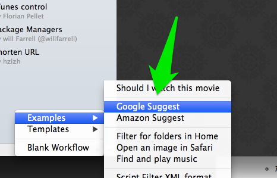
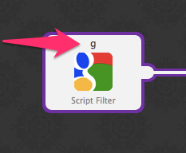
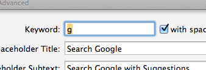
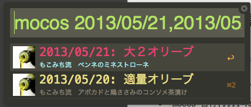
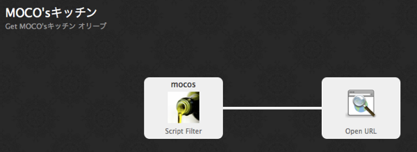
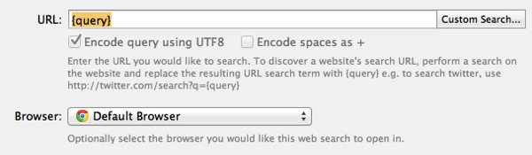

こんにちは。  
最近は、[Alfred](http://www.alfredapp.com/)というアプリに大変お世話になっております。  
アプリを起動するのにいちいちトラックパッドを使わなくて済むので、すごく捗ります。

Alfredには、色々な便利機能があるのですが、

今回はもう少し突っ込んだことについて書きたいので、  
参考になった記事を貼っておきます。

> [Mac仕事効率化！Spotlightを完全に超えた神ランチャーアプリ「Alfred 2」の使い方とおすすめWorkflows10選。[Mac] | MacWin Ver.1.0](http://macwin.org/mac/alfred-2-workflows/)

<!---->

> [[太]MacのランチャーアプリAlfred ver2の新機能「workflows」が結構凄そう。 | Fujitaiju Blog](http://fujitaiju.com/blog/apple/mac/mac-launch-app-alfred-ver-2/)

ここからが本題です。  
Alfredには**Workflows**という機能があります。

このWorkflowsが非常に強力で、

* Evernoteのクリップしてある記事から検索をかけたり
* リマインダーにワンライナーでタスクを追加したり
* Amazonの商品検索のサジェスト機能を使ったり
* カラーコードを入力すると該当する色を表示してくれたり
* URLを入力すると、短縮URLが生成されてクリップボードにコピーできたり

と、他にも色々ありますが、 Alfredというアプリ上で、**一つのまとまった作業を一気に行うことができます**。

で、この中から  
**WebでAPIが公開されているサービスに何らかの問い合わせをし、  
その結果を元に、何かアクションを起こす**

といったタスクを行うWorkflowsを作ってみようと思います。

ググっても、チュートリアル系の記事が１件も見つからなかったので、 ソースを読んで作り方を学んでいきます。

今回は、日付を入力すると、  
速水もこみちがMOCO'sキッチンで使ったオリーブオイルの量を検索出来るAPI  
[MOCO'SキッチンオリーブオイルAPI]()を利用したWorkflowsを作ります。

<!--more-->

## Alfred Workflowsの前提知識

まず、Alfredというアプリをインストールしないと始まらないので、  
[公式](http://www.alfredapp.com/)かApp Storeからインストールをします。  
**インストール+利用は無料**です。

<a href="https://itunes.apple.com/jp/app/alfred/id405843582?mt=12&uo=4" rel="nofollow" target="_blank">  


<b>Alfred</b>   


<br /> </a>カテゴリ: 仕事効率化  
価格: 無料<br clear="all" />

そして、残念ですが、注意事項です。

**Alfred Workflows(以下workflows)を利用するには、課金が必要です**。

価格にして、15英ポンド、2013/05/21現在**¥2,300くらい**です。  
しかし、**それだけのお金を払う価値は十分にある**と思います。

ここから先の内容は、  
Alfredの有料機能を使うためのPowerPackを買った人を対象に進めます。

## サンプルのGoogle Suggestを利用してみる

PowerPackを購入すると、workflowsが利用できるようになります。

まずは感覚をつかむために、  
Google Suggestというサンプルを利用します。

### 1. Google Suggestを作成





workflowsの下の方にある**[+]**を押し、  
**Examples→Google Suggest**をクリックすると、作成完了です。 workflowsのリストにGoogle Suggestというのが表示されたと思います。


これは、Alfredにあらかじめサンプルとして入っているworkflowsで、  
このまま利用できます。

### 2. 使ってみる

では早速使ってみます。  
Alfredを起動し、`g 検索ワード(何でもいい)`と入力します。

例えば`g jQ`と入力すると、このようなリストが表示されます。


表示されたものを選択し、Enterを押すと、  
その検索結果ページがブラウザで開かれます。

### 3. つまり

このように、**Googleの検索窓で打つのと同じことを、  
Alfred上で完結できます**。

今回、  
**urlを叩いてjsonやらxmlを入手して、その結果を元に処理を行う**ことがしたいので、  
このサンプルは非常に参考になります。

Examplesに、同様の機能を持った**Amazon Suggest**というものもあるんですが、  
こちらはコードがあまりシンプルじゃなかったので、Google Suggestの方を見ていきます。

サンプルのコードを読む
----------------------------------------

まず、Google Suggestのコードを、全部貼っつけてみます。  
あまり行数はないです。PHPで書かれています。

```php
require_once("workflows.php");
$wf = new Workflows();
$orig = '{query}';
$xml = $wf->request( 'http://google.com/complete/search?output=toolbar&q='.urlencode( $orig ) );
$xml = simplexml_load_string( utf8_encode($xml) );
$int = 1;
foreach( $xml as $sugg ):
  $data = $sugg->suggestion->attributes()->data;
  $wf->result( $int.".".time(), '$data', '$data', "Search Google for ".$data, "icon.png" );
  $int++;
endforeach;
$results = $wf->results();
if ( count( $results ) == 0 ):
  $wf->result( "googlesuggest", $orig, "No Suggestions", "No search suggestions found. Search Google for ".$orig, "icon.png" );
endif;
echo $wf->toxml();
```

これで分かる方なら、もう早速作り始められると思います。  
備忘録のために、これを部分的に掻い摘んでいきます。

### 0. 言語について

その前に、workflows作成に利用できる言語について。

Google SuggestもAmazon Suggestも**PHP**で書かれています。  
ですが、もちろん**他の言語でも書くことができます**。

他に対応している言語は、

* bash
* zsh
* Ruby
* Python
* Perl

があります。

PHPで書く際の注意点は、  
**ファイルの先頭、末尾に`<\?php`と`?>`を入れない**こと、くらいです。

**今回は、Google Suggestに倣って書くので、PHPで書きます**。  
ご了承下さい。

<span class="line-through">というかPHP以外の言語あまり分かりません。<span></span></span>

### 1. workflows.phpとWorkflowsクラス

```php
require_once('workflows.php');
$wf = new Workflows();
```

この部分、いかにもなクラスをrequireしています。  
Workflowsクラスは、workflowsを作る上でのユーティリティです。

これのお陰で、通信などの処理を自前で書かずとも、  
簡単にworkflowsが作成できるようになっています。

**workflows.phpは、workflowsを作成すると自動的に生成される**ので、  
自前で揃える必要はありません。

### 2. 入力値の格納

```php
$orig = "{query}";
```

とありますが、これはworkflows上での**おまじない**です。

`"{query}"`という文字列は、Google Suggestで設定されている、  
`g`キーワード以降に入力された文字列に置き換えられます。

例えば、`g jQuery`と入力すると、  
$origには、`"{query}"`ではなく、変換後の`jQuery`という文字列が入ります。

どのタイミングで置換が行われるかは、調査はしていません。

### 3. $wf->requesr( url )

Workflowsクラス大活躍です。  
urlを渡すだけでレスポンスを取得できます。

必要に応じて、**urlencode**を使ってエンコードして下さい。

### 4. $wf->result()

```php
foreach( $xml as $sugg ):
    $data = $sugg->suggestion->attributes()->data;
    $wf->result( $int.'.'.time(), "$data", "$data", 'Search Google for '.$data, 'icon.png' );
    $int++;
endforeach;
```

レスポンスを取得したら、  
必要なデータを抜き出して`$wf->result`に突っ込んでいます。

result()に突っ込まれたデータが、Alfred上で表示されます。

この$wf->result()の引数が分かりにくいので、  
Workflows.phpの中身を見てみました。

```php
/**
 * Description:
 * Helper function that just makes it easier to pass values into a function
 * and create an array result to be passed back to Alfred
 *
 * @param $uid – the uid of the result, should be unique
 * @param $arg – the argument that will be passed on
 * @param $title – The title of the result item
 * @param $sub – The subtitle text for the result item
 * @param $icon – the icon to use for the result item
 * @param $valid – sets whether the result item can be actioned
 * @param $auto – the autocomplete value for the result item
 * @return array – array item to be passed back to Alfred
 */
public function result( $uid, $arg, $title, $sub, $icon, $valid='yes', $auto=null, $type=null ) {
    // …
}
```

という引数になっています。  
リストに見える部分は、$titleと$sub、$iconです。

$argは、取得結果を表示した**次のアクションに渡される値**です。

例えば、取得結果にURLが存在する場合には、そのURLを$argに渡しておくと、  
次のURLを開くアクションなどで$argの値を渡すことができます。

### 5. echo $wf->toxml();

workflowsは、`echo $wf->toxml()`でechoされたxml文字列を受け取って、リスト表示するようです。

### 6. まとめ

これらの処理をすごくざっくりまとめると、

  1. $wf->request()でAPIを叩く
  2. レスポンスから、使いたいデータを$wf->result()に突っ込む
  3. echo $wf->toXML()でリスト表示させる

と言った３ステップになると思います。

### 補足. キーワード？ ？ ？

`g 検索ワード`のように、  
`g`というキーワードにこのworkflowsが反応させるように決めます。





反応させるキーワードは、図の上部に書かれた文字を見れば分かります。





反応キーワードを変更したい場合には、  
この図をダブルクリックして、keywordを変更すればOKです。

今回作るものの詳細
----------------------------------------

冒頭でも話しましたが、  
今回は、[MOCO'sキッチンオリーブAPI]()を利用したサンプルを作ります。

今回使用するキーワードは、`mocos`として、

* `mocos 日付(YYYY-MM-DD)[,日付…]`と入力する
* 該当する日付に使われたオリーブの数とレシピの名前を表示
* レシピを選択してEnterキーを押すとブラウザでレシピが見れる
* `YYYY/MM/DD`形式でも入力を受け付ける

と言った機能を作ります。 完成図はこんな感じ。





このAPIはパラメータは１種類しか取らず、  
その書式もはっきりしているのでHello worldに最適だと思います。

今回利用するAPIについて学ぶ
----------------------------------------

MOCO'sキッチンオリーブAPIのURLは、  
`GET:` です。

パラメータは`date`のみで、  
値は、`YYYY-MM-DD`形式の日付です。  
カンマ区切りで複数書くこともできます。

<span class="removed_link" title="http://pastak.cosmio.net/mocoDB/oliveAPI/getJson.php?date=2013-05-21"></span>  
にアクセスして、レスポンスを整形したものが以下です。

```javascript
{ "2013-05-21": { "menu": "もこみち流　ペンネのミネストローネ", "url": "http://www.ntv.co.jp/zip/mokomichi/397800.html", "olive": "大２", "thumb": "http://pastak.cosmio.net/mocoDB/oliveAPI/img/thumb_800.jpg" } }
```

レスポンスは、上記の形式で得られます。

コードの説明
----------------------------------------

先ほどのGoogle Suggestにならって作ったコードがこちらです。

```php
<?php

 require_once('workflows.php'); $wf = new Workflows(); $in = "{query}"; define("REQUEST_URL", "http://pastak.cosmio.net/mocoDB/oliveAPI/getJson.php"); // YYYY/MM/DD形式の場合パラメータを変換 $in = str_replace("/", "-", $in); $url = REQUEST_URL."?date=".$in; $json = json_decode($wf->request($url)); // エラーがある場合 if ( $json->error ) { $wf->result(time(), ", $json->error, ", 'icon.png'); // 正常に取得ができた場合 } else { foreach($json as $menu => $info) { $title = $menu.": ".$info->olive."オリーブ"; $wf->result(time(), $info->url, $title, $info->menu, 'icon.png'); } } echo $wf->toXML();
```

先ほどのGoogle Suggestの例を見れば、  
特に難しいことは無いと思います。

PHPでJSONのパースを行うには、`json_decode()`を利用します。

ポイントは、  
**result()の第２引数$argに、レシピのURLを設定している**ところです。

これによって、この後に続く**「URLを開く」という処理が可能に**なります。

workflowsの全体図とopen URLの設定内容がこちらです。








繰り返しますが、**$wf->result()の第二匹数$argは、次の処理へ渡す値を指定しています**。  
そして、**次の処理でも同様に`"{query}"`という文字列で値を取ることが出来る**ようです。

まとめ
----------------------------------------

web APIと連携したAlfred Workflowsの作り方は、  
このような感じになっています。

シンプルなMOCO'sキッチンAPIだから簡単だったわけではなく、  
他のAPIを利用しても同様の方法でかなり簡単に書けます。

これを機に、是非皆さんもworkflow製作者になってみては如何でしょうか。

* [Alfred App – Productivity App for Mac OS X](http://www.alfredapp.com/)

* [Alfred 2のユーザ体験をロケットスタートで始めるための13の偉大なWorkflow – Macの手書き説明書](http://veadardiary.blog29.fc2.com/blog-entry-4425.html)

* [Alfred 2のWorkflowをまとめたサイト『Alfred 2 Workflow List』が宝の山](http://veadardiary.blog29.fc2.com/blog-entry-4435.html)

* [[Mac] バージョンアップした Alfred2で使える、おすすめ Workflows まとめ20個。 « Appdrill](http://appdrill.net/63089/alfred2-workflows.html)
