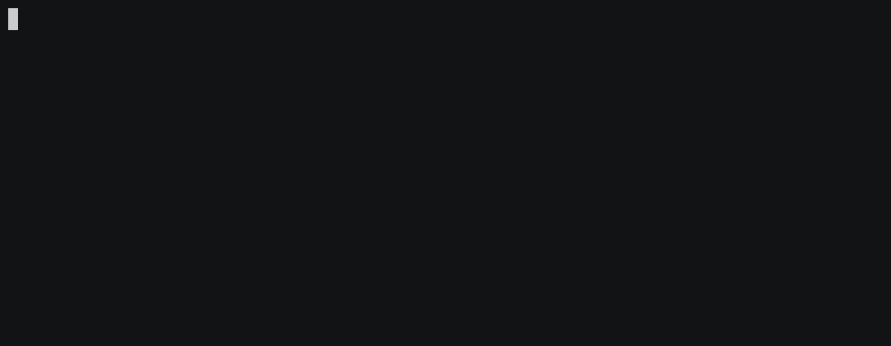

便乗ネタです。

> &mdash; [peco で npm-scripts を超簡単に実行したい - Qiita](https://qiita.com/hogesuke_1/items/46f009f31b5f2ec8c02c)

という素晴らしい記事が公開されたので実際に使ってみたのですが、  
`npm run`まで打ってから「あれ、コマンドなんだっけ」と思い、入力内容を消し`nrun`を実行するという一手間を省略したいと思いました。  
もっと超簡単に実行できるように`npm run <TAB>`で peco が起動するようにしてみました。

<!--more-->

## CHANGELOG

2018/06/01: yarn にも対応しました

## まえおき

Bash でのみ動作確認してます。  
Z や F の方は別途記事書いていただけるとありがたいです。

また、元記事の通りにセットアップができていることを前提とします。

> &mdash; [peco で npm-scripts を超簡単に実行したい - Qiita](https://qiita.com/hogesuke_1/items/46f009f31b5f2ec8c02c)

## `npm run <TAB>`で peco を作動させる

タブ補完に関しては、こちらの記事を参考にしました。

> &mdash; [Bash タブ補完自作入門 - Cybozu Inside Out | サイボウズエンジニアのブログ](http://blog.cybozu.io/entry/2016/09/26/080000)

で、実際に書いたシェルがこちら。

```sh
_npm_run_peco() {
    local cur prev cword
    _get_comp_words_by_ref -n : cur prev cword
    if [ "$prev" = "run" ] || [ "$prev" = "yarn" ]; then
        COMPREPLY=$(cat package.json | jq -r '.scripts | keys[]' | peco --initial-filter=Fuzzy --query=$cur)
    fi
}
complete -F _npm_run_peco npm yarn
```

このコードを bash_profile などに貼り付け、

```
source ~/.bash_profile
```

などと実行すれば反映されます。
コードは短いですが一応解説です。

### Tab 補完の定義方法

`complete -F フックさせたい関数名 補完対象にするコマンド（可変長）`を実行すると、タブ補完が有効になります。  
例えば`complete -F hoge npm yarn`と書けば`npm`と`yarn`コマンドに対して関数`hoge`をフックするタブ補完になります。

### \_get_comp_words_by_ref

便利関数。現在カーソルがある手前の単語が何かわかります。  
例えば、prev が`run`だった時だけ処理するみたいにフィルタできます。  
cur は現在カーソルがある単語を指すので、入力途中のスクリプト名を peco の初期クエリに渡せます。

```
npm run <TAB>  # Tabの位置に単語はないので、クエリは空文字列。全script一覧が表示される
npm run b<TAB> # Tabのいちに`b`があるので、bにマッチするscript一覧が表示される
```

### COMPREPLY

`COMPREPLY`に値をセットすると、補完される文字列になります。  
例えば COMPREPLY に`build`という値をセットすると、

```
npm run build
```

のような補完になります。  
これに peco を組み合わせて、peco で選ばれた script が COMPREPLY にセットされるようにすれば良い

### peco で fuzzy search

設定次第ですが、オプション指定なしで peco を呼ぶと`IgnoreCase`というフィルタになっています。  
個人的には Fuzzy search なら適当にタイプしても見つかるので設定しています。  
この設定は好みなので、[peco のオプション](https://github.com/peco/peco#--initial-filter-ignorecasecasesensitivesmartcaseregexpfuzzy)を読みつつ、手に馴染む設定をすると良いと思います。

## 動作デモ



> &mdash; [タブ補完で peco で npm-scripts をもっと超簡単に実行したい - asciinema](https://asciinema.org/a/184718)

快適 ٩( 'ω' )و  
作ってみたら Bash の Tab 補完とても簡単だったので、これからは積極的に補完していきたい
