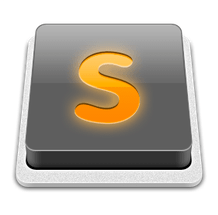
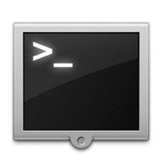
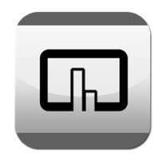

明けましておめでとうございます。  
本年も良いブログになるよう日々精進してゆきますので、  
今後ともご愛読いただけると幸いです。

今回は、「私がMacでいつも使っているおすすめのアプリを15個」  
日常生活に使ったり、常に起動している便利ツールだったり、web制作やアプリ開発などに使っている捗るアプリをメインにご紹介いたします。  

<!--more-->

エディタ
----------------------------------------

### Coda 2

¥6,500 | Panic, inc.

<a href="https://itunes.apple.com/jp/app/coda-2/id499340368?mt=12" target="_blank">App Storeで見る</a>

言わずと知れた開発環境Coda2。 痒いところに手が届くコード補完、クオリティの高いシンタックスハイライト、綺麗なカラーリング、自然な操作でローカル->サーバへアップロード出来る、などなど 多少お高くても文句なしです！（私は半額セールだった時に買いましたが）。 そして地味に楽しいのが、「サイト」機能にサムネイル機能が有ることです！ どのサイトかひと目でわかるし、見た目に現れることでモチベが上がります。 <aside>

* <a href="http://stocker.jp/diary/coda-2/" target="_blank">Coda 2 ファーストインプレッション | Stocker.jp / diary</a>
* <a href="http://www.webcreatorbox.com/tech/dreamweaver-to-coda/" target="_blank">DreamweaverからCodaに変えました | Webクリエイターボックス</a></aside> 

### Sublime Text 2

試用¥0 or $59

<a href="http://www.sublimetext.com/" target="_blank">ダウンロード</a>

これも有名だと思います。一時期バズりましたね。 高機能＆多機能＋軽い！ カーソルを一度に複数使えたりと不思議なことの出来るエディタです。 私もまだ全く使いこなせていないので、今度練習しがてらエントリを１つ書いてみようと思います。 <aside> 

* <a href="http://liginc.co.jp/designer/archives/6774" target="_blank">"恋に落ちるエディタ"「Sublime Text」 完全入門ガイド！ | 株式会社LIG</a> 
* <a href="http://blog.huwy.org/article/292827228.html" target="_blank">【Windowsアプリケーション】Sublime Text 2 メニュー日本語化: ゆーがいぶろぐ</a></aside> 

### OmmWriter

¥450 | Herraiz Sato & AsociadosSL <a href="https://itunes.apple.com/jp/app/ommwriter-dana-ii/id412347921?mt=12" target="_blank">App Storeで見る</a>

癖になるエディターアプリ。 起動するとフルスクリーンになり、癒される音と背景に、何者にも邪魔されること無く文章を書くことができます。 さらに、キーボードを叩くたびにタイプライターのようなパチパチ音があり、一度入力すると病みつきになります。 <aside> 

* <a href="http://d.hatena.ne.jp/iumem/20110331/1301501697" target="_blank">OmmWriterとかいうテキストエディタを全力で紹介する。 – Nemui！ (id:iumem)</a>
* <a href="http://ozpa-h4.com/2011/02/26/ommwrite/" target="_blank">Macで集中して文章を書くなら「OmmWriter」を使うべき | OZPAの表4</a></aside> 

Todo管理
----------------------------------------

### Wunderlist

無料 | 6 Wunderkinder GmbH

<a class="app_store" href="https://itunes.apple.com/jp/app/wunderlist/id410628904?mt=12" target="_blank">App Storeで見る</a>

色々なTodo管理アプリを使ってみた中で、 手軽さと綺麗さ、使いやすさのバランスが一番しっくり来たTodo管理アプリ。 iPhoneや他のOS、デバイスにも対応しているのも吉。 UIがとても綺麗で使っててクセになります。 <aside> 

* <a href="http://matome.naver.jp/odai/2132454671916471701" target="_blank">2011年ベストiPhoneアプリに輝いたWunderlistって何？ 【使い方まとめ】 – NAVER まとめ</a>
* <a href="http://www.lifehacker.jp/2012/12/121222wunderlist_2.html" target="_blank">To-Doリストに欲しい機能満載！ ほぼ全てのプラットフォームで使える『Wunderlist』 : ライフハッカー［日本版］</a></aside> 

情報収集
----------------------------------------

### Snackr

無料 | snackr.net

<a href="http://snackr.net/" target="_blank">ダウンロード</a>   

効率良く情報収集が出来る、というよりは楽しく情報収集ができるAdobe Airアプリです。 何より、おしゃれ。 画面の端に常駐して、登録されたRSSフィードをスクロールで流してくれます。 作業しながら横目に確認できので、 全フィード熟読はしないけど、さらっと目を通したいという時におすすめです。 GoogleReaderと連携できるのも吉。後輩に教えていただきました。 <aside> 

* <a href="http://boku-pocket.blogspot.com/2012/06/macwindowslinuxrsssnackr.html" target="_blank">僕のポケット: Mac・Windows・Linuxで使える超クールなRSSリーダー[Snackr]がおすすめです。</a>
* <a href="http://tokuna.blog40.fc2.com/blog-entry-1524.html" target="_blank">電光掲示板のようなRSSティッカー「Snackr」でデスクトップにニュースを流す*二十歳街道まっしぐら（FC2ブログ時代）</a></aside> 

便利ツール
----------------------------------------

### Alfred

無料 | Running with Crayons Ltd

<a href="https://itunes.apple.com/jp/app/alfred/id405843582?mt=12" target="_blank">App Storeで見る</a>

標準アプリSpotlightの強化版、といった感じです。 Spotlightよりも動作が軽くて高機能。愛用しています。 ロックやスリープもこれから一発！ 参考エントリを読まれると魅力が伝わるかも知れません。 <aside> 

* <a href="http://www.danshihack.com/2011/06/09/saku/alfred.html" target="_blank">Quick Silverを超えた？ AlfredでMacをカチャカチャ使う | 男子ハック</a>
* <a href="http://kazoo1837.blog23.fc2.com/blog-entry-272.html" target="_blank">Macのランチャーアプリ「Alfred」の便利さに、今さらながら気がついた。</a></aside> 

### TotalTerminal

無料 | binaryage

<a href="http://totalterminal.binaryage.com/" target="_blank">ダウンロード</a>   

めちゃくちゃ捗るターミナルアプリです。 ⌘Commandキーを２回打つだけでターミナルを呼び出せます。 そして画面の端からにゅっと出てきて、もう１度同じキーを打つとにゅっと隠れます。 この感覚がくせになるのと、ブログ記事を見ながらコマンドを叩くときにすごく捗ります！ <aside> 

* <a href="http://d.hatena.ne.jp/shepherdMaster/20110929/1317308430" target="_blank">格好良いターミナル「TotalTerminal」 – 世界中の羊をかき集めて</a>
* <a href="http://succi.jp/blog/?p=593" target="_blank" class="broken_link">コマンドラインからターミナル.appの列数を変更してTotalTerminalをもっと便利に使う | prime factor</a></aside> 

### BetterTouchTool

無料 | © Andreas Hegenberg 2012

<a href="http://blog.boastr.net/" target="_blank">ダウンロード</a>   

Macで不便に思っていた動作の多くをこれで実現できます！ ！ Windows 7のように、ウィンドウを左右に分割したりデスクトップを表示したり… トラックパッドのジェスチャーもかなり設定できるので詳しくはこちらでどうぞ！ ！ <aside> 

* <a href="http://bamka.info/267/" target="_blank">アプリをキーボードから一発起動するショートカットを作成できる。そう、BetterTouchToolならね。</a>
* <a href="http://bamka.info/2045/" target="_blank">ウィンドウの一発リサイズは、BetterTouchToolなら無料。Macユーザーは入れるべき。</a></aside> 

### Scroll Reverser

無料 | PILOTMOON

<a href="http://pilotmoon.com/scrollreverser/" target="_blank">ダウンロード</a>   

トラックパッドとマウスを同時に使うことってありませんか？ いくらトラックパッドでのスクロールに慣れても、マウスのスクロールが逆になると、私は不自然です。 そんなときにこのアプリ。 マウスとトラックパッドでのスクロール方向を逆にしてくれます。 これで作業がだいぶ捗っております。 <aside> 

* <a href="http://www.conchikuwa.com/2011/09/08/crollreverser/" target="_blank">[Mac]マウス派の方にオススメ！ OS X LIONでマウスのスクロール方向だけを今までと同じ方向にする方法を見つけた!! | こんちくわのぶろぐ</a></aside> image"> 

画像
----------------------------------------

### Toycamera Analogcolor

試用¥0 or ¥1050 | pentacom

<a href="http://www.pentacom.jp/pentacom/toycamera_analogcolor/index_ja.html" target="_blank">ダウンロード</a>   

トイカメラ風の画像加工アプリです。 細かい設定が出来るものさることながら、プリセットの設定が私好みなので いちいち自分で値を調整しなくても数クリックでかなり満足の出来になります。 <aside> 

* <a href="http://thinkingscrap.cocolog-nifty.com/blog/2009/08/toycamera-analo.html" target="_blank">TOYCAMERA ANALOGCOLORかPoladroidか: thinking scrap</a></aside> 

### Wallpapers HD Lite

無料 | StuckPixel, Inc.

<a href="https://itunes.apple.com/jp/app/wallpapers-hd-lite/id441812880?mt=12" target="_blank">App Storeで見る</a>

壁紙ダウンロードアプリです。 無料版なので5枚/日しか落とせないのですが、色んなニーズをカバーしていて キャラクターものや季節物も多く、なおかつクオリティが軒並み高い。 ハロウィン系の画像にはお世話になりました。笑 好みによりますが、無料なのでとりあえず一度入れてみては如何でしょうか。 

### JPEDmini Lite

無料 | ICVT Ltd.

<a class="app_store" href="https://itunes.apple.com/jp/app/jpegmini-lite/id525742250?mt=12" target="_blank">App Storeで見る</a>

JPEG画像を（ほぼ）無劣化で1/5くらいにサイズダウンできるwebサービスが、アプリになりました！ 今までこれで変換をかけて「荒いなぁ」と思ったことはありません。 使う側は容量の節約に、見る側は表示速度の劇的改善になりWIN-WINです。 ちなみに無料版だと、20枚/日までしか変換できません。 <aside> 

* <a href="http://www.jpegmini.com/main/home" target="_blank">JPEGmini – Your Photos on a Diet!</a>
* <a href="http://www.danshihack.com/2012/06/09/junp/macapp-jpegmini.html" target="_blank">1.2MB→394KBってすごいぞ！ 画像データを軽くする「JPEG mini」がMacアプリに！ | 男子ハック</a></aside> 

データベース
----------------------------------------

### MySQLWorkbench

無料 | ORACLE

<a href="http://www-jp.mysql.com/downloads/workbench/" target="_blank">ダウンロード</a>   

ORACLE MySQL公式のGUIツールです。 ER図の作成は設計時だけでなく、実在する外部DBとも連携できて 型やリレーションの変更が可能で、phpMyAdmin要らずなスグレモノです。 ER図だけでなく他にもまだまだ機能があるので、 練習がてら今度エントリを書いてみようと思います。 <aside> 

* <a href="http://blog.toor.jp/2010/05/24/mysql_workbench_great_software/" target="_blank">MySQL Workbench が便利です</a>
* ※「MySQL Workbench」を日本語化するには？ – 適当なWeb屋の気ままなブログ</aside> 

その他
----------------------------------------

### FreeMind

無料

<a href="http://freemind.sourceforge.net/wiki/index.php/Main_Page" target="_blank">ダウンロード</a>   

マインドマップ作成ツールは多く有るのですが、 無料のものだとこれが一番しっくり来るかなと思います。 キーボードでだいたいの操作が出来てしまうので、 頭の中を広げて整理したい時にはガーッとこれに書きなぐっています。 <aside> 

* <a href="http://freemind.asia/" target="_blank">FreeMind使おう会 | 思考整理の定番フリーソフトFreeMindユーザー会</a></aside> 

いかがでしたでしょうか。 以上が、私のおすすめアプリです。 何かの助けになれれば幸いです。 最近また新しいアプリを入れて使い心地を確かめているので 半年後くらいにエントリを書くかも知れません。 
