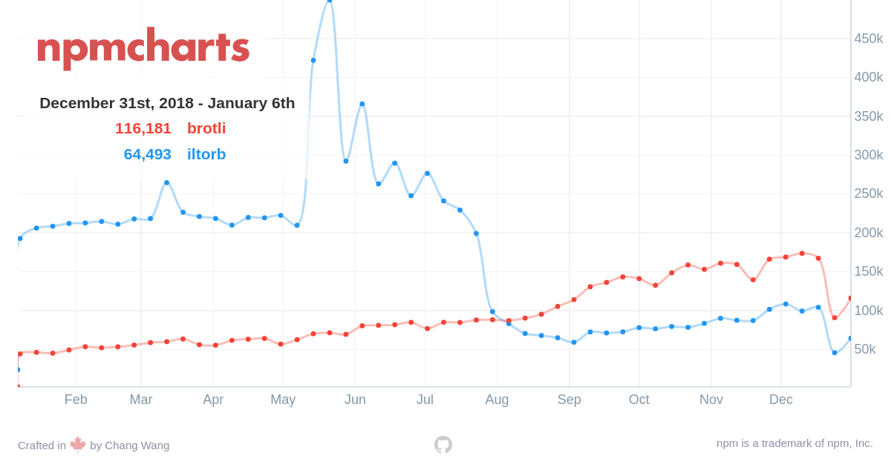

以下の PR により、Node.js に Brotli 圧縮がサポートされました。

> &mdash; [zlib: add Brotli support by addaleax · Pull Request #24938 · nodejs/node](https://github.com/nodejs/node/pull/24938)

~~まだ master に入ったばかり（2019/01/06 マージ）なので 2019/01/08 現在リリースはされていませんが、手元でビルドすれば試せるようになります。~~  
2019/01/20: 11.7.0 でリリースされました。[リリースノート](https://nodejs.org/en/blog/release/v11.7.0/)

## Brotli とは

Brotli とは、Google が作成した新しいデータ圧縮/解凍アルゴリズムの一種です。  
gzip(Zopfli)と比較して高い圧縮率と圧縮/解凍のパフォーマンスが特徴です。HTML や JavaScript などと相性の良い辞書が用いられており、web 関連のリソースにおいてより高い圧縮率を発揮します。圧縮・解凍のパフォーマンスもよく、gzip に変わる新しい圧縮形式として注目されています。
IE を除くメジャーなブラウザですでにサポートされており、現時点で Brotli でコンテンツを配信している web サービス、web サイトも多いことでしょう。

Brotli 自体については以下の記事がとても参考になりました。

> &mdash; [WEB スピード向上・転送量削減する Brotli 圧縮と CDN の連携 | REDBOX Labo](https://blog.redbox.ne.jp/cdn_brotli.html)  
> &mdash; [Brotli を用いた静的コンテンツ配信最適化と Accept-Encoding: br について | blog.jxck.io](https://blog.jxck.io/entries/2017-08-19/content-encoding-brotli.html)

なお当ブログでも.br（Brotli の拡張子）と.gz の静的ファイルを配布しています。

## 背景

Brotli に関しての議論は以下の Issue から確認できます。

> &mdash; [Feature Idea: Brotli support in core · Issue #18964 · nodejs/node](https://github.com/nodejs/node/issues/18964)

TLDR;  
IE 以外のほぼすべてのモダンブラウザが Brotli 形式のリクエストをサポートしたので、コアに入れようという話です。

## これまでの Brotli の利用方法

これまでは Brotli 圧縮を利用するために、主に２つの npm パッケージがよく使われていました。  
[google/brotli](https://github.com/google/brotli)にて提供されている C++のコードを gyp でビルドする[iltorb](https://www.npmjs.com/package/iltorb)と、Emscripten でラップした[brotli](https://www.npmjs.com/package/brotli)の２つです。  
DL 数の変遷はこちら。

>   
> https://npmcharts.com/compare/iltorb,brotli

Google 公式の C++をそのまま Node.js で動くよう port にした iltorb が流行ったあとに、gyp 不要でお手軽な brotli が徐々に人気を獲得していったように見えます。DL 数が乱高下しているところはなにがあったんでしょう。。。

なお当ブログは Brotli 圧縮のために[gatsby-plugin-brotli](https://github.com/ovhemert/gatsby-plugin-brotli)を利用しています。このプラグインは内部で brotli の方を利用していました。

## これからの Brotli の利用方法

Brotli サポートがリリースされれば、npm パッケージには不要になり、Node.js の`zlib`モジュールから Brotli が利用できるようになります。  
使い方は[PR 内のドキュメントの差分](https://github.com/nodejs/node/pull/24938/files?short_path=c245d87#diff-c245d87dba893de0b77c7574f0081633)を見るのがわかりやすいです。HTTP サーバでどのように Brotli のリクエストを扱えばいいかのデモコードなどがあります。

例えば文字列を Brotli で圧縮して解凍するプログラムは次ようになります。  
なお、この記事を作成した時点ではまだリリースされてないので、試すには master ブランチでビルドした最新版の Node.js が必要になります。

```js
const {
  brotliCompress,
  brotliCompressSync,
  brotliDecompress,
  brotliDecompressSync,
} = require('zlib')
const { promisify } = require('util')

const text = 'Hello world'

// Promise
;(async () => {
  const brotliCompressAsync = promisify(brotliCompress)
  const brotliDecompressAsync = promisify(brotliDecompress)

  const compressed = await brotliCompressAsync(text)
  const decodedBuffer = await brotliDecompressAsync(compressed)
  const decodedText = decodedBuffer.toString()
  console.log(decodedText) // => Hello world
  console.log(decodedText === text) // => true
})()

// Sync
const compressed = brotliCompressSync(text)
const decodedBuffer = brotliDecompressSync(compressed)
const decodedText = decodedBuffer.toString()
console.log(decodedText) // => Hello world
console.log(decodedText === text) // => true
```

`brotliCompress`, `brotliCompressSync`が圧縮、`brotliDecompress`, `brotliDecompressSync`が解凍用の関数です。  
圧縮および解凍には、`String`, `Buffer`, `ArrayBuffer`などを渡せます。

圧縮率などのオプションを変更するには zlib.constants の中にある定数たちを使います。詳しくはドキュメントを参照してください。  
圧縮率は`BROTLI_MIN_QUALITY`から`BROTLI_MAX_QUALITY`の間の整数値が指定できます。

```js
const { constants, brotliCompressSync } = require('zlib')
const { BROTLI_PARAM_QUALITY, BROTLI_MAX_QUALITY } = constants

const text = 'Hello world'
const maxCompressed = brotliCompressSync(text, {
  params: {
    [BROTLI_PARAM_QUALITY]: BROTLI_MAX_QUALITY,
  },
})
```

stream を利用したサンプルはこんな感じです。

```js
const fs = require('fs')
const { createBrotliCompress } = require('zlib')

fs.createReadStream('./test.txt')
  .pipe(createBrotliCompress())
  .pipe(fs.createWriteStream('./test.txt.br'))
```

```js
const fs = require('fs')
const { createBrotliDecompress } = require('zlib')

const pipeline = fs
  .createReadStream('./test.txt.br')
  .pipe(createBrotliDecompress())

;(async () => {
  let text = ''
  for await (let chunk of pipeline) {
    text += chunk
  }

  console.log(text)
})()
```

## さいごに

web とのシナジーが高い Brotli ですが、実際のところ.br ファイルを配信するには Apache や nginx・h2o などのレイヤで処理させたり CDN 側に移譲したりすることが多いと思います。仮に実装するとしても express のミドルウェア（や何かしらの npm パッケージ）を使うことがほとんどで、zlib を用いて自前で Node.js レイヤで圧縮プログラムを書く機会はそう多くないと思います。そういったサービスやライブラリの中身が npm モジュールではなく zlib モジュールにおきかわるだけで、実質的な恩恵/影響を受けることは少ないかもしれません。

ちなみに私は CLI ツールや書き捨ての変換スクリプトを書くときに.gz を読み書きするために結構使ってます。これからは gzip じゃなくても問題ない場合は積極的に Brotli を使っていこうと思います。

多くのユースケースにおいて直接的な恩恵は少ないかもしれませんが、Brotli とは何か、素の Node.js だけで Brotli 圧縮/解凍できるようになったことを頭の片隅に入れておき、使いどころが来たらここぞとばかりに使うといいかなと思います。
