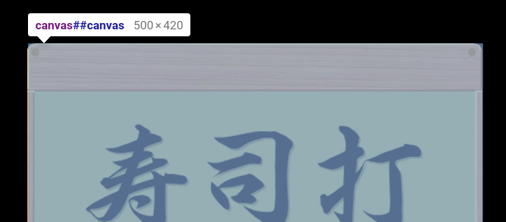
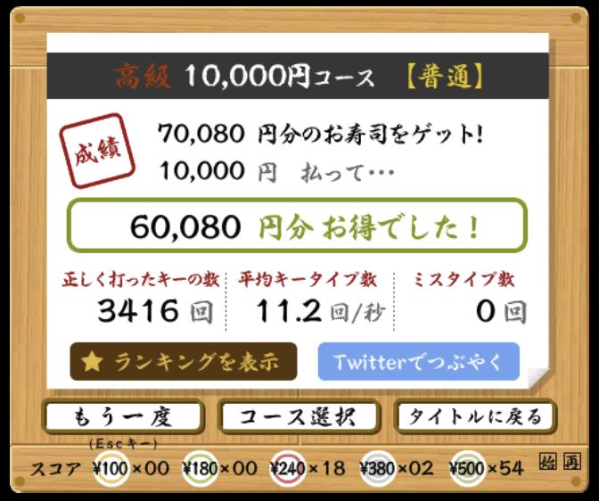

> この記事は[闇の魔術に対する防衛術 Advent Calendar 2019](https://qiita.com/advent-calendar/2019/yaminomajutu)2 日目の記事です。

ある日、会社で[寿司打](http://typingx0.net/sushida/)というタイピングの速度や正確さを競うゲームが流行った。  
みんなやってるので私も挑戦してみたところ、結果は惨敗。全エンジニアの中で最もスコアが低かった。もともとタイピングが早くも正確でもないことを自覚していたつもりだったが、現実を突きつけられ大人しく家に返って枕を濡らそうと思った。が、あまりの悔しさにまみれ「JSer ならタイピング速度ではなく JS で勝負すればいいんだ」とダークサイドに堕ち闇の力に手を染めてしまった。

本記事はムキになって寿司打（WebGL 版）のスコアを稼ぐ自動化 JavaScript の話。  
なお動作確認には Ubuntu 19.04、Google Chrome 80.0.3955.4 を使用した。

## 寿司打 WebGL 版

http://typingx0.net/sushida/

寿司打はもともと Flash ゲームだったが、いつからか WebGL 版に移植されたらしい。  
難読化されてなかったのでサイト上で動作している JavaScript を軽く読んでみたところ Unity が使用されていることが分かった。"WebGL"版とうたっているだけあり、ゲーム画面は Canvas で描画されている。Canvas を用いているのであれば JavaScript から座標データを読み取って OCR することができそうだ。



## TL;DR 最終的なコード

こちら。

<script src="https://gist.github.com/Leko/713f278bf2ffd3cc010f21145293492c.js"></script>

必要最小限の自動化しかしてないため、以下のような手順で実行する。

1. [寿司打 WebGL 版](http://typingx0.net/sushida/)を開く
1. タイトル画面が表示されるまで待つ
1. 開発者ツールを起動し、以下の JS を実行
1. 手動でゲームを開始する。最初の寿司が置かれるまで待つ
1. **タブを切り替えて画面を表示しないようにして待つ**

音を出してプレイすれば分かりやすく、モリモリ寿司を食べてくれる。  
詳しくは後述するが、最後の手順が重要で、なぜかこれをやらないと WebGL のピクセル情報が全て 0 になってしまう。画面が非表示になってるときだけうまく動くという悲しい完成度だけど、そこさえ守れば動作はする。

Chrome 拡張とかにすれば多少便利になると思うけど、そこまでやるようなことでもないので割愛する。

## 基本戦略

> &mdash; [CookieCliker を js から操作してみる | WEB EGG](https://blog.leko.jp/post/automate-cookie-clicker-with-js/)

６年前に CookirClicker を自動化したことがあった。CookieClicker のゲーム画面は HTML だったので JavaScript による操作の自動化や値の読み取りが非常に簡単だった。  
こと WebGL においてはどうだろう。当然ながら JavaScript から目的の要素を取り出しクリックすることも、表示されているテキストを JavaScript の文字列として読み取ることもできない。その制約で真っ先に思いつくであろう戦略は OCR だ。

ゲーム画面のうち入力すべきローマ字が書かれている近辺の座標に OCR をかけ解析された文字列を JavaScript からキーボード入力を模倣すれば自動化できそうだ。ローマ字部分は背景と文字のコントラスト差が明瞭なので二値化などの前処理も不要だろう。

この記事を書くにあたって類似記事を調べたところ OCR を用いて寿司だを自動化する先駆者が既にいた。この記事では Selenium を使用して画面のキャプチャを OCR している。アプローチは同じだが今回は JS でスコアを稼ぐことを目的にしているため全く同じ実装ではない。

> &mdash; [弊社の新卒タイピング課題「寿司打」を自動化?してみた - Qiita](https://qiita.com/tetsuya-ogawa/items/09f9578a30bffc47603b)

## デバッグ過程

以下の内容は、最終的なコードに至るまでの変遷をつらつらと書いていく。

### WebGL2RenderingContext と CanvasRenderingContext2D

クラスタによると思うが「Canvas を操作する」と聞いたとき、以下のようなコードをまずイメージすると思う。

```js
const canvas = document.querySelector('canvas')
const context = canvas.getContext('2d')
```

getContext に`'2d'`を与えると[CanvasRenderingContext2D](https://developer.mozilla.org/en-US/docs/Web/API/CanvasRenderingContext2D)というオブジェクトが返却される。**しかし寿司打の画面で実行してみるとなぜか null が返ってくる。**Canvas 要素は存在しているのに`getContext('2d')`の戻り値が null。もちろんタイポなどはしていない。  
stackoverflow で調べてみたところ、「既に他のコンテキストで呼び出されている場合も戻り地が null になるよ」と書いてあったので試したところ、寿司打においては`'webgl2'`という値で既にコンテキストが生成されていた。

```js
const context = canvas.getContext('2d') // => null
const context = canvas.getContext('webgl') // => null
const context = canvas.getContext('welgl2') // => WebGL2RenderingContext
```

getContext に`webgl2`を指定した場合の戻り値は[WebGL2RenderingContext](https://developer.mozilla.org/en-US/docs/Web/API/WebGL2RenderingContext)になる。2d のときとはメソッド体系が全く異なっている。WebGL を扱ったことがないので、そもそもわからないしメソッドの説明を読んでもよくわからない。

だが OCR において必要なのはあくまで特定座標（吹き出し部分）のピクセル情報を抜き出すことなので、ピクセル情報が読めさえすればいい。ということで、OCR 用の Canvas を生成し、そちらに対して WebGL2 の Canvas の一部分を描画させる作戦を取る

## drawImage

CanvasRenderingContext2D の [drawImage](https://developer.mozilla.org/en-US/docs/Web/API/CanvasRenderingContext2D/drawImage) は Canvas を受け取りその Canvas を画像として再描画させることができる。これを利用し不慣れな WebGL2 を扱わずに CanvasRenderingContext2D の世界観に変換できる。

```js
const WIDTH_ROMAJI_AREA = 440
const HEIGHT_ROMAJI_AREA = 30
const X_ROMAJI_AREA = 30
const Y_ROMAJI_AREA = 230

// 寿司打のゲーム画面のCanvas
const canvas = document.querySelector('canvas')
// OCR用のCanvasを生成する。DOMにappendしなくても使える
const bufferCanvas = document.createElement('canvas')
const bufferContext = bufferCanvas.getContext('2d')

bufferContext.drawImage(
  canvas, // drawImageにはHTMLCanvasElementが渡せる
  // gl.canvasのこの領域を、
  X_ROMAJI_AREA,
  Y_ROMAJI_AREA,
  WIDTH_ROMAJI_AREA,
  HEIGHT_ROMAJI_AREA,
  // コピー用キャンバスのこの領域に描画
  0,
  0,
  WIDTH_ROMAJI_AREA,
  HEIGHT_ROMAJI_AREA
)
```

DOM に append しなくても動作するが、デバッグ用に画面に表示してみるとこのように入力すべきローマ字部分だけが描画されている Canvas を手に入れることができた。入力するローマ字の長さによって吹き出しのサイズが変わるため横幅を広めに確保している。余計なノイズは除去したのであとは OCR にかけるだけで入力すべき文字列が手に入るはずだ。


### タブが表示されているとすべての座標が 0 になってしまう

結局解決できなかったのだが、記事の冒頭に書いたとおりタブが表示されているとこの現象が発生する。  
drawImage だけでなく WebGL2RenderingContext の readPixels メソッドも同様にすべての座標データが 0（つまり黒）で返ってきてしまうため WebGL2 関連の問題だと思うが、調査の勘所がわからず解決を諦めた。
最前面に表示するタブを切り替えて裏側で処理させれば動作するため、一旦それで妥協した。もしかしたら Chrome のバージョンや OS によっては動作するのかも知れない。

## OCR+微調整

OCR 自体は[tesseract.js](https://github.com/naptha/tesseract.js)というライブラリを使用している。OCR をするなら[Shape Detection API](https://www.chromestatus.com/feature/4757990523535360)の[TextDetector](https://paul.kinlan.me/detecting-text-in-an-image/)を使えたら面白いと思ったが、Origin-trial の申込みが必要だったので今回は見送った。

まずは tesseract.js を画面に挿入する。

```js
const script = document.createElement('script')
script.src =
  'https://unpkg.com/tesseract.js@v2.0.0-alpha.16/dist/tesseract.min.js'
script.onload = () => {
  // ここにOCRの処理を書いていく
}
document.body.appendChild(script)
```

次に OCR をかける。ここは tesseract.js の README の通りなので説明は割愛する。やってることは`TesseractWorker`のインスタンスを生成して`recognize`を呼ぶだけ。解析の速度を上げるために解析される可能性の文字列のホワイトリストを指定している。

```js
const worker = new Tesseract.TesseractWorker({
  tessedit_char_whitelist: '!?,-abcdefghijklmnopqrstuvwxyz01234567890',
})
worker
  .recognize(bufferCanvas)
  .then(r => {
    r.text // => 解析された文字列
  })
  .catch(console.error)
```

## キー入力の模倣

OCR で文字列を解析した後は、JavaScript からキーボード入力させるために`KeyboardEvent`を生成して`dispatchEvent`するだけだが一点注意があった。入力を同期的に実行すると入力が早すぎて処理が追いつかないという問題が発生した。なので１文字ごとに意図的に数ミリ秒のディレイを入れることで入力漏れが起きないようにしている。

```js
// キー入力の模倣をする
function sendKey(key) {
  const event = new KeyboardEvent('keypress', { charCode: key.charCodeAt() })
  document.dispatchEvent(event)
}
// キー入力を同期でやると処理が早すぎてうまく行かないので入力を遅延させる
async function sendKeys(keys, { inputDelay = DELAY_KEYINPUT } = {}) {
  return new Promise(resolve => {
    keys.split('').forEach((c, i) => {
      setTimeout(() => {
        sendKey(c)
        if (i + 1 === lastParsed.length) {
          resolve(keys)
        }
      }, inputDelay * i)
    })
  })
}

worker
  .recognize(bufferCanvas)
  .then(r => {
    sendKeys(r.text) // => 解析された文字列を入力
  })
  .catch(console.error)
```

これで OCR した結果を画面に入力することができるようになった。あとは OCR の精度を向上し、ループさせれば良い。

## 誤解析・誤入力の防止

ここまでの処理で寿司打が自動化できるかといえば、NO である。なぜなら解析結果がかなりの確率でそのまま入力可能な形式にはなってないからだ。スコアを上げるために微調整したことは以下の通り

- 枠線が`I`とか`|`（パイプ）と認識される
  - ノイズ除去のため認識結果を正規表現で整形
- 解析結果が正しくない
  - 小文字英字＋`!`+`?`+`-`だけが文字列に含まれていれば OK、それ以外は無視
  - 解析に失敗した場合その寿司を逃すことになるが、ミスのほうが痛いためミスしないように調整した
- 明らかに正しくない文字列が解析結果に出てくる（`jgKx`など）
  - ４文字以下の文字列が解析されたら無視するようにした
- キーボード入力中にキーボード入力してしまい入力が阻害されミス判定になる
  - キーの入力中が重複しないように排他制御

これらの微調整を終えた上で、出てくる寿司（入力する文字）の組み合わせが良ければミス 0 の解析ができるようになった。



ランキングでも無事一位を獲得することができた。世界最強の寿司職人になれたが、闇の力で手に入れたスコアは実に空虚で、賢者モードになりながらこの記事を書いた。

※寿司打のランキングは２週間に１回リセットされるそうで、チートでスコアを出してしまっても未来永劫人力でハイスコアが塗り替えられないことは起こらないようになっている。
