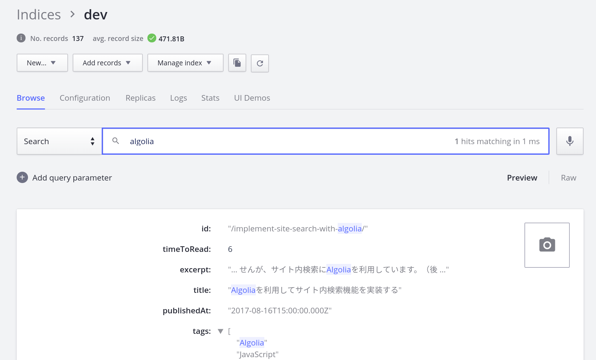
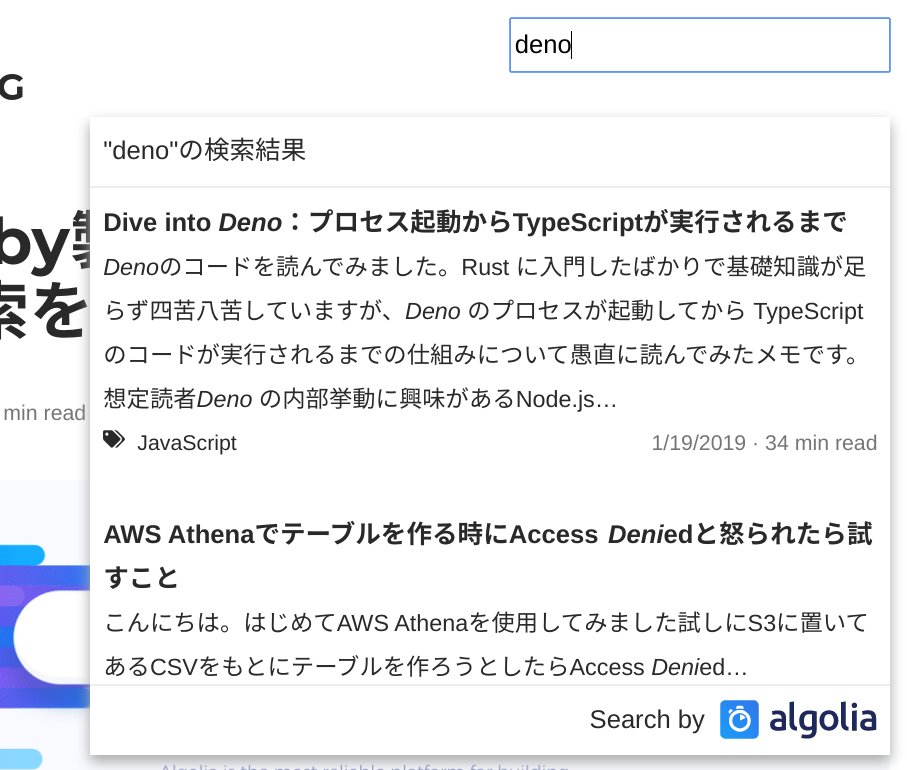

ブログをGatsbyに移行してからずっとサボっていたサイト内検索機能ですが、ゴールデンウィークで時間があったので実装してみました。

なお、当記事はAlgolia自体の知識がある前提で書いてます。  
Algolia自体の説明やMiddleman製サイトに検索機能を導入する話に関してはこちらの記事をご参照ください。

> &mdash; [Algoliaを利用してMiddleman製サイトに検索機能を実装する | WEB EGG](/post/implement-site-search-with-algolia/)  

<!--more-->

## はじめに

当記事はAlgoliaを用いた実現手段の紹介になります。他の手段（JSONファイルに記事データを出力してFuse.js等を用いて全文検索etc）との比較検討などはしていません。  
当記事で使用してる技術に関して、Gatsbyのドキュメントでも紹介されてるのでそちらも併せてご参照ください。

> &mdash; [Adding search with Algolia | GatsbyJS](https://www.gatsbyjs.org/docs/adding-search-with-algolia/)

## 実装方針

Middleman時代はフルスクラッチで作っていたのですが、スクラッチだと記事の内容も実装の手間も無駄にかさんでしまうので、楽に導入できるよう今回はAlgolia公式のライブラリを2つ使用します。  

1. 記事をAlgoliaに登録する：[gatsby-plugin-algolia](https://github.com/algolia/gatsby-plugin-algolia)
1. 検索UIを提供する：[React InstantSearch](https://www.algolia.com/doc/guides/building-search-ui/what-is-instantsearch/react/)

これらを利用することで導入コストをかなり抑えられました。

## 記事をAlgoliaに登録する（gatsby-plugin-algolia）

gatsby-plugin-algoliaのリポジトリはこちらです。

> &mdash; [algolia/gatsby-plugin-algolia: A plugin to push to Algolia based on graphQl queries](https://github.com/algolia/gatsby-plugin-algolia)

記事執筆時のREADMEではサイト内のすべてのページを登録するような処理になっていますが、ブログ記事だけを登録したいのでGraphQLのクエリを変えました。

当サイトでは[こんな感じ](https://github.com/Leko/WEB-EGG/blob/ca76642dff5e8e64df55e1a92d54881ab105ef05/gatsby-config.js#L153-L199)で設定にしてあります。  

- query: 記事一覧を取得するGraphQL queryに変更
- transformer: ↑の結果をshallowなオブジェクトの配列に整形

transformerオプションには「オブジェクトの配列を返す必要がある」「配列の各要素は`id`という名前のフィールドをもつ必要が有ります」という2点の制約が有ります。  
`id`フィールドはすべての記事において一意な任意の文字列を指定できます。個人的に自動生成される値ではなくcontrollableな値が好きなのでslugをidにしました。  
それ以外のフィールドや構造に制約はなく、返却したオブジェクのすべてのフィールドがAlgoliaに登録されます。  

記事の本文を検索対象に含めたい場合、1objectあたりのサイズ制限を突破するために複数のチャンクにちぎって送信するなどの工夫が必要ですが、そもそも本文を検索対象に含めることはAlgoliaが非推奨だと言ってるので本文を含めないように設定しました。

> 2. In most cases, having bigger objects is a sign that you’re not using Algolia at its full capacity:
>     - Having very big chunks of text is usually bad for relevance, because most objects end-up having a lot of similar words, and they will match with a lot of irrelevant queries
>     - It’s often better to de-duplicate big objects into several smaller ones
>
> &mdash; [Is there a size limit for my index/records? | Basics FAQ | Docs Algolia](https://www.algolia.com/doc/faq/basics/is-there-a-size-limit-for-my-index-records/)

設定を済ませて`gatsby build`を実行すると、記事の一覧がAlgoliaに登録されます。こんな感じ。

うまく行かない場合、transform関数がオブジェクトの配列を返せているか確認しましょう。

## 検索UIを提供する（React InstantSearch）

Algoliaに記事を登録して検索できるようになったので、フロントエンドを作ります。  
検索フォームや検索結果の表示にはReact InstantSearchを利用します。

### React InstantSearchとは

[InstantSearch.js](https://www.algolia.com/doc/guides/building-search-ui/what-is-instantsearch/js/)というAlgoliaが提供している検索用UI用のコンポーネントのReact版です。  
InstantSearchを利用することで、Algoliaの検索ロジックや状態管理をスクラッチで実装する必要がなくなり、検索UIと検索結果の見た目を作ることだけに注力できます。
（VueやAngularなどの各種フレームワークやPure JavaScript、webのみならずiOSやAndroid、React Nativeでも使えるように複数バージョンが提供されており、今回はReact版を採用しています）

公式の[Live Demo (codesandbox)](https://codesandbox.io/embed/github/algolia/doc-code-samples/tree/master/React+InstantSearch/getting-started)を見てみると、複雑な検索UIにも対応できるようです。  

React版を使って実装してみて、UIの自由度やカスタマイズ製も高くかなり使いやすかったので採用しました。

### 動作デモ・コード
当サイトの右上にある検索窓が触れるデモです。  
特にチューニングやパラメータの最適化などしていませんが、えげつない速度で検索結果が表示されます。スクショとしてはこんな感じです。

コードは[こちら（OnSiteSearchコンポーネント）](https://github.com/Leko/WEB-EGG/blob/ca76642dff5e8e64df55e1a92d54881ab105ef05/src/components/OnSiteSearch.jsx)を読むとInstantSearchコンポーネントとwidgetsの使い方がわかると思います。

### React InstantSearchのドキュメント

https://www.algolia.com/doc/api-reference/widgets/instantsearch/react/

これを読みつつお好みでウィジェットを足していく感じになると思います。  
基本的にドキュメント見ながらやるだけなんですが、実装してて思った注意事項を以下に残します。

### フロントエンドへ環境変数を渡したい
ローカルと本番環境で検索対象のインデックスを分けるためにAPI KEYなどを環境変数に逃がしたくなると思います。  
GatsbyにはwebpackのDefinePluginが入っているので、ちょっと設定をしてあげれば各設定値を環境変数に逃がせます。

> &mdash; [Environment Variables | GatsbyJS](https://www.gatsbyjs.org/docs/environment-variables/)
>
> &mdash; [gatsby Environment Variables まとめ - Qiita](https://qiita.com/github0013@github/items/f138ce14a69ca8bfd068)

### 未入力のときは検索結果を表示したくない

デフォルトのウィジェットだけで検索UIを組むと、何も入力してない状態でも検索結果が表示されていると思います。  
サイト内検索では何か入力したときだけ結果を表示するためカスタマイズしました。

`connectStateResults`というHoCがexportされているので、それを利用してStateに対する見た目を制御できます。詳しくはドキュメント参照。  
なお、こちらのドキュメントに検索結果が空の場合、エラーハンドリングについても記載が有ります。

> &mdash; [Conditional display | Building Search UI | Guide | Algolia Documentation](https://www.algolia.com/doc/guides/building-search-ui/going-further/conditional-display/react/)

### Algoliaのロゴを表示したい
[こちら（OnSiteSearchHitListコンポーネント）](https://github.com/Leko/WEB-EGG/blob/ca76642dff5e8e64df55e1a92d54881ab105ef05/src/components/OnSiteSearchHitList.jsx)のように実装しました。  
InstantSearchの`Panel`コンポーネントを利用してヘッダとフッタを作り、フッタに`PoweredBy`コンポーネントを表示してCSSでちょっと見た目を調整しました。  
CSSに関しては[こちら](https://github.com/Leko/WEB-EGG/blob/ca76642dff5e8e64df55e1a92d54881ab105ef05/src/styles/OnSiteSearch.css#L44-L51)をご参照ください。  

## さいごに
Gatsby製サイトに検索機能を追加するときの参考になれば幸いです。

スクラッチで作るよりはるかに簡単に導入できた（デバッグ含めて3hくらい）ので、Gatsbyのようにエコシステムが充実しているものに乗っかるのは正義だなと思いました。
