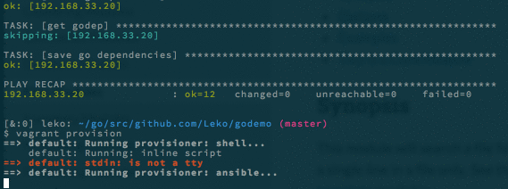

  * [Hamee advent calendar](http://qiita.com/advent-calendar/2015/hamee)13日目
  * [Ansible advent calendar](http://qiita.com/advent-calendar/2015/ansible)の13日目

の投稿です。

まだGoもAnsibleも良くわかってない頃に作った、Goの環境を整えるAnsibleの設定をリファクタリングしました。

やってる事はごく当たり前なんですが、冪等性を担保し、changedが出ないことによって何回でもいつでも実行できる環境にしたので、その過程をメモします。

<!--more-->

まえおき
----------------------------------------

[リファクタリング前](https://github.com/Leko/godemo/blob/91d4c1b439e9546ff14f6aeae44edee2bc28d262/provisioning/playbook.yml)と [リファクタリング後](https://github.com/Leko/godemo/blob/e0d9ca401755e0c4b02ac4a07f4f9bf8632fbaa4/provisioning/playbook.yml)はそれぞれリンクをご参照下さい

Goのバージョンを最新に
----------------------------------------

Goのバージョンが1.4で古かったので1.5に上げました。  
ちなみに1.4と1.5は[こんな感じ](https://golang.org/doc/go1.5)に違うそうです。

URL内にバージョン番号をハードコードしていたのでvarsの中に移して、バージョン番号の変更漏れを起こさないようにしました。([差分](https://github.com/Leko/godemo/commit/1af93346995a444a4992b96e7086c5b8def03701?diff=unified))  
以後はURLに変更がなければ[このように](https://github.com/Leko/godemo/commit/2e34efbeb9ce75e17a902e1f3fd6cf89dcf14599)変えるだけで良くなりました。

## shell, commandモジュールをなるべく使わない

shell, commandモジュールはシェルなので便利ですが、代わりに全ての操作が`changed`になってしまいます。  
これでは **プロビジョニングを実行した結果何が変わったのか** が分かりません。安心感に欠けます。

幸い、それらのモジュールを使わないで済む代替手段が色々あったので、なるべくそちらに寄せていきます。 ファイルの上書きなどで冪等性をシェルだけで担保しようとするとかなり煩雑になってしまうので、とても有り難いです。  
以下に何かと使いそうな例と、それを利用したリファクタの差分を出してみました。

  * ファイルの存在チェックなら[stat](http://docs.ansible.com/ansible/stat_module.html)モジュール ([差分](https://github.com/Leko/godemo/commit/2057011dc30720be1c7833a89676cc436a950c26))
  * apt-update, apt-upgradeは[apt](http://docs.ansible.com/ansible/apt_module.html)モジュール([差分](https://github.com/Leko/godemo/commit/6d3f26a9c9759e93474cf3a0d1c7d775cb6fae5d))
  * ファイルの末尾に挿入、ファイル内の編集は[lineinfile](http://docs.ansible.com/ansible/lineinfile_module.html)モジュール([差分](https://github.com/Leko/godemo/commit/6b1ed78b93a9042d45b211f7361be6988f592dc6))

## shell, commandモジュールを使うならchanged_whenをつける

それでもやっぱり、シェルにお力添え頂きたい箇所は出てしまいます。  
そんなときは`changed_when`というプロパティを足して、実行した結果何か変わったのか否か？ を明示してあげると、シェル系のモジュールを使用してもokが出るようになります。

例えば[Goのバージョンチェック](https://github.com/Leko/godemo/commit/d4c0b6ff86e06ef6880ca5c350d82ad510feb02c)では標準出力の内容に指定した文字列が含まれるか否かでchangedを出しています。

```yaml
- name: check Go version
    shell: go version | awk '{ print $3 }'
    register: go_version
    ignore_errors: yes
    changed_when: "go_version.stdout.find('go{{ goversion }}')"
```

例えば[godep save](https://github.com/Leko/godemo/commit/cde5d3d48f24967d83402b23699b04fb09fd87be)では、終了コードも標準出力の内容も違わないため無理かと思いましたが、ゴリ推しました。  
godep save実行後に`Godeps/Godeps.json`のdiffを見てもし差分が出ていればchangedという判定にしました。

```yaml
- name: save go dependencies
    shell: cd {{ apppath }} && go get && godep save && git diff Godeps/Godeps.json
    register: godep_diff
    changed_when: "godep_diff.stdout != ''"
```

結果
----------------------------------------

実行結果のgifアニメを撮ってみました。





二回目の実行では全部okになります。  
これで(シェルがバグってなければ)冪等性が担保できるようになりました。

<del>今回の場合は開発環境の初期構築しかやってないので最初の一回しか実行する必要無いんですが、</del>冪等性のある設定がきちんと書けるようになっていると必要なときに何かと役立つと思います。  
まだまだAnsibleの知識と慣れが不足しているので、よりよい書き方などご教授頂けると幸いです。
