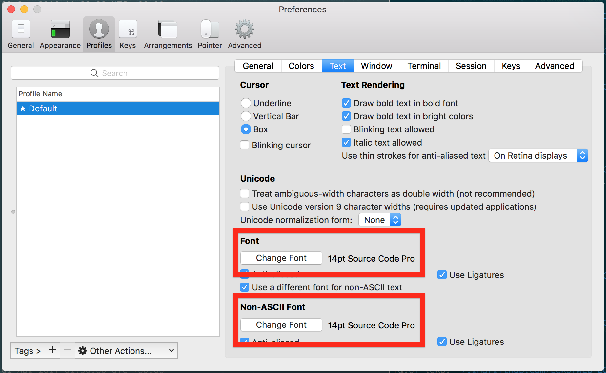

こんにちは。  
Githubのトレンドに[vadimdemedes/ink](https://github.com/vadimdemedes/ink)というツールが上がっており、CLIといえば[chjj/blessed](https://github.com/chjj/blessed)やReact版の[Yomguithereal/react-blessed](https://github.com/Yomguithereal/react-blessed)とかあったなぁ、と懐かしみつつ  

そういえばPowerlineもシェルのアスキーアート的に表現されてるんだよな、  
どうやってパンくずっぽいもの描画してるんだろう？

というのが気になったので調べてみたらおもったより面白そうだったので遊んでみました。

<!--more-->

作ったもの
--------------------------------------------------------------------------------


記事にも貼っていきますが、ソースはこちら（TODO）から確認できます。  
上記画像のようなものを１つずつ作っていきます

フォントに注意
--------------------------------------------------------------------------------
その前に注意点です。  
以下の文字は文字化けせずに表示されてますでしょうか。この後の内容に欠かせない重要パーツたちです。

``, ``, `░`, `⠋⠙⠹⠸⠼⠴⠦⠧⠇⠏`

画像として表示するとこんな感じです。


では、これらの文字をコピーしてターミナルに貼り付けても表示できていますでしょうか。  
他にもこれらの文字を表示できるフォントあると思いますが、フォント設定が`Source Code Pro`であればおそらく表示できていると思います。  
Googleフォントとかから読み込めるWebフォント版のSource Code Proだとマルチバイトが省略されているそうで、文字化けします。

[iTerm2](https://www.iterm2.com/)をお使いの場合は、以下の画像のようにフォントを設定すればおそらく表示できると思います。



表示できていたら、フォントを適当に変えてみてください。だいたい文字化けすると思います。  
これらの**特殊文字は対応しているフォントが少ないため、ターミナルのフォント設定に強く依存する**という点にご注意ください。

ターミナルで色付き文字を出力する
--------------------------------------------------------------------------------
bash_profileとかをいじったことある人ならおそらく触れたことあると思いますが、`[\e[00;34m]`とかそういうやつです。  

> &mdash; [ターミナルのechoやprintfに256色で色をつける 完全版 - vorfee's Tech Blog](http://vorfee.hatenablog.jp/entry/2015/03/17/173635)

そのままechoしてもいいのですが、コードとして分かりにくいので、npmの[chalk](https://www.npmjs.com/package/chalk)というパッケージを使用して色名を使ってコードを書いていきます。

```js
const chalk = require('chalk')

console.log(
  chalk.red('H')
  + chalk.magenta('e')
  + chalk.yellow('l')
  + chalk.green('l')
  + chalk.blue('o')
  + ' '
  + chalk.cyan('w')
  + chalk.white('o')
  + chalk.yellowBright('r')
  + chalk.greenBright('l')
  + chalk.blueBright('d')
  + chalk.cyanBright('!')
  + chalk.whiteBright('!')
)
```


スピナーに使えそうな文字
--------------------------------------------------------------------------------
npm本家のスピナーが好きなので、それの簡易版を作ってみます。  
npmのソースを見てみたところ、内部で使用しているのは[iarna/gauge](https://github.com/iarna/gauge/blob/master/themes.js)というライブラリでした。  
[ソースの中を追っていったところ](https://github.com/iarna/gauge/blob/master/themes.js)、先程例に出したこれらの文字（`⠋⠙⠹⠸⠼⠴⠦⠧⠇⠏`）が見つかりました。  

これらの文字をくり返し表示することで、ぐるぐる回っているっぽいアニメーションを作ります。

スピナーを作る下準備
--------------------------------------------------------------------------------
さっそくアニメーションを実装する前に。  
昔[CLIでマリオが走るアニメーション](https://gist.github.com/Leko/0f6865648a34f233f047)を実装したことがありましたが、  
そのときは複数行をアニメーションさせるためにカーソル操作もやってました。


今回は1行だけをアニメーションさせればいいので、簡単に`\r`と空白を出力することで、その行の表示済みの内容をクリアする手法をとります。

```js
// \r ≒ 行頭にカーソル移動
// スペースは消したい文字の数分だけ入れる。今回は1文字のアニメーションなので１文字で足りる。
// `process.stdout.columns`でウィンドウ幅を取得して、その分だけスペースを出力すると行の内容がすべてクリアできる
// https://stackoverflow.com/questions/30335637/get-width-of-terminal-in-node-js
process.stdout.write('\r \r')
```

なお、`console.log`だと改行されてしまって予期したとおり動いてくれないので、`process.stdout.write`を使用しています

スピナーを作ってみる
--------------------------------------------------------------------------------
ではアニメーションを実装してみます。  
最近は[ink](https://github.com/vadimdemedes/ink)などのCLIに向けたライブラリが色々出てますが、今回はシンプルに原理を理解するため愚直に書きます。  
コードは[こちら](https://gist.github.com/Leko/76727c0c4634b57de7231ba4427d5ed1#file-spinner-js)からも確認できます

```js
const chalk = require('chalk')

const FPS = 20
const colors = [
  'red',
  'magenta',
  'yellow',
  'green',
  'blue',
  'cyan',
  'white',
  'yellowBright',
  'greenBright',
  'blueBright',
  'cyanBright',
  'whiteBright',
]
const frames = '⠋⠙⠹⠸⠼⠴⠦⠧⠇⠏'.split('')
let cursor = 0

setInterval(() => {
  cursor = (cursor + 1) % frames.length
  process.stdout.write(`\r \r${chalk[colors[cursor]](frames[cursor])}`)
}, 1000 / FPS)
```

動かしてみるとこんな感じです。


Powerline的なUIに使えそうな文字
--------------------------------------------------------------------------------
さて、本題のPowerlineです。  
これも[ソースを追っていったところ](https://github.com/powerline/powerline/blob/01d28baf72bb90a8ecd8a242f3578bcf6adc2705/powerline/config_files/themes/powerline.json)、先程例に出した文字（``, ``）や他にもアイコン相当の文字などが見つかりました。

こんな文字どこから見つけてきたんだよ。というツッコミを入れたくなるほどレパートリーがあります。  
ちなみに、普通に「さんかく」と打って変換できる文字では文字サイズがテキストと同じなのでパンくずっぽい見た目になりませんでした。

これらの文字と背景色を組み合わせて、PowerlineっぽいUIを実装してみます。  
まずは背景色を理解しないとそれっぽいUIにならないので、それを説明します。

ターミナルで文字に背景色をつける
--------------------------------------------------------------------------------
先程リンクを貼ったCLIでマリオが走るアニメーションでは、半角スペースに背景色を付けてドットっぽく扱っています。  

今回はそれよりもう少し難しいですが、概念は同じです。今回作りたいモノは


のように、パンくずリストっぽいものです。色の変わり目がミソです。  
なぜこういう見た目になるかというと、``の文字色と背景色を設定することでレイヤーっぽく扱っているからです。

```
(白文字背景黒) (白文字背景赤) (白文字背景緑)...
```

という全体構成になってます。  
例えば１つ目のつなぎ目（``）であれば、「文字色＝黒、背景色＝赤」で表示することでいい感じに繋がります。  
``を使ってしまうとどうしても図形っぽく認識してしまうと思うので、スペースを開けたりつなぎ文字を変更してみると、イメージが付きやすいかもしれません。

```js
const chalk = require('chalk')

console.log(
  chalk.white.bgRed(' Hello ')
  + ' '
  + chalk.red.bgBlack('')
  + ' '
  + chalk.bgBlack(' world!! ')
  + ' '
  + chalk.black('')
)
```


背景色の設定は、先ほど紹介した`chalk`でできます

`chalk.black.bgRed('')`と言った具合に。

Powerline的なUIを作ってみる
--------------------------------------------------------------------------------
概念的な部分はお話したので、コードに移ります。  
とはいえ、つなぎ目の文字色と背景色をハードコードせずに計算したり、多少クラスに分けたりした程度です。

コードの全文を載せると長いので[こちら](https://gist.github.com/Leko/76727c0c4634b57de7231ba4427d5ed1#file-powerline-js)を参照して下さい。

```js
// ... 略
const powerline = new Powerline()
const stack = new IndicatorStack()

stack.add(new Indicator({ text: 'White',   color: 'red',   backgroundColor: 'white',   icon: '✉' }))
stack.add(new Indicator({ text: 'Cyan',    color: 'white', backgroundColor: 'cyan',    icon: '' }))
stack.add(new Indicator({ text: 'Blue',    color: 'white', backgroundColor: 'blue' }))
stack.add(new Indicator({ text: 'Magenta', color: 'white', backgroundColor: 'magenta', icon: '♥' }))
stack.add(new Indicator({ text: 'Red',     color: 'white', backgroundColor: 'red',     icon: '' }))
stack.add(new Indicator({ text: 'Yellow',  color: 'white', backgroundColor: 'yellow',  icon: '⚡︎' }))
stack.add(new Indicator({ text: 'Green',   color: 'white', backgroundColor: 'green' }))

powerline.add(stack)

console.log('\n\n\n')
console.log(powerline.render())
console.log('\n\n\n')
```


適当にアイコンとかも公式のソースから引っ張ってきてみました。

あとがき
--------------------------------------------------------------------------------
「なんでそんな文字あるんだよ...」という文字が思っていたより色々あって、夢が広がると思います。  
HTMLの実体参照なんかもかなりの種類があるので、ユースケースによっては画像やフォントアイコンではなくそれらを使ってみるのも面白いかもしれませんね。

> &mdash; [【みんなの知識 ちょっと便利帳】使いたいときの HTML特殊文字 & 機種依存文字 - 矢印 & 矢印に使える記号、使えそうな記号](http://www.benricho.org/symbol/tokusyu_02_arrow.html)
