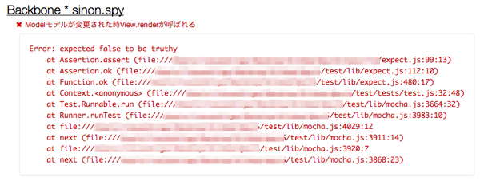

こんにちは。  
最近、[Backbone.js](http://backbonejs.org/)というライブラリを使って、制作をしています。

Backboneいいですね〜。  
各UIパーツの結合度が下がるので、  
全体の見通しが良くなり、メンテもしやすくなります。

今作っているものはそこまで規模が大きいものではないのですが、  
大規模js開発入門ということで。

それに加えて、先日[JavaScript道場](http://connpass.com/event/1664/)に行ってきてから、  
jsの開発でもテストコードを書くようにしています。

[師範に習った](http://hokaccha.github.com/slides/javascript_design_and_test/)とおり、  
_<span class="removed_link" title="http://visionmedia.github.com/mocha/">mocha</span>_ + _[expectjs](https://github.com/LearnBoost/expect.js/blob/master/README.md)_ + _[sinonjs](http://sinonjs.org/)_を用いてユニットテストを書いているのですが、  
そのテストを書いている時に、sinonjsのspyで詰まったのでメモ。

<!--more-->

## sinonjs spyの使い道・使い方

そもそも、**sinonjs**とは何か。   
そしてその中の**spy**という機能は何なのかをざっと。

sinonjsとは、テストダブルのライブラリのことです。

> テストダブル (Test Double) とは、ソフトウェアテストにおいて、テスト対象が依存しているコンポーネントを置き換える代用品のこと。ダブルは代役、影武者を意味する。 – テストタブル – wikipedia  
> [フロントエンドJavaScriptにおける設計とテスト](http://hokaccha.github.com/slides/javascript_design_and_test/#page93)

すごくざっくり言うと、**テスト用の便利なライブラリ**です。

そして、そんなsinonjsのspyという機能は、 その名の通り**スパイをしてくれます。**

何のスパイをするかというと、任意の関数に忍び込ませて、

  * その関数が呼ばれたか否か
  * 合計で何回関数が呼ばれているか
  * その引数は何か

などなどを調べることが出来るのが、spyです。

ざっくりした使い方を書くと、

```javascript
it('sinon.spyのテスト', function() {
    var hoge, spy;
    hoge = {
        foo: function() {
            return true;
        }
    };
    spy = sinon.spy(hoge, 'foo');
    hoge.foo();
    return expect(spy.calledOnce).to.be.ok();
});
```

という感じに書けます。

```javascript
spy = sinon.spy( object, 'proterty' );
```

というふうに書くと、object.propertyを監視出来ます。 この感じで、Backboneのon系のコールバックも見れるんじゃないかと思ったら、詰まりました。

これで動くんじゃないの？ →動かない
----------------------------------------

動かなかったコードを簡略化したものがこちらです。

少し長いのでCoffeeScriptで書きます。

```coffeescript
describe 'Backbone * sinon.spy', -> 
	Model = Backbone.Model.extend
		defaults:
			name: 'hoge'
	View = Backbone.View.extend
		initialize: -> 
			_.bindAll @, 'render'
			@model.on 'change:name', @render
		render: -> 
			@$el.html @model.get('name')
	before -> 
		@view = new View(model: new Model())
		@spy = sinon.spy(@view, 'render')
	after -> 
		@spy.restore()
	it 'Modelモデルが変更された時View.renderが呼ばれる', -> 
		@view.model.set('name', 'leko') expect(@spy.calledOnce).to.be.ok()
```

実行してみると、通りません。。





Backboneを理解されてる方なら  
「初心者乙」  
で終わってしまうのかもしれませんが、Backbone初心者だから仕方ない。

先ほどの例のように、

```javascript
spy = sinon.spy(view, 'render')
```

と指定したので、  
view.renderが呼ばれたらspy.calledOnceはtrueになるはず。  
console.logなどを挟んで関数が呼ばれているか試したところ、呼ばれていました。 しかし、spy上では呼ばれたことになっていません。ここで詰まりました。

解決策
----------------------------------------

なるべく英語は読みたくない（読めない）ので、 日本語の記事が無いか探してみたんですが、無さそうでした。

英語記事を漁っていると、StackOverFlowに  
似た悩みを抱えた質問と解答が寄せられていました。

> [javascript – Backbone.js view tests using Sinon Spies in a browser – Stack Overflow](http://stackoverflow.com/questions/9623986/backbone-js-view-tests-using-sinon-spies-in-a-browser)

結論を先に書くと、先ほどのコード、惜しい感じでした。

間違っていたのは、spyの設定の仕方でした。

```coffeescript
# 間違い
before ->
	@view = new View( model: new Model() )
	@spy = sinon.spy( @view, 'render' )
# 合ってる
before ->
	@spy = sinon.spy( View.prototype, 'render' )
	@view = new View( model: new Model() )
```

実行してみると、通ります。


このように、インスタンス化したオブジェクトにspyを忍び込ませるのではなく、  
**コンストラクタ関数のprototypeにspyを設定して、  
その後にインスタンスを生成するとうまく動くようです。**
