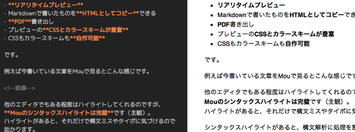
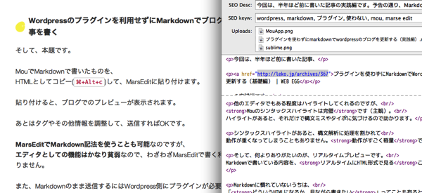

今回は、半年ほど前に書いた記事、

[プラグインを使わずに Markdown で Wordpress のブログを更新する（基礎編） \| WEB EGG](/post/write-post-with-markdown-without-plugin-beginner/)

の実践編です。  
予告の通り、

- Markdown が書きやすいエディタ
- WordPress のプラグインを利用せずに Markdown でブログ記事を書く

をメインに説明します。

<!--more-->

## Markdown が書きやすいエディタ

Markdown とは、Markdown の書き方については、[基礎編](/post/write-post-with-markdown-without-plugin-beginner/)を御覧ください。  
ざっくり書くと、**HTML より見やすく書きやすいマークアップ記法**です。

僕が Markdown を書くときに使っているアプリは主に 2 つです。

### Mou

２つとか行っておきながらも、  
**Mac で Markdown 書くならこれ一択**だと思います。

この子のすごいところは、

- 動作が軽い
- Markdown 記法の**完璧なシンタックスハイライト**
- **リアリタイムプレビュー**
- Markdown で書いたものを**HTML としてコピー**できる
- **PDF**書き出し
- プレビューの**CSS とカラースキームが豊富**
- CSS もカラースキームも**自作可能**

です。

例えば今書いている文章を Mou で見るとこんな感じです。

他のエディタでもある程度はハイライトしてくれるのですが、  
**Mou のシンタックスハイライトは完璧**です（主観）。  
ハイライトがあると、それだけで構文ミスやタイポに気づけるので助かります。

シンタックスハイライトがあると、構文解析に処理を割かれて  
動作が重くなってしまうこともありません。**動作がすごく軽量**です。

そして、何よりありがたいのが、リアルタイムプレビューです。  
Markdown で書いている内容を、**リアルタイムに HTML 形式で見る**ことができます。

Markdown に慣れていないうちは、  
「**どのような HTML になるか、見ながら書きたい**」ってことも有ると思います。

エディタとプレビューの 2 カラムで作業をするので、  
**エディタ部分の横幅が狭いと感じるときは**、`⌘+Shift+i`を押せば、  
**プレビュー画面の ON/OFF が出来ます**。

書いているときはプレビューを OFF にして、  
ひと通り書き終わったら ON にしてどのような見た目になっているかチェック。  
という具合に使い分けると、いい感じになると思います。

しかも、デフォルトで Github のテーマが入っているので、  
（ブログとは関係ないけど）Github の README を書く時にも重宝します。

また、プレビューのテーマは自分で追加できるので、  
自分のブログの CSS を持ってきて`Application Support/Mou/CSS`に追加すれば、  
**自分のブログでどのような表示になるか**も手軽に分かってしまいます。

ギークな方々は、やたらと自分好みにカスタマイズしたがると思います。  
そんな方々は、**いくらでもテーマをカスタマイズできる喜び**を噛み締められます。

> 僕は自分のブログでの表示部分は、MarsEdit に任せているので、  
> プレビューのテーマは特にいじっていません。

他にも、プレビュー画面の方を PDF 形式で書き出せるので、  
ドキュメントを作成するときに楽だったりします。

### Sublime Text2

言わずもがな知れた Sublime Text2(ST2)です。  
こちらは**削除や置換など、文章の編集にめっぽう強い**ので、

大規模な修正を入れるときには一度 ST2 の方に全文持って来て、  
ガツっと修正してまた Mou に戻す、なんてことをしたりします。

ST2 でも、パッケージをインストールすれば、  
それなりに**Markdown を書く、プレビュー可能**なのですが、  
**Markdown の書き心地については Mou の圧勝**なので、基本 Mou で書いています。

## WordPress のプラグインを利用せずに Markdown でブログ記事を書く

そして、本題です。

Mou で Markdown で書いたものを、  
HTML としてコピー(`⌘+Alt+c`)して、MarsEdit に貼り付けます。

貼り付けると、ブログでのプレビューが表示されます。

あとはタグやその他情報を調整して、送信すれば OK です。

**MarsEdit で Markdown 記法を使うことも可能**なのですが、  
**エディタとしての機能はかなり貧弱**なので、わざわざ MarsEdit で書く利点はありません。

また、Markdown のまま送信するには Wordpress 側にプラグインが必要です。 なので Mou で書いて、HTML として MarsEdit に貼り付けて送信しています。

## Markdown だと何がいいの？

**何より記事の作成・編集・修正が超絶楽**です。

タグをいちいち書く必要がないので、  
プレーンな文章を書いているような間隔でマークアップされた記事を書いていけます。

また、HTML の記事を修正しようとすると、  
ブログの本文として必要のない文字(タグ)が多数含まれてしまいます。

ですが、Markdown では**たかだか 2~3 文字のマークアップしか無い**です。

そのため文章中の br を追加、削除したりタグの名前を変えたり、  
という**HTML あるあるの煩わしさがありません**。

その分、**class をつけたり id 付けたりインライン CSS を書いたりという自由度は失う**のですが、  
CSS を考えて書いていれば、それらを使わなければ表現不可能なことって稀だと思います。

必要であれば、  
HTML を貼り付けた MarsEdit 側で少し修正を入れれば済む話ですしね。笑

## なんで Wordpress プラグインを避けるの？

WordPress のプラグインだと、**なんかあった時に困る**と考えているからです。

例えば、  
そのプラグインの**バグや不具合によって、公開中の記事に影響が出る**  
という可能性があります。

しかし、**手元では Markdown で書いて、公開は HTML**という形にしておくと、  
HTML で記事を更新していれば、ほとんどの場合バグや不具合は起きませんし、  
**プラグインのメンテナンスやアップデートという手間も減り**ます。

プラグインが悪いとは思っていませんが、  
減らせるリスクは減らしておくべきだと思います。

## まとめ

という感じで、いつも Markdown を使ってブログ記事を書いています。

まだ Markdown を触ったことがなくて、ブログを書いている方が居たら、  
是非基礎編と当記事を読んで、Markdown を使って記事を更新してみて下さい！

最期まで読んで下さいまして、ありがとうございました。

> [プラグインを使わずに Markdown で Wordpress のブログを更新する（基礎編） \| WEB EGG](/post/write-post-with-markdown-without-plugin-beginner/)
