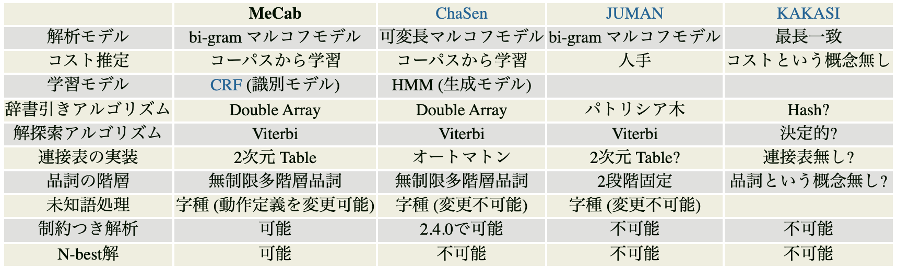

先日[WebAssembly で動作する Goya という形態素解析ライブラリ](/post/goya-yet-another-japanese-morphological-analyzer/)の紹介記事を書いたので、当記事では Goya の技術的な解説、Goya における形態素解析器の実装について解説したいと思います。

## はじめに

タイトルで「IPA 辞書ベースの」と前置きをしている理由は形態素解析器の作り方が他にも色々とあるからです。例えば IPA 辞書ではない他の辞書をベースにした方法や、辞書を使わずに機械学習で解析結果を推論する方法などがあります。また、解析対象の言語によってアプローチは全く変わります。以後断りなく「形態素解析」という言葉を使う場合「（IPA 辞書ベースの日本語の）形態素解析」を意味していますので脳内補完してお読み下さい。

## 概論

まずは詳細なアルゴリズムには触れずに形態素解析器の構成要素について触れます。IPA 辞書ベースの形態素解析の中でも実装のアプローチは様々あると思いますが、Goya では以下のようにラティスを構築して最小コスト法を求めるアプローチを採用しています。

1. IPA 辞書のパース
2. 辞書引き
3. 未知語の処理
4. 同音異義語、同形異音語の処理
5. ラティスを構築
6. コストを計算
7. 最小コストとなる経路を探索

ラティスとは形態素解析として取り得る全ての解候補を有向グラフで表現したデータ構造です。コストとは各形態素が文中にどれほど出現しやすいか、ある形態素の前後にどのような形態素が連続しやすいかを表したものです。ラティスの先頭と末尾を結ぶ最小コストのパスを探索することで日本語としてもっとも出現しやすい（自然である確率が最も高い）形態素の組み合わせが求まります。

具体例として"京都府"という日本語を形態素解析するケースを考えます。IPA 辞書には京,都,京都,府という４つの形態素が登録されており同音異義語、同形異音語もあります。実際に辞書に登録されている形態素は以下の通りです。IPA 辞書の CSV は EUC_JP でエンコーディングされているため辞書を探す際は iconv 等で UTF8 に変換してから grep をかけると便利です。

形態素の CSV の各フィールドの意味については[MeCab: 単語の追加方法](https://taku910.github.io/mecab/dic.html)の`エントリのフォーマット`を参照してください。

```shell
cat ~/Downloads/mecab-ipadic-2.7.0-20070801/*.csv | iconv -f euc-jp | grep -r '^京都府,'
# `京都府`という１単語では登録されていない

cat ~/Downloads/mecab-ipadic-2.7.0-20070801/*.csv | iconv -f euc-jp | grep -r '^京都,'
京都,1293,1293,2135,名詞,固有名詞,地域,一般,*,*,京都,キョウト,キョート
京都,1293,1293,8069,名詞,固有名詞,地域,一般,*,*,京都,ミヤコ,ミヤコ
京都,1288,1288,6481,名詞,固有名詞,一般,*,*,*,京都,キョウト,キョート

cat ~/Downloads/mecab-ipadic-2.7.0-20070801/*.csv | iconv -f euc-jp | grep -r '^京,'
京,1290,1290,10243,名詞,固有名詞,人名,姓,*,*,京,キョウ,キョー
京,1291,1291,11209,名詞,固有名詞,人名,名,*,*,京,ミヤコ,ミヤコ
京,1291,1291,11276,名詞,固有名詞,人名,名,*,*,京,キョウ,キョー
京,1293,1293,10791,名詞,固有名詞,地域,一般,*,*,京,キョウ,キョー

cat ~/Downloads/mecab-ipadic-2.7.0-20070801/*.csv | iconv -f euc-jp | grep -r '^都,'
都,1285,1285,7241,名詞,一般,*,*,*,*,都,ト,ト
都,1285,1285,7595,名詞,一般,*,*,*,*,都,ミヤコ,ミヤコ
都,1291,1291,11341,名詞,固有名詞,人名,名,*,*,都,ミヤコ,ミヤコ
都,1290,1290,11474,名詞,固有名詞,人名,姓,*,*,都,ミヤコ,ミヤコ
都,1293,1293,12159,名詞,固有名詞,地域,一般,*,*,都,ミヤコ,ミヤコ
都,1303,1303,9428,名詞,接尾,地域,*,*,*,都,ト,ト

cat ~/Downloads/mecab-ipadic-2.7.0-20070801/*.csv | iconv -f euc-jp | grep -r '^府,'
府,1285,1285,9854,名詞,一般,*,*,*,*,府,フ,フ
府,1303,1303,11202,名詞,接尾,地域,*,*,*,府,フ,フ
```

これらを辞書引きしてラティスを構築し各パス・ノードのコストをマッピングした結果を可視化したものが以下の図です。[Goya の playground](https://goya.pages.dev/?text=%E4%BA%AC%E9%83%BD%E5%BA%9C)で動作を確認できます。画像内の`BOS`とは Beginning Of Sentence、`EOS`とは End Of Sentence のことを指します。


太線（図の一番下を通るパス）が最もコストの小さい経路となり、解析結果は「京都（名詞,固有名詞,地域）/府（名詞,接尾,地域）」、読み仮名は「キョート/フ」であると求められます。これが IPA 辞書ベースの形態素解析器の仕組みの概論となります。  
詳細な技術的な説明が必要だと思う要素について詳しく解説します。

### IPA 辞書のパース

このアプローチでは IPA 辞書が前提です。表層体が分からなければ辞書引きも未知語や同音異義語も処理できませんし、コストの計算もできません。IPA 辞書には形態素の一覧とその他メタ情報が格納されています。IPA 辞書を[MeCab の公式ページ](https://taku910.github.io/mecab/)からダウンロードして中身を覗いてみてください。このアプローチの形態素解析に最低限必要なファイルはこれらです。これらをプログラムから扱える形式にパースするのが IPA 辞書のパースです。

- `*.csv`: 形態素の一覧。辞書引きと生起コスト計算に必要。詳しくは[MeCab: 単語の追加方法](https://taku910.github.io/mecab/dic.html)を参照
- `unk.def`, `char.def`: 未知語の処理に必要。詳しくは後述
- `matrix.def`: 連結コスト計算に必要。詳しくは後述

Goya での実装は[ipadic/src/ipadic_loader.rs](https://github.com/Leko/goya/blob/f716d6b62f71d491821d6d6655f61c03b88f9197/ipadic/src/ipadic_loader.rs)にあります。

### 未知語の処理

IPA 辞書はあくまで辞書なので、当然辞書には定義がない単語や造語が入力されることもあります。その際に IPA 辞書ではあらかじめ定義した文字のカテゴリ（漢字・ひらがな・カタカナ・英数字）ごとにコストが設定されており、そのルール表に基づいて未知語を処理する必要があります。ファイルの形式などの詳細については [MeCab: 未知語処理](https://taku910.github.io/mecab/unk.html)のページを参照。

### コストを計算

ここでいうコストとは、その形態素が文中にどれほど出現しやすいか（生起コスト）・その形態素が別の形態素の前後にどれくらい接続されやすいか（連結コスト）の２つのコストがあります。生起コストは各形態素の`コスト`列に格納されており、連結コストは各形態素の`左文脈ID,右文脈ID`列と`matrix.def`を組み合わせて計算します。matrix.def の詳細については[MeCab の辞書構造と汎用テキスト変換ツールとしての利用](https://taku910.github.io/mecab/dic-detail.html)を参照。

> エントリは, 以下のような CSV で追加します. 名詞などの活用しない語だと, 登録は簡単です.  
> `工藤,1223,1223,6058,名詞,固有名詞,人名,名,*,*,くどう,クドウ,クドウ`  
> 左から,  
> `表層形,左文脈ID,右文脈ID,コスト,品詞,品詞細分類1,品詞細分類2,品詞細分類3,活用型,活用形,原形,読み,発音`  
> です.
>
> &mdash; [MeCab: 単語の追加方法](https://taku910.github.io/mecab/dic.html)

## 計算量と最適化

ここまでの仕組みを、計算量やメモリ使用量を気にせずナイーブに実装する場合さほど複雑な作りにはならないと思います。要は辞書をハッシュマップ化し、１文字ずつ入力を走査し、マッチした形態素の有向グラフを作成し、コストをマッピングし、グラフの最小コストを解けばいいわけです。ですが、愚直なアプローチはあまり現実的ではありません。  
愚直な辞書引きは文字列長 N に対して O(N^3)のコストがかかります。また最小コストの計算も愚直（全探索）に実装した場合、入力にマッチした形態素数の全ての組み合わせを網羅するためこちらも非現実的な計算量が必要になります。`京都府`というたった３文字の入力ですら先述の図のような分岐数になるため、長い文字列や同音異義語の多い文字列を与えたら計算量が膨大になることは容易に想像できると思います。

軽量で高速な形態素解析器を作るためにキーとなるパーツを大まかに分けると 1)辞書の構築および辞書引き、2)ラティスの最小コストを求めるの２パートに分解できます。ちなみに Goya では 1)ダブル配列（Double array）、2 にビタビアルゴリズム（Viterbi algorithm）を使用しています。

[Mecab 公式ドキュメント](https://taku910.github.io/mecab/)の比較表によると Mecab や ChaSen などと同じアルゴリズムになります。蛇足ですが IPA 辞書に頼ることでこの表でいう「解析モデル、コスト推定、学習モデル」の３ステップの実装を全てスキップできます。表の残りの部分が IPA 辞書を用いて自分で実装する箇所になります。



## 辞書の構築および辞書引き

Goya では辞書を構築する際にダブル配列という Trie 木の一種であるデータ構造に変換しています。ダブル配列とはその名の通り２つの配列を用いて辞書引きという文字列探索処理をステートマシンとして表現するためのデータ構造です。  
ダブル配列を使った場合の辞書引き

## 実行速度とデータ構造の最適化

仮に IPA 辞書の形態素を全て文字列で保持した場合、それだけで約 40MB の文字列になります。これ以外にもコスト計算用のメタデータなど保持すべき辞書のデータが多々あるため実際にはもっと容量が増えます。辞書のサイズが小さく、パース処理が早ければ実行速度はその分早くなります。辞書のサイズを削りつつ速度を維持する方法としてどのような方法が考えられるか。Rust にはデータのシリアライズ・デシリアライズのフレームワークである serde がありますが、Goya ではバイナリ辞書のデータ構造としてどのように serde を使ってバイナリ辞書の削減・及び速度の担保をしているかなどについては別の記事（Rust の Serde フレームワークと Goya におけるデータ容量の削減）にて詳しく話したいと思います。
