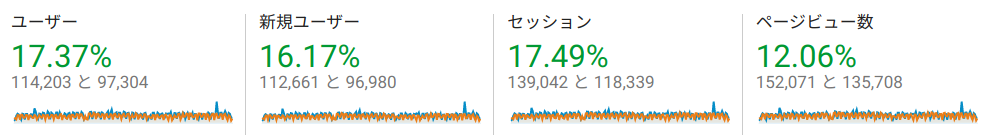
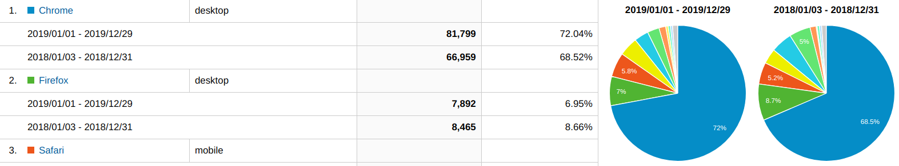
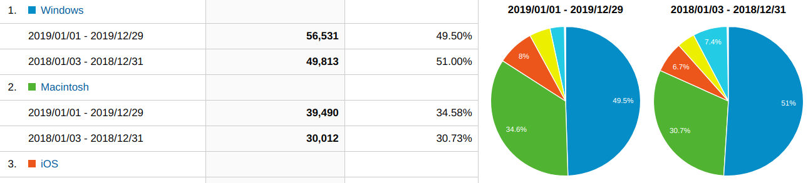
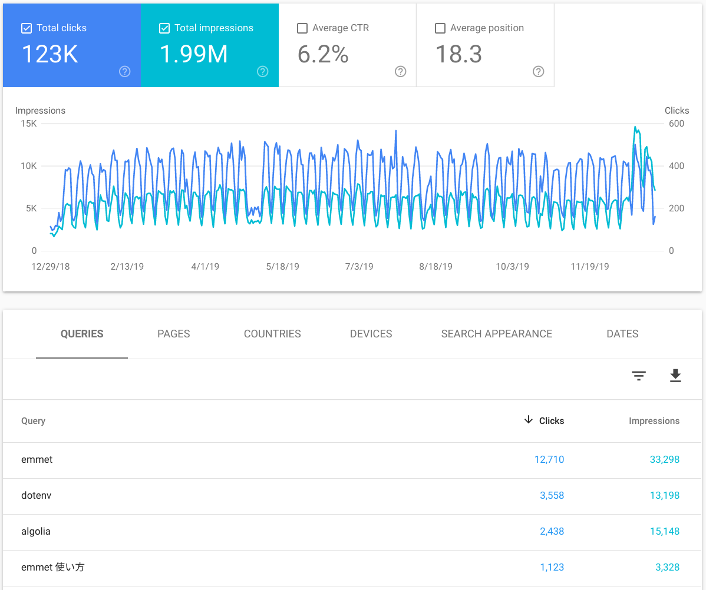
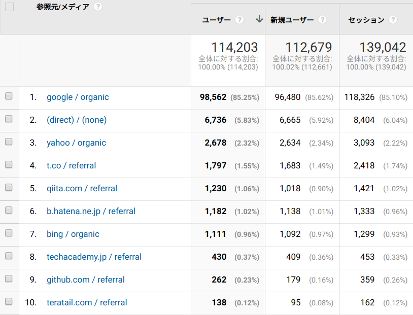

気づけば年末。今年はあと１日残っているんですが、休日のアクセスがほとんどないブログなので 2019 年のアクセスを振り返ります。  
自分が気になったところだけをピックアップして紹介しています。筆者はアクセス解析のド素人なのであしからず。

## アクセス

まずはアクセス数です。UU は去年とくらべて 17％ほど伸びて 11.4 万、PV は 12％ほど伸びて 15.2 万でした。  
小さくて見づらいですが、ページビューで 2 月ごろに跳ねてるやつ[Deno のコードリーディング記事](https://blog.leko.jp/post/code-reading-of-deno-boot-process/)、6 月頃に跳ねてるのが[JSConf EU の記事](https://blog.leko.jp/post/jsconfeu2019/)と[TypeScript のオレオレ playground](https://blog.leko.jp/post/introduce-the-new-typescript-playground-for-advanced-use/)、12 月頭頃に跳ねてるやつは[寿司打 WebGL 版を OCR でチートする記事](https://blog.leko.jp/post/ocr-web-gl-with-tesseract-js/)ですね。

### アクセス元の環境

Chrome が圧倒的です。去年と比べても割合が増しています。代わりに Firefox の割合が少し減っています。次点は iOS Safari なので、モバイル向けの対応をちゃんとやらないとなーと思いました。

OS は Windows の割合が減って Mac がちょっと増えてますね。

## 流入

### 検索キーワード

検索エンジンからの流入は Emmet, dotenv, Algolia という感じです。  
Deno とか TypeScript で調べてほしかった。

### 参照元メディア

検索エンジンを除けばトップは Twitter 経由のアクセスでした。

絶対数ではなく変化率で見るともっとも増加が多かったのははてブ、続いて Twitter、GitHub 経由のアクセスでした。  
今年ははてブの人気のエントリーに何度か載ってたようで、はてブ経由のアクセスが急激に跳ねてるタイミングが何度かありました。  
Twitter の方はフォロワー数が去年に比べてかなり増えたので、ただ記事をツイートしただけでも閲覧数は増えるだろうなと思います。  
GitHub に関しては[denolib/awesome-deno](https://github.com/denolib/awesome-deno)に[Deno のコードリーディング記事](https://blog.leko.jp/post/code-reading-of-deno-boot-process/)が掲載されたので、そこからの流入が多かったです。

## 検索エンジン経由の人気記事

検索エンジン経由の人気記事はこんな感じでした。

アクセス数の多い記事のうち上位何件かをピックアップします。  
今年の新入り記事は dotenv のみでした。他にも古い記事がランクインしてましたが省略します。

> &mdash; [Emmet を始めるのに、とりあえずこれだけ覚えておけば大丈夫 | WEB EGG](https://blog.leko.jp/post/introduction-of-emmet/)

↑ ブログ開始当初から不動の１位。この記事をパクったしょーもないメディアを結構見かけるくらいにはアクセスがあるようです。
HTML 書く機会が減ってしまって私自身はもう Emmet を殆ど使ってないのですが、いまだにアクセスが集まる記事です。

> &mdash; [php で require_once するときに相対パスでハマった | WEB EGG](https://blog.leko.jp/post/fix-require-relative-path-of-php/)

↑ これも毎年順位が高いです。検索順位が高いとどうしてもアクセスが集まってしまう悲しい記事。  
今更この知識いるのか。PSR4 でオートロードとか言ってた時代ってもう何年前だよ。という感想。

> &mdash; [プログラム内で dotenv を読み込むのをやめた話 | WEB EGG](https://blog.leko.jp/post/you-might-not-need-dotenv-in-source/)

検索トラフィックでアクセスの多かった記事は、**ずっと昔に書いたやつばかりじゃん...。**その記事たち多分もう古いよ...という感触です。  
ここ数年書いてるものは JS 界隈に浸かってる人にしか刺さらない狙い撃ちの記事が多いので、大衆受けしないというのは分かっているのですが、代表的な記事がちゃんと自分のやってる分野でありたいなと悔しさを感じています。  
ここ数年ずっと検索上位に来るような記事を書けてないと反省し、来年はこれらが全て塗り替えられるくらい良い記事を書いていきたいです。

## リファラル/SNS の人気記事

主に Twitter とはてブで人気だった記事は、検索トラフィックとはかなり顔ぶれが違います。

> &mdash; [Dive into Deno：プロセス起動から TypeScript が実行されるまで | WEB EGG](https://blog.leko.jp/post/code-reading-of-deno-boot-process/)

↑Deno が発表されてそんなに経ってない頃、「とりあえず Deno 読んどくか」ってノリで書いた記事。めちゃくちゃ長いです。
ただ、この記事書いた当初にここまで細かくコードを追う記事は無かったので圧倒的な記事のボリュームに「すごそう」って拡散された記憶があります。

---

> &mdash; [開発者ツールで使える便利な copy 関数 | WEB EGG](https://blog.leko.jp/post/copy-function-of-developer-tools/)

↑ あかめさんにツイートされて、そんなにふぁぼリツいってないのになぜかはてブに飛び火してアクセスが伸びました。

<blockquote class="twitter-tweet">
開発者ツールで使える便利なcopy関数 | WEB EGG <a href="https://t.co/uLw26q26uZ">https://t.co/uLw26q26uZ</a> 普通に知らなかった...便利じゃん
&mdash; あかめ@転職活動中。気軽にDMお願いします.js (@akameco) <a href="https://twitter.com/akameco/status/1172880627764355073?ref_src=twsrc%5Etfw">September 14, 2019</a></blockquote> 

---

> &mdash; [ブログを Middleman から Gatsby に乗り換えた雑感 | WEB EGG](https://blog.leko.jp/post/impression-comparison-of-middleman-and-gatsby/)

↑ 今年の年始に書いた記事です。今年は Gatsby 力がとても伸びました。

---

> &mdash; [寿司打の限界を目指して ~WebGL の OCR~ | WEB EGG](https://blog.leko.jp/post/ocr-web-gl-with-tesseract-js/)

↑ 今年のアドカレで書いたネタ記事。タイトルだけで分かるゴリ押し、エンジニア童心をくすぐる懐かしいネタがいい感じに刺さったようです。

---

> &mdash; [「外部パッケージの型定義もインストールし推論できる TypeScript playground を作った」という題で登壇してきました＋スライドの補足 | WEB EGG](https://blog.leko.jp/post/introduce-the-new-typescript-playground-for-advanced-use/)

↑ 作りました。まだこの当時は TS の公式 playground で外部パッケージの推論ができなかったので実益があったのと、monaco-editor や TypeScript Compiler API とか内部で使用してる技術がブラウザ IDE 界隈の進捗を生むきっかけになれたようです。

<blockquote class="twitter-tweet">
<a href="https://twitter.com/L_e_k_o?ref_src=twsrc%5Etfw">@L_e_k_o</a> 進捗です <a href="https://t.co/8GkNmTlmNn">https://t.co/8GkNmTlmNn</a>
&mdash; HDMI (@mizchi) <a href="https://twitter.com/mizchi/status/1194630582057107456?ref_src=twsrc%5Etfw">November 13, 2019</a></blockquote> 

> &mdash; [Monaco Editor をハックする - Qiita](https://qiita.com/mizchi/items/5c5cb5abcb22d87f9031#typescript-%E3%81%AE%E3%82%B3%E3%83%B3%E3%83%91%E3%82%A4%E3%83%A9%E3%82%AA%E3%83%97%E3%82%B7%E3%83%A7%E3%83%B3%E3%82%92%E5%A4%89%E6%9B%B4%E3%81%99%E3%82%8B)

---

> &mdash; [JSConf EU 2019 に行ってきました | WEB EGG](https://blog.leko.jp/post/jsconfeu2019/)

↑ 会長こと@yosuke_furukawa が 「JSConf JP をやるぞ、そのために本家行くぞ！」と言ってたのに感化され、はじめての海外カンファレンスにいってきた記事です。

---

> &mdash; [タブ補完で peco で npm-scripts をもっと超簡単に実行したい | WEB EGG](https://blog.leko.jp/post/more-easy-to-use-npm-scripts/)

↑ これがないと JS のプロジェクト触りたくないってレベルに便利なスタメンです。

---

> &mdash; [Intl.NumberFormat でゼロ埋めや％表記などの数値表現を楽に実装する | WEB EGG](https://blog.leko.jp/post/what-benefit-of-intl-number-format/)

↑ 身の回りに浸かってる人少ないなー、便利なのにと思って書いたら予想以上に反響があった記事です。

## まとめ

ソーシャル経由での流入は見て欲しい記事をちゃんと見てもらえてるなと思ったのですが、検索経由のトラフィックはタイムスリップしたかのような感覚でびっくりしました。  
年々少しずつですがアクセスが増えていってるのでこのブログを必要としてくれていることを実感し感謝しつつ来年も書きたい記事を気が向くままに書いていきます。
