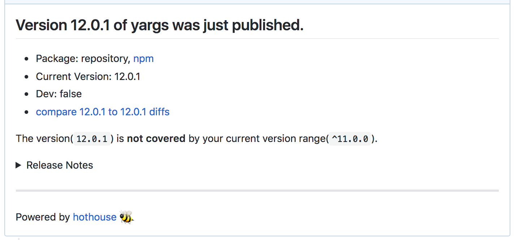

[hothouse](https://github.com/Leko/hothouse)というツールを作成しました。  
package.json とロックファイルを更新して GitHub に pull request を作成する CLI ツールです。

npm か Yarn をパッケージマネージャとして使用できます。  
普通のリポジトリだけではなく、Lerna や Yarn workspaces など monorepo の構成にも対応しています。

<!--more-->

## 概要



こんな感じの PR が作成されます。  
文言のベースは Greenkeeper をリスペクトしていますが、微妙にアレンジしています。

実際に hothouse で出してみた PR の例をいくつか挙げると、

- [単一パッケージ＋リリースノートあり(eslint@5.0.1)](https://github.com/Leko/IDDFS/pull/20)
- [単一パッケージ＋リリースノートなし(nyc@12.0.2)](https://github.com/Leko/IDDFS/pull/21)
- [lerna ＋リリースノートなし(sinon@6.1.0)](https://github.com/Leko/zapshot/pull/25)

こんな感じです。

### 主な強み

- npm/Yarn をサポート
  - プラグインを作ればその他のパッケージマネージャにも対応できます
- monorepo(lerna/yarn workspaces)をサポート
  - プラグインを作ればその他の monorepo ツールにも対応できます
- １つのパッケージごとに PR を作成し、マージの心理的コストを下げます
  - オプション指定すればひとまとめにできます

## 用途

「[Greenkeeper](https://greenkeeper.io/)でいいやん」感があるのは認めます。  
ただしこのツールは Greenkeeper の障壁が上がる private repo での使用を主な用途にしています。

たった数ドルお金払うだけなんですが、そこが障壁になって

- 自動アップデートしてない
- 人力で苦労してアップデートに追従している
- 自作のオレオレツールを維持運用する手間

とかとかの話が身の回りにあるなーと思い、OSS の Greenkeeper 的なものを作りたいなと思いました。  
あと純粋に技術的にどう作るのか気になったので、検証のために作ってみました。

いちいち手動で実行するのではなく、CI の定期実行（cron）の仕組みに乗っけて使っていただきたいので、ガイドを~~整備中です。~~[しました](https://github.com/Leko/hothouse#run-hothouse-regularly)

## 使い方

https://github.com/settings/tokens/new  
から新しい Github の Personal access token を`repo`スコープで取得しておきます。  
もし public なリポジトリなら`public_repo`だけあれば足ります。プライベートリポジトリなら`repo`が必要です。

```
npm i -g hothouse
```

して、アップデートしたいリポジトリに移動して、`hothouse -t {取得したトークン}`コマンドを実行すると PR が送られます。  
もし Git の config が設定されて入ればそれを使います。もし未設定なら`hothouse`という名前で commit します。

```
git config user.name hothouse
git config user.email hothouse@example.com
```

必要であれば、これらを設定してコミッターの名前を変更してください。  
npm の private scoped package を使っている場合には、事前に`npm login`してから実行してください。

## お試し

いきなり PR 作られるの怖いって場合は、`--dry-run`オプションをつけると副作用は起こらなくなります。  
合わせて`DEBUG`環境変数を使用すると、より詳細な出力が出るので、何が起こるのか、なんとなく掴めるかなと思います。

```
DEBUG=hothouse* hothouse --dry-run -t {取得したトークン}
```

## 特定のパッケージのアップデートは無視したい

アップデートのマイグレーション・心理的コストが大きかったり、package.json 上げるだけではダメなもの（[react-native](https://www.npmjs.com/package/react-native)とか）は、hothouse の監視下から外す方が良いと思います。

```
hothouse -t {取得したトークン} --ignore react-native*
```

## 仕組み

1. カレントディレクトリの構成を検出
1. ローカルパッケージ一覧を取得
1. npm|yarn outdated からアップデート可能なパッケージ一覧を取得
1. package.json に書かれている semver の範囲から外れているものだけにフィルタ
1. パッケージ名ごとにグルーピング
1. package.json のバージョンをいじり、プロジェクト構成ごとにコミットすべきファイルをコミット
1. パッケージのバージョンから GitHub のタグ・リリースノートを取得して PR の文言を作成  
   タグやリリースノートは取得できないこともあるので、ないことも許容
1. GitHub に PR 作成

ざっくりこんな流れで動いてます。

publish された npm パッケージを Git(Hub)と紐付けたり、さらに tag やリリースノートを取得するところを地味に工夫しています。  
命名規則に頼るなどのヒューリスティックなやり方しかできないと思っていたのですが、  
npm 公式で package.json の正規化などのユーティリティを提供していたり、`gitHead`というプロパティがあることを知り、これをベースにヒューリスティックでない方法も模索できるようになっていました。  
この辺りは長くなるので、別途記事を書くと思います。

## マージビリティの高いプルリク

マージビリティ＝マージするための心理的・レビューコストの低いオーナーに優しい PR

Greenkeeper と、類似系の OSS を比べてて思ったマージビリティの違いが、  
「PR が全パッケージのアップデート入りになっているか、パッケージ別に分かれているか」でした。

例えば開発系のツール（webpack、Babel、ESLint、sinon etc）がアップデートされた場合、テストが書かれていて、CI が通ればほぼ確実にマージして良いと言えるでしょう。  
一方、製品に使用しているライブラリは、いろいろごちゃまぜになっている場合、  
**いざアップデートしたら何が起こるか読み切れず、なかなかマージに至らない**というケースがあると思います。  
全てのパッケージの受入テストを書くのはかなり維持コストがかかるので、よほど体力があるプロジェクトでないとやりきれないかなと思います。

なので、1 パッケージごとに PR を出すことで、マージするための心理的コスト、検証コストを下げ、**このパッケージは merge するけど、このパッケージは close**という緩さを許容したいと思います。  
その緩さが、可能な限り多くのライブラリが新しいバージョンになっている状態を作るんじゃないかなーと仮説を立てています。  
（代わりに、しばらくアプデをサボっていたリポジトリで hothouse を実行すると、かなりの数の PR が飛びます）

## 今後の動き

方針は「心地よいデフォルト挙動」なので、マージビリティについて探求していきたいです。  
あとは脆弱性の文脈で、npm@6 から追加されている[npm audit](https://docs.npmjs.com/cli/audit)を取り入れたいなと思っています。

他には、日本語だとこれくらい思いを書けるのですが README が弱いので、この記事に書いたことを README に反映していきたい。
あと想定よりも複雑なものになったのでリファクタしたり、ドキュメント整備したりもぼちぼちやっていきます。

npm パッケージたくさん抱えている CureApp に少しずつ導入してって、バグの洗い出しや使い心地の検証・改善を進めていきたいと思います。

個人的によく見る構成・パッケージマネージャはサポートしたつもりなので、プロジェクト構成やパッケージマネージャの拡充はあまり考えていません。メンテコストかかるし。

## 最後に

ぜひ使ってみてください！  
動かなかったり気に食わないところあれば、ぜひ Issue や Pull request 送っていただけると喜びます。

あと、スターください

> &mdash; [Leko/hothouse: Continuous dependency update for Node.js project](https://github.com/Leko/hothouse)
