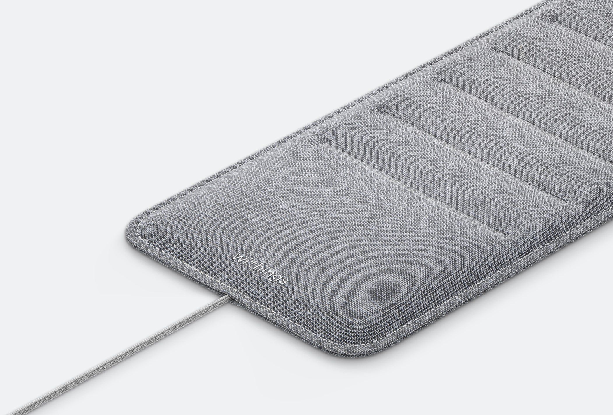
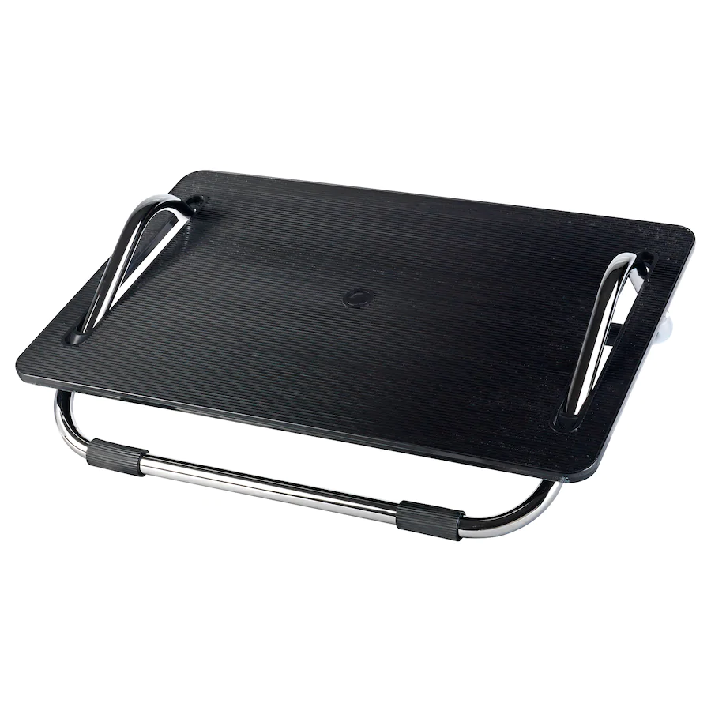
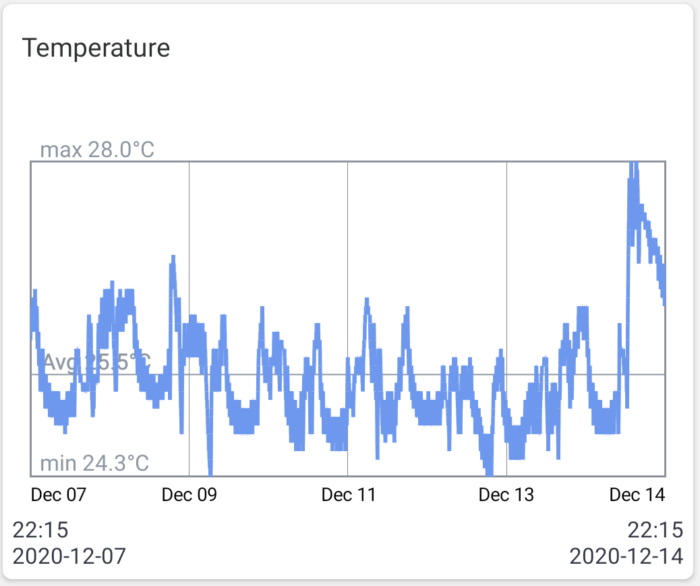
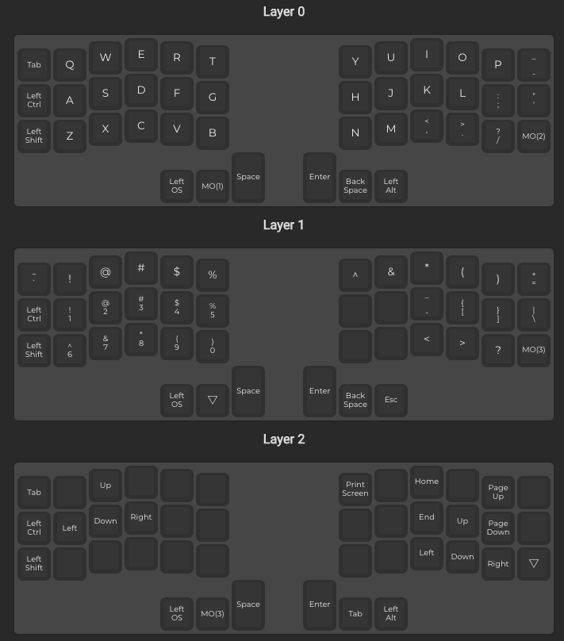
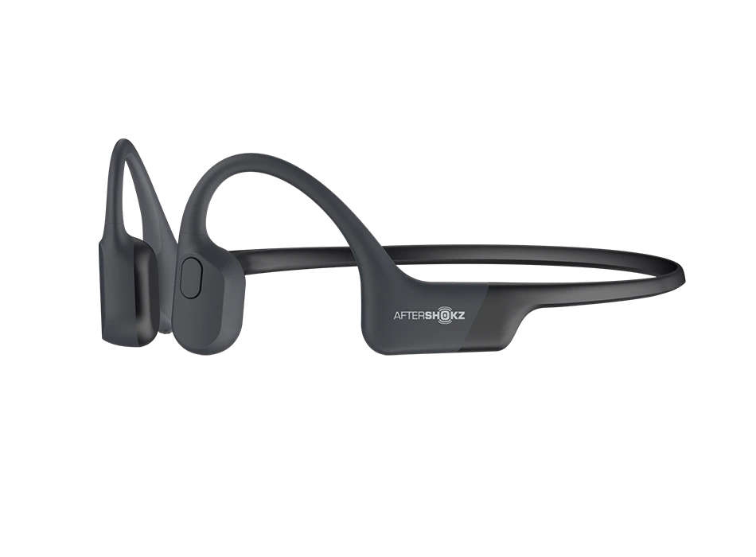

れこです。本記事は技術的な話ではなく 2020 年に買ったガジェットとその振り返りをしたいと思います。  
今年は 1〜3 月は蔵前、〜7 月は実家、8 月〜シンガポールと慌ただしく移動した年でした。そのためどの製品も長期間使用した上での経験は語れないのですが、色々試してみたので参考になれば幸いです。

## 買ったもの

今更感あるものも含まれていますが、気になるとこだけ見てください。

- ロボット掃除機（Anker Eufy RoboVac）
- スマートロック（セサミ）
- 大容量・高出力モバイルバッテリー
- ドラム式洗濯機
- BALMUDA The Toaster
- 睡眠トラッカー（Withings Sleep）
- フットレスト（IKEA DAGOTTO）
- SwitchBot Meter
- Corne Cherry
- AfterShokz Aeropex
- Apple Watch Series 6
- iPad Air 4th gen

## ロボット掃除機

> &mdash; [Anker Eufy RoboVac G10 Hybrid | ロボット掃除機の製品情報 | Anker (アンカー) Japan 公式サイト](https://www.ankerjapan.com/item/T2150.html)

今更感ありますがロボット掃除機です。色々なロボット掃除機を吟味した上でこの一台を選んだわけではないですが、コスパはかなり良かったです。日本にいた頃 20 畳の 1K というふざけた物件に居たのですが、これ 1 台で床の掃除は全部足りてました。

## スマートロック

> &mdash; [セサミ スマートロック | CANDY HOUSE JAPAN](https://jp.candyhouse.co/)

今更感ありますがスマートロックです。ある程度の形のサムターン状であれば設置できます。  
スマフォアプリから明示的に操作をしてる限りはただ面倒くさい鍵の劣化版で、オートロックと自動開錠をきちんと設定して初めて真価を発揮すると思います。サイズ感もお値段も程よく良い商品でした。

## 大容量・高出力モバイルバッテリー

> &mdash; [Anker | PowerCore+ 26800 PD 45W](https://www.anker.com/products/variant/powercore--26800-pd-45w/B1376111)

荷物の重さをあまり気にしないならとてもお勧めです。  
出力があるので Mac だろうと Thinkpad だろうと他のラップトップだろうと充電できちゃいます。加えて大容量なので PC なら約二回、スマフォなら 8 回くらい満充電にできるので、外出して作業がめちゃくちゃ捗ります。

## ドラム式洗濯機

> &mdash; [仕様：洗濯乾燥機 BD-SG100E ： 洗濯機・衣類乾燥機 ： 日立の家電品](https://kadenfan.hitachi.co.jp/wash/lineup/bdsg100e/spec.html)

日本で住んでた家にベランダがなく、浴室乾燥機もないので思い切って買っちゃいました。他の機種を吟味して日立のビッグドラムを選んだわけではないのであなたにあったドラム式洗濯機を見つけて買ってくれという感じです。  
ドラム式洗濯機もっと早く買っておくべきでした。まじで QOL 上がる。洗濯物を干す・取り込むという工程がなくなるだけで洗濯ってめっちゃ気軽になるんですね。天候にも左右されないし、洗濯後は完全に乾くので洗濯物が雨で溜まることもないし、出かけてる間ににわか雨が降って洗い直しってこともありません。シワもある程度取れるし、高いこと以外はいいことづくめでした。

あと個人的に重要だったポイントが、**ベランダに出なくていいことです。**私はセミが本当に大嫌いなので夏は可能な限りベランダに出たくないし、洗濯物やベランダにセミがいたら雨が降っていても洗濯物を取り込むのを諦めるほどです。ドラム式ならその必要がないので季節も天候も問わずいつでも好きなときに洗濯できる幸せがありました。

ドラム式洗濯機さえあれば物件選びの条件から「ベランダ」「浴室乾燥機」を外せるので、"ちょっと古かったり変な建物なんだけど中身はめっちゃいい"物件を選べるチャンスが増えると思いました。代わりに「洗濯機置き場のスペースが十分にあること」が加わりますが。。。

音がうるさいんじゃないか、と懸念していましたが全くそんなことはなかったです。むしろこれまで使ってた縦型の方がよほどうるさかったです。

## BALMUDA The Toaster

> &mdash; [使い方 | BALMUDA The Toaster | バルミューダ](https://www.balmuda.com/jp/toaster/howto)

見た目のおしゃれさ、プロモーションのうまさから持ってないけど気になってる方は多いんじゃないでしょうか。勢いで買っちゃいました。  
一言で言うと、とんでもなくおいしいトーストが作れるトースターです。お値段以上の価値を感じるかどうかはあなたがどのような「美味しいトースト」をイメージしており、それをどれくらい渇望しているかによると思います。  
私は食パンに何も付けず生で食べるくらい食パンもトーストも好きなのでその価値がありました。

セブンの食パンをただ焼いただけなのにマジで美味くなります。外側はカリカリなんですが中が本当にフワッフワしており、ただのコンビニの食パンなのに朝からニコニコしてしまいます。バターなんて乗せた日には朝からパーティです。  
「食パン自体の性能に左右されず、日が経ってても安い食パンでもだいたい同じクオリティになる」と言うのもとてもいいポイントでした。

## 睡眠トラッカー（Withings Sleep）

>   
> &mdash; [Sleep Tracking Mat - Sleep | Withings](https://www.withings.com/us/en/sleep)

ヘルスケア系ガジェットをいろいろ作っている Withings 製の睡眠トラッカーです。要は布団の下に敷く感圧センサーです。睡眠時間・サイクルのトラッキングはもちろん睡眠の質（寝返りの圧力変化をとっている...？）などもアプリから取得できます。  
単に睡眠トラッカーとして使ってもいいのですが、この製品は「布団に入った・布団から出た」という行動をプログラミング可能なトリガーにできることが強い利点だと思います。日本にいた頃はこれ + IFTTT + Hue で「布団に入ると部屋の電気が消えて布団から出ると電気がつく」自動化をして暮らしていました。詳しくは記事を書いているのでこちらをご覧ください。

> &mdash; [睡眠トラッカー Withings Sleep を IFTTT で繋いで電気の On/Off を制御する | WEB EGG](/post/smart-home-light-with-sleep/)

## フットレスト（IKEA DAGOTTO）

>   
> &mdash; [DAGOTTO Foot-rest - black - IKEA](https://www.ikea.com/jp/en/p/dagotto-foot-rest-black-20240990/)

フットレスト/足置きです。ガジェットではありません。  
日本にいたころ[WORKAHOLIC（オフィスチェア・デスク専門店）](https://www.iamworkaholic.jp/)が家の近くにあったので、店員さんにデスク周りの整え方について色々聞きノウハウを得て、足置きを使うこと・姿勢の重要性を理解しました。結局そのお店に売ってた高級なものではなく IKEA で売ってた安いのを使ってます。足置き自体の選び方や良し悪しは分かっていません。体にあったのを使えばいいと思います。  
特に「椅子に座ってると腿が痺れる」「足を床につけると机が高くて肩・首がこる」のいずれかで悩んでる人にはとてもいいと思います。足置き半年以上使っていますが足腰が疲れにくくなったと感じます。

## SwitchBot Meter

> &mdash; [SwitchBot Meter - Monitor and Track Temperature and Humidity Easily](https://www.switch-bot.com/products/switchbot-meter)

IoT でお馴染みの SwitchBot 社が発売している温度計＋湿度計です。日本からシンガポールに移ったので温度・湿度のデータを取得しておきたいと思って購入しました。  
が全く使いこなせていません。SwitchBot 公式のアプリと連携してデータを取ったり、IFTTT と連携したりできるようなのですが、特に何も設定せずとりあえずデータだけ取っている状態です。試しに自室に置いて 1 週間気温データを取得した結果がこちらです。グラフが被っていてみにくいですが平均は 25.5℃ のようです。

なおシンガポールには四季がなく、常夏で、湿度も高いです。雨季はほぼ毎日のようにスコールと雷が襲ってきます。日本で例えると**暑い梅雨**のような気候が一年中続いています。今住んでいる家では 24 時間エアコンをつけっぱなしで過ごしています。

## Corne Cherry

> &mdash; [Corne Cherry | 遊舎工房](https://yushakobo.jp/shop/corne-cherry/)

分割式キーボードです。沼に落ちました。**そしてこのキーボードが私にとって今年イチの買い物でした。**  
いわゆる「自作キーボード」と呼ばれるカテゴリですが私は自作していません。自分で作りたいという欲は一切なくて、組み立て失敗や動作不良など起きうるすべての面倒ごとを金で解決したかったので、ビットトレードワンさんのもろもろ実装済みのはんだ付け不要バージョンを購入しました。手とドライバーだけあれば組み立てられます。ホットスワップが実装されているのでキースイッチを簡単に取り替えられます。自作キーボードが欲しいけど自作したくない方におすすめです。

> &mdash; [“Corne Cherry” – 半田付けのいらない 42 キー スプリットキーボードキット – BTO Self-Made keyboards](https://bit-trade-one.co.jp/selfmadekb/adskbcc/)

キーキャップは王道の[MDA Big Bang](https://yushakobo.jp/shop/mda-big-bang/)、キースイッチは [MX Cherry の Silent Red(Pink)](https://yushakobo.jp/shop/cherry-mx/)を使用しています。実物や打鍵音とか気になると思うので、スマフォのカメラで撮ったものそのままアップロードしました。

<iframe width="560" height="315" src="https://www.youtube.com/embed/pK9uLUiYN8Q" frameborder="0" allow="accelerometer; autoplay; clipboard-write; encrypted-media; gyroscope; picture-in-picture" allowfullscreen></iframe>

打鍵音はかなり静かだと思います。HHKB を使っていた頃ストレスに感じていた、キーに触れた瞬間に発生する「ｯﾁｬｯ」って音や底打ち音がなくとても好みです。他の軸を使う人に打ってもらったところ、少し重いと感じるようです。昔から押し込み深め・打鍵重め・クリック感弱めのキースイッチばかり使っていますが、今のところこの組み合わせがベストだと感じます。

動画を見ての通り、左右のキーボードを離して使っています。肩幅と同じかちょっと広いくらいの間隔を空けてます。肩や首が疲れたなと思うことが減った気がします。  
動画でパームレストっぽく見えるものは、ヨドバシで投げ売りされてた 400 円のマウス用リストレストです。高さ、サイズ感、触感どれもちょうど良くてクソ安いのでお気に入りです。

> &mdash; [ヨドバシ.com - エレコム ELECOM MOH-013GY [COMFY リストレスト シングル グレー] 通販【全品無料配達】](https://www.yodobashi.com/product/100000001000802295/)

40％キーボードって実際どうなのという点に関しては、足りないキーを補う納得感のあるキーマップを組むこと、それに慣れることは大変だと思います。一度慣れてしまえばとても快適です。特に我々プログラマは記号の入力が命綱なので、記号にこだわりはじめるとかなり時間が溶けると思います。

キーマップとこだわりを開く

無理に QWERTY 時代の配列にこだわりすぎず、手癖で打てるようにしています。おそらく他の人と大きく違う点は数字（Layer 1 の左側）と矢印キー（Layer 2）です。  
数字は、テンキーのように `3x3` で並べようとしても QWERTY のように横一列に並べようとしてもキーが足りないため何かしらの記号と衝突します。なので思い切って `5x2` という謎配置にして無理やり１レイヤに数字と記号を収めました。  
矢印に関しては、HHKB のキーマップをパクってきました。もともと HHKB での配置に慣れているため、右下の Fn キーを押しっぱなしにしてカーソル操作することに慣れているのでこの配列になりました。

PC で音楽を聞かないので音量の操作とかは直接 Mac の Touchbar 経由で操作してます。レイヤ 2、3 がだいぶ余ってるのでメタ系のキーを充実させたいですね。

## AfterShokz Aeropex

>   
> &mdash; [AfterShokz Aeropex Open-Ear デザイン骨伝導ヘッドホン – AfterShokzJP](https://aftershokz.jp/products/aeropex)

骨伝導ヘッドフォンです。値は張りますがおすすめです。
見ての通り耳に入れるのではなく耳にかけて使います。耳を塞がない形なので音楽が聞こえるのに周囲の音もクリアに聞こえることです。慣れるまでは複数種の音が同時に聞こえる感覚に脳がバグります。音楽をガンガンかけていても車のエンジン音やチャリのベルも聞こえますし、声をかけられても気づきます。

- 装着感：そこまで気にならない。数時間つけ続けていると耳が痛くなる
- 音質：びっくりするほど普通に聞こえる。こもった感じは全くない。音質こだわる人が満足かは知らん
- バッテリー：めっちゃ持つ（2-3 日充電なしで使える、連続使用なら 14 時間くらい？）
- 機能：音量調整、再生/一時停止、次へ、前へなど基本的なものは揃ってる
- その他：防水なので汗かいても雨降っても大丈夫

## Apple Watch Series 6

Apple watch デビューしてみました。自分の生体データ蓄積用に購入しました。とりあえずデータを取っておけば何か困ったときや振り返りたいときに役立つだろうと思っています。  
シンガポールでは日本と違って医療機器として引っかかる機能がないので、血中の酸素濃度の測定などもアンロックできます。今は iPhone ではなく Android をメインに使っていますが、一度 iPhone とペアリングしておけば、あとは Android のテザリングでも利用できるので、SIM ありモデルを買わずとも、iPhone を持ち歩いていなくても普通に使えます。

腕につけて寝ると確実に起きられるので目覚ましとしても超優秀です。目覚められずに寝坊したことはありません。起きたけど N 度寝して寝過ごしたことは何度もありますが。

## iPad Air 4th gen

持ってる iPad が古い（Air 2th gen, Pro 1st gen）ので、お値段もお手頃な iPad Air 第四世代を購入しました。  
やっと卵焼き焼くやつ、カブトガニスタイルの充電じゃなくなり、ペンも普段使いできるようになりました。

<blockquote class="twitter-tweet">
iPad Pro2が欲しい <a href="https://t.co/2CJt71aR72">pic.twitter.com/2CJt71aR72</a>
&mdash; するぽあｗ (@sulpoaN) <a href="https://twitter.com/sulpoaN/status/1188815219725762561?ref_src=twsrc%5Etfw">October 28, 2019</a></blockquote> 

これまで使い捨ての紙や markdown などにアイデアを書いてたんですが、とりあえずなんでもメモっておくのいいなぁと思い、英語の勉強メモとか実装の思考整理に適当に書くのに使っています。だいぶペン使いにも慣れてきたので、絵も描けるようになりたい。

## まとめ

色々と家電を買った時点ではシンガポールへ行くなんて微塵も思っていなかったので、いきなり転機が訪れシンガポール行くとに決めたことで、数十万の散財が発生しました。。。結果論としては勿体なかったですが、これまで試したことなかった製品を色々試して沢山ノウハウが溜まったので良しとします。

来年からは東南アジアならではの安くて良いガジェットが仕入れられたら良いなーと思っています。
Sim Lim Square とか一見やばそうなんだけど掘り出し物とかが見つかるといいな。

> &mdash; [🇸🇬 シンガポールの闇？ぼったくり多発エリアを散策した結果…【シムリムスクウェア】](https://www.youtube.com/watch?v=eshSzX3HI3Q)
