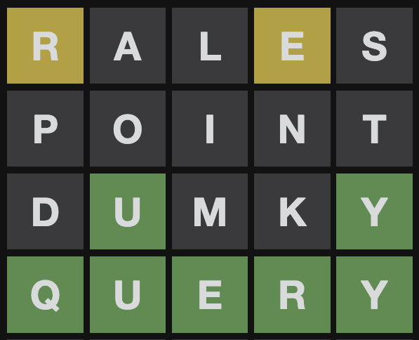
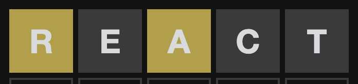
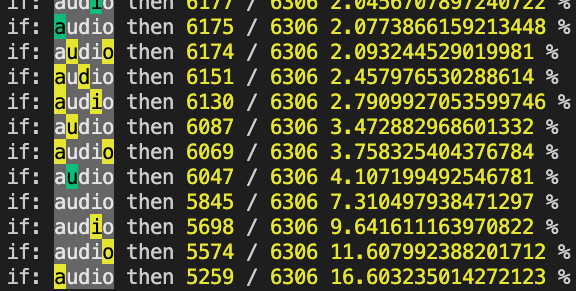
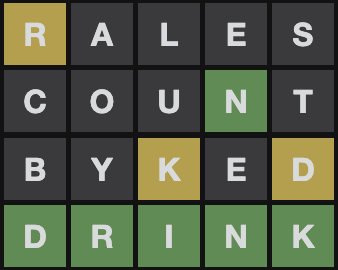
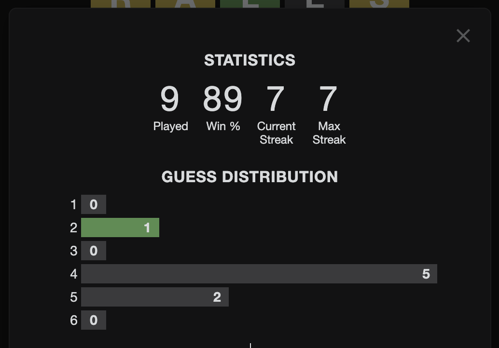

突然ですがこういうツイートを見たことないでしょうか。どの界隈で流行ってるのかわかりませんが[Wordle](https://www.powerlanguage.co.uk/wordle/)というゲームが密かに人気を集めています。

<blockquote class="twitter-tweet">
Wordle 205 4/6  🟨⬛⬛🟨⬛ ⬛⬛⬛⬛⬛ ⬛🟩⬛⬛🟩 🟩🟩🟩🟩🟩
&mdash; Leko / れこ (@L_e_k_o) <a href="https://twitter.com/L_e_k_o/status/1480210232433278981?ref_src=twsrc%5Etfw">January 9, 2022</a></blockquote> 

ルールは非常にシンプルで、フィードバックを頼りに５文字の英単語を予測するゲームです。

- 1 ゲームにつき６回まで試行可能、一度確定した入力はやり直せない
- 単語を確定すると、文字の種類と位置についてのフィードバックが得られる
  - 灰: その文字は正解の単語に含まれない
  - 黄: その文字は正解の単語に含まれているが位置が違う
  - 緑: その文字がその位置に含まれる
- ゲームの辞書に登録されてない文字列（ex. ランダムな英数など）は入力不可

下記の画像は実際にあった問題の回答例で、これと仕様を照らし合わせると以下のような流れになります。

1. `RALES`: `R`と`E`が含まれているが`A`, `L`, `S`は含まれていない
2. `POINT`: `P`, `O`, `I`, `N`, `T`は含まれていない
3. `DUMKY`: 正解の単語は`*U**Y`である
4. `QUERY`: 正解

このように得られたフィードバックから単語の文字と位置を絞り正解に辿り着くゲームです。最初は友人と人力で解いて遊んでいましたが、ゲームの理解が進むにつれて徐々に「母音/子音を絞り込む強単語」「フィードバックによる 2 手目以降の対応」などの戦略が練られてきたため、カッとなって自動で解くアルゴリズムを考え実装してみました。

## 成果物

実際に作ったものはこちらのリポジトリにコミットしています。README にも書いてありますが私が使ってる英単語辞書は購入したものであり権利的にリポジトリにコミットできないため辞書は各自で用意してください。

> &mdash; [Leko/wordle-solver: An unofficial solver for the Wordle](https://github.com/Leko/wordle-solver)

## アルゴリズムのスコープ

このような使い方ができるプログラムが当記事におけるアルゴリズムのスコープとします。

1. repl を起動
2. 1 手目の単語の予測を標準出力に出力
3. その単語を Wordle のゲーム画面に転記
4. 得られたフィードバックを repl に転記
5. 2 に戻り正解するか最長 6 ターン繰り返し

Wordle はブラウザゲーなので Chrome 拡張などを作れば完全な自動操作もできるのですが、そこは solver アルゴリズムの本筋ではないためスコープから除外します。なので Node コマンドで repl を起動し対話しながら手動でブラウザを操作するようにしました。

## 基本戦略

Wordle は単語を推測するゲームであり、存在しない単語は使用できないため、最適な文字列の組み合わせを選択するのではなく辞書から適切な単語を選択してくるゲームになります。そこで評価値の概念を導入し、各手番においてもっとも評価値の高い単語を入力していけば正解に辿り着けるのではないかと考えました。

1. 5 文字の単語の辞書を用意する
2. 1 手目（ノーヒント）においてもっとも評価値の高い単語を求める
3. （その単語をブラウザに入力、色のフィードバックを入力）
4. 2 手目以降はフィードバックに応じてもっとも評価値の高い単語を求める
5. （繰り返し）

1 ターン目では何の情報も得られていないため辞書の単語全てが候補となります。2 手目以降では色の組み合わせが得られているため、それと矛盾しない単語だけ候補となります。例えば`react`と入力したときに以下の結果が得られたとします。

この場合、`r`と`a`の両方を含んでおり`e`と`c`と`t`を含んでいない単語だけが候補として残ります。例えば organ, polar, solar, marry などが該当します。得られる組み合わせ数は 3 色\*\*5 マスで 243 通りあります。何色の組み合わせが得られるか正解の単語（未知）によるためどの組み合わせが得られるかを確実に計算する手段はありませんが、どの組み合わせが何％の確率で得られるかは見積もり可能です。

## 辞書の構築

まずは辞書の構築です。入力すべき単語リストがないと何も計算できないので、5 文字の単語を可能な限りかき集めてリストにします。ここで構築する辞書に Wordle の答えが含まれていないと何をどう計算しても正解は不可能になるので 8000 語くらいは用意したほうが安心感があると思います。方法はなんでもいいのですが、私は以前に購入してあった英辞郎のテキストデータをパースして 5 文字の単語だけ抽出して辞書化しました。たった 495 円でプログラムからパース可能な辞書が買えると思えばお手頃価格です。

> &mdash; [英辞郎 Ver.144.8（2015 年 3 月 20 日版）のテキストデータ - ＥＤＰ - BOOTH](https://booth.pm/ja/items/777563)

英辞郎の辞書では法具だったり地名、人名、ハワイの言葉や古語などのニッチすぎる単語が含まれておりゲーム内の辞書に存在しない単語を選択してしまうことも多々あります。英辞郎を辞書として使う場合存在しない単語を都度取り除いていく苦行が必要です...。  
ハッキーな手段としては、Wordle の JS にゲーム内辞書の単語一覧が書いてあるのでそれを元に辞書を作るのが一番確実な方法です。ただし成否判定ロジックも JS に書いてあるので、コードを読みすぎると正解が見えてしまいます。気をつけましょう。

## 評価値の計算

このアルゴリズムのコアである評価値の計算について書きます。なおこれはあくまで私の解釈であり Wordle の正しい解き方や正攻法が存在するわけではありません。  
評価値の計算方法は「その単語を入力した結果、得られる色の組み合わせによって絞り込める単語候補数の期待値」としました。数千語ある単語リストから 6 回の入力で 1 単語まで絞り込まなければいけないため、１入力ごとに残る候補が最小になるような入力をするためこのような計算にしました。当記事では「その組み合わせが仮に得られた場合に絞り込める単語の数」のことを`削減数`と呼びます。具体例として、`audio`という単語について得られた組み合わせそれぞれにおける削減値と確率を出力した図です。

全部緑の組み合わせ（つまり正解）が返ってきた場合、削減数が最大値の`今残ってる単語候補数 - 1`になりますが、その確率は`1 / 候補の単語数`しかありません。確率は`(現在の候補の単語数 - 削減数) / 現在の候補の単語数`で計算できます。例えば 10000 語残っている状態でとある 1 単語が全部緑になる期待値は`(10000-1) * 0.01 = 99.99`です。一方で削減数は 1000 だけど確率が 20％で起こる場合の期待値は 200 になります。つまり、奇跡的な確率でしか起こらない最高の値より現実的な確率で起こるうる普通の値に重みをつけて判断するために削減数ではなく期待値から評価値を計算しています。  
以上を踏まえて単語の評価値は、全ての色の組み合わせにおいて削減数と確率を計算し、それらの加重平均で求めています。全単語の評価値を計算したら、そのうちもっとも評価値の高い単語が今の盤面におけるもっとも良い手になります。

1 つ工夫した点は、すでに正解にはなり得ないことが確定している単語も含め全ての単語を使い評価値を計算していることです。これは緑が出てしまった場合にその位置と文字が固定されてしまうため選べる単語の自由度が下がり評価値も下がる問題を回避するためです。  
例えば以下の棋譜を例にすると、1 手目`RALES`で R が黄、2 手目`COUNT`で N が緑の場合、私の辞書では残る単語は bring, brink, briny, drink, grind, iring, prink, wring の 8 単語です。ただしこの 8 単語を 1 手で 1 つに絞り切れる単語はこの 8 単語の中には存在しません。ここで残りの候補を総当たりしてしまうと、運次第ではターン数が足りず負ける可能性があります。そこで`byked`のように、**絶対に正解ではないが評価値が最大の単語**をあえて選び `b`, `d`, `k`を含むかなどの残りの候補を絞り切るための複数のチェックを黄色・灰色で絞ります。全ての候補に共通している`*rin*`を避けて別の文字を使うことで 1 手消費する代わりに確実に候補を絞り切れます。この戦略により残り候補が 1/2 や 1/3 になったときに総当たりで運負けが起こりにくい戦いができます。

## 動いている様子

実際に Wordle を解きながら repl を操作してる様子はこんな感じになります。評価値の計算が非常に遅く改善の余地がありますが、使用感としては申し分ありません。

## 実戦投入した結果

現在の結果がこちらです。まだ実戦投入して一週間ほどしか経っていないためデータが少ないです。最初の数日は人力でやっていたため何度か負けていますが、solver を導入してからの勝率は 100％で、平均 4-5 ターンで正解しています。

他の方の solver も見てみたいので、もし solver を作った方がいたら [@L_e_k_o](https://twitter.com/L_e_k_o) までご連絡ください。
